# 5. spark sql (session)

### [跳至上一章](./A4_transformation.md)

# 第1章 Spark SQL概述
## 1.1	什么是Spark SQL
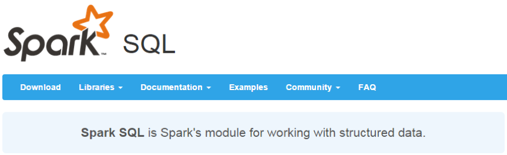

Spark SQL是Spark用来处理结构化数据的一个模块，它提供了一个编程抽象叫做DataFrame并且作为分布式SQL查询引擎的作用。
我们已经学习了Hive，它是将Hive SQL转换成MapReduce然后提交到集群上执行，大大简化了编写MapReduce的程序的复杂性，由于MapReduce这种计算模型执行效率比较慢。所有Spark SQL的应运而生，它是将Spark SQL转换成RDD，然后提交到集群执行，执行效率非常快！

1）易整合
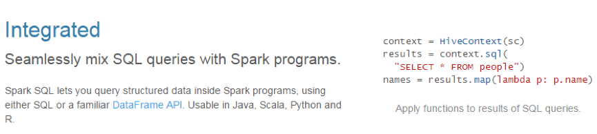

2）统一的数据访问方式
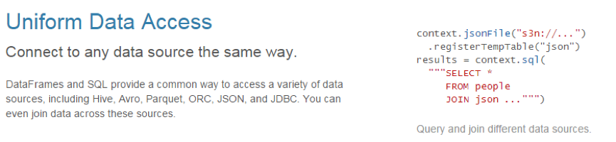

3）兼容Hive
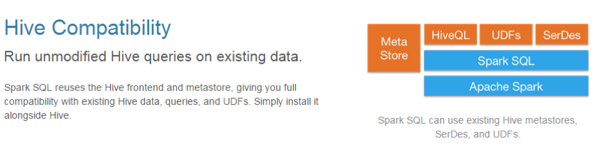

4）标准的数据连接
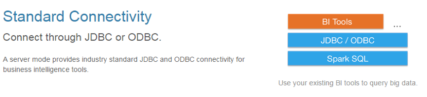
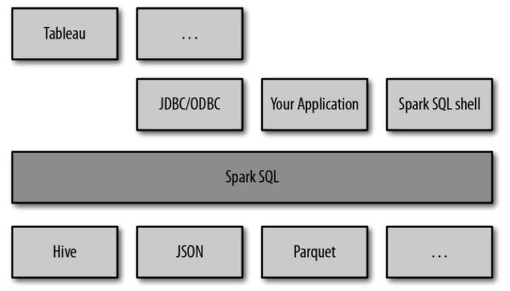

 SparkSQL可以看做是一个转换层，向下对接各种不同的结构化数据源，向上提供不同的数据访问方式。
 
## 1.2 RDD vs DataFrames vs DataSet
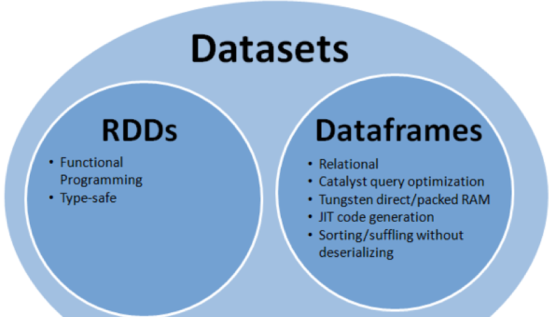

 在SparkSQL中Spark为我们提供了两个新的抽象，分别是DataFrame和DataSet。他们和RDD有什么区别呢？首先从版本的产生上来看：
RDD (Spark1.0) —> Dataframe(Spark1.3) —> Dataset(Spark1.6)
如果同样的数据都给到这三个数据结构，他们分别计算之后，都会给出相同的结果。不同是的他们的执行效率和执行方式。
在后期的Spark版本中，DataSet会逐步取代RDD和DataFrame成为唯一的API接口。
### 1.1.1	RDD

RDD是一个懒执行的不可变的可以支持Lambda表达式的并行数据集合。

RDD的最大好处就是简单，API的人性化程度很高。

RDD的劣势是性能限制，它是一个JVM驻内存对象，这也就决定了存在GC的限制和数据增加时Java序列化成本的升高。

RDD 例子如下:
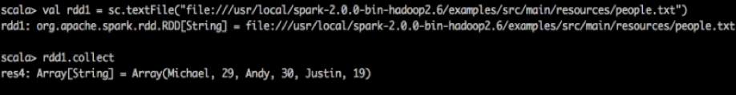

### 1.1.2	Dataframe
与RDD类似，DataFrame也是一个分布式数据容器。然而DataFrame更像传统数据库的二维表格，除了数据以外，还记录数据的结构信息，即schema。同时，与Hive类似，DataFrame也支持嵌套数据类型（struct、array和map）。从API易用性的角度上看，DataFrame API提供的是一套高层的关系操作，比函数式的RDD API要更加友好，门槛更低。由于与R和Pandas的DataFrame类似，Spark DataFrame很好地继承了传统单机数据分析的开发体验。
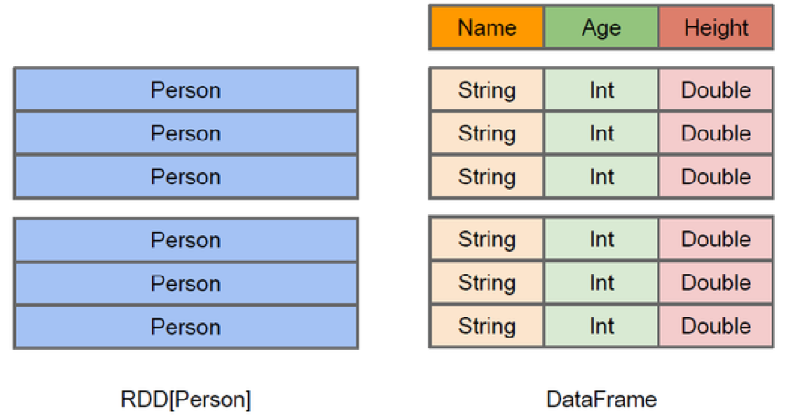

 上图直观地体现了DataFrame和RDD的区别。左侧的RDD[Person]虽然以Person为类型参数，但Spark框架本身不了解Person类的内部结构。而右侧的DataFrame却提供了详细的结构信息，使得Spark SQL可以清楚地知道该数据集中包含哪些列，每列的名称和类型各是什么。DataFrame多了数据的结构信息，即schema。RDD是分布式的Java对象的集合。DataFrame是分布式的Row对象的集合。DataFrame除了提供了比RDD更丰富的算子以外，更重要的特点是提升执行效率、减少数据读取以及执行计划的优化，比如filter下推、裁剪等。
DataFrame是为数据提供了Schema的视图。可以把它当做数据库中的一张表来对待

DataFrame也是懒执行的。

性能上比RDD要高，主要有两方面原因： 
1. 定制化内存管理
    
2. 数据以二进制的方式存在于非堆内存，节省了大量空间之外，还摆脱了GC的限制。
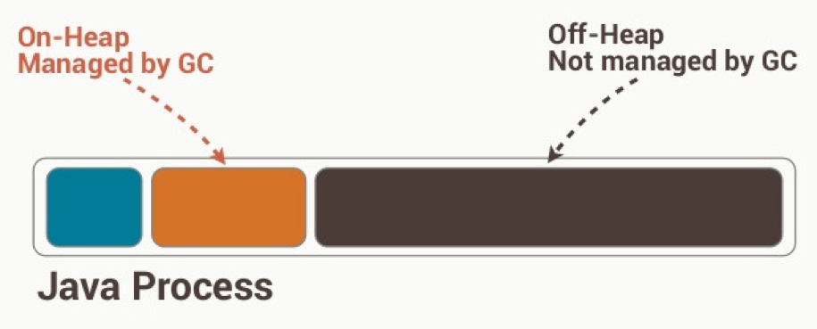

优化的执行计划
查询计划通过Spark catalyst optimiser进行优化. 

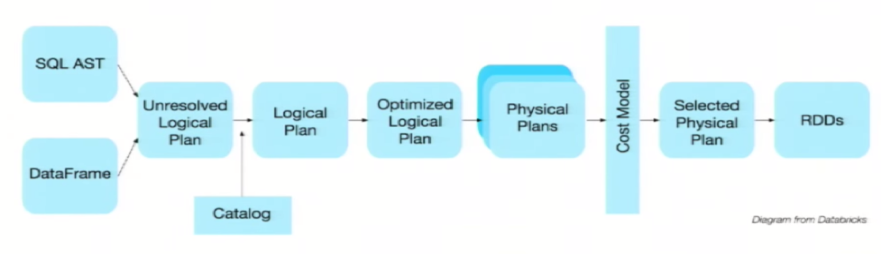

比如下面一个例子：
 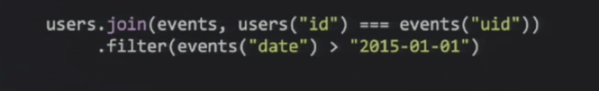
 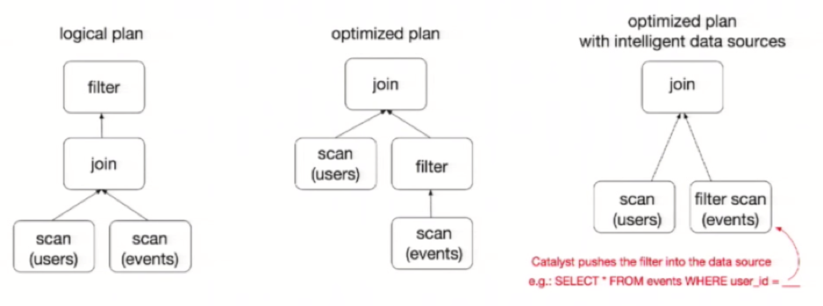
 
为了说明查询优化，我们来看上图展示的人口数据分析的示例。图中构造了两个DataFrame，将它们join之后又做了一次filter操作。如果原封不动地执行这个执行计划，最终的执行效率是不高的。因为join是一个代价较大的操作，也可能会产生一个较大的数据集。如果我们能将filter下推到 join下方，先对DataFrame进行过滤，再join过滤后的较小的结果集，便可以有效缩短执行时间。而Spark SQL的查询优化器正是这样做的。简而言之，逻辑查询计划优化就是一个利用基于关系代数的等价变换，将高成本的操作替换为低成本操作的过程。 

得到的优化执行计划在转换成物 理执行计划的过程中，还可以根据具体的数据源的特性将过滤条件下推至数据源内。最右侧的物理执行计划中Filter之所以消失不见，就是因为溶入了用于执行最终的读取操作的表扫描节点内。 

对于普通开发者而言，查询优化器的意义在于，即便是经验并不丰富的程序员写出的次优的查询，也可以被尽量转换为高效的形式予以执行。

Dataframe的劣势在于在编译期缺少类型安全检查，导致运行时出错.


### 1.1.3	Dataset
1. 是Dataframe API的一个扩展，是Spark最新的数据抽象

2. 用户友好的API风格，既具有类型安全检查也具有Dataframe的查询优化特性。

3. Dataset支持编解码器，当需要访问非堆上的数据时可以避免反序列化整个对象，提高了效率。

4. 样例类被用来在Dataset中定义数据的结构信息，样例类中每个属性的名称直接映射到DataSet中的字段名称。

5. Dataframe是Dataset的特列，DataFrame=Dataset[Row] ，所以可以通过as方法将Dataframe转换为Dataset。Row是一个类型，跟Car、Person这些的类型一样，所有的表结构信息我都用Row来表示。

6. DataSet是强类型的。比如可以有Dataset[Car]，Dataset[Person].

7. DataFrame只是知道字段，但是不知道字段的类型，所以在执行这些操作的时候是没办法在编译的时候检查是否类型失败的，比如你可以对一个String进行减法操作，在执行的时候才报错，而DataSet不仅仅知道字段，而且知道字段类型，所以有更严格的错误检查。就跟JSON对象和类对象之间的类比。

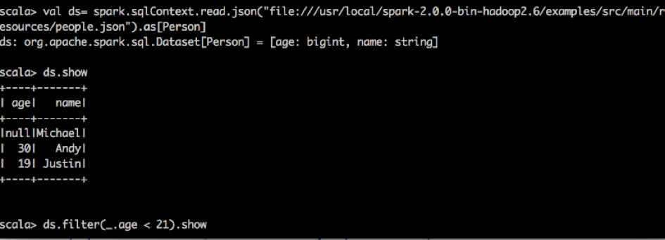

RDD让我们能够决定怎么做，而DataFrame和DataSet让我们决定做什么，控制的粒度不一样。
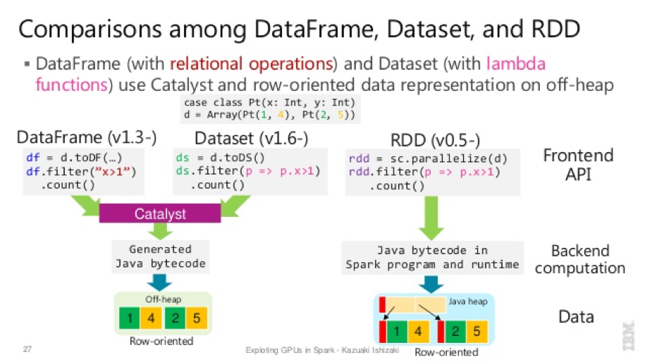

### 1.1.4	三者的共性
1. RDD、DataFrame、Dataset全都是spark平台下的分布式弹性数据集，为处理超大型数据提供便利
2. 三者都有惰性机制，在进行创建、转换，如map方法时，不会立即执行，只有在遇到Action如foreach时，三者才会开始遍历运算，极端情况下，如果代码里面有创建、转换，但是后面没有在Action中使用对应的结果，在执行时会被直接跳过。
```
val sparkconf = new SparkConf().setMaster("local").setAppName("test").set("spark.port.maxRetries","1000")
val spark = SparkSession.builder().config(sparkconf).getOrCreate()
val rdd=spark.sparkContext.parallelize(Seq(("a", 1), ("b", 1), ("a", 1)))
// map不运行
rdd.map{line=>
  println("运行")
  line._1
}
```
3. 三者都会根据spark的内存情况自动缓存运算，这样即使数据量很大，也不用担心会内存溢出
4. 三者都有partition的概念
5. 三者有许多共同的函数，如filter，排序等
6. 在对DataFrame和Dataset进行操作许多操作都需要这个包进行支持
```
import spark.implicits._
7、DataFrame和Dataset均可使用模式匹配获取各个字段的值和类型
DataFrame:
testDF.map{
      case Row(col1:String,col2:Int)=>
        println(col1);println(col2)
        col1
      case _=>
        ""
    }
Dataset:
case class Coltest(col1:String,col2:Int)extends Serializable //定义字段名和类型
    testDS.map{
      case Coltest(col1:String,col2:Int)=>
        println(col1);println(col2)
        col1
      case _=>
        ""
    }
```
### 1.1.5	三者的区别
RDD:
1. RDD一般和spark mlib同时使用
2. RDD不支持sparksql操作

##### DataFrame:
1. 与RDD和Dataset不同，DataFrame每一行的类型固定为Row，只有通过解析才能获取各个字段的值，如
```
testDF.foreach{
  line =>
    val col1=line.getAs[String]("col1")
    val col2=line.getAs[String]("col2")
}
```
##### 每一列的值没法直接访问
2. DataFrame与Dataset一般不与spark ml同时使用
3. DataFrame与Dataset均支持sparksql的操作，比如select，groupby之类，还能注册临时表/视窗，进行sql语句操作，如
```
dataDF.createOrReplaceTempView("tmp")
spark.sql("select  ROW,DATE from tmp where DATE is not null order by DATE").show(100,false)
```
4. DataFrame与Dataset支持一些特别方便的保存方式，比如保存成csv，可以带上表头，这样每一列的字段名一目了然
```
//保存
val saveoptions = Map("header" -> "true", "delimiter" -> "\t", "path" -> "hdfs://master01:9000/test")
datawDF.write.format("com.atguigu.spark.csv").mode(SaveMode.Overwrite).options(saveoptions).save()
//读取
val options = Map("header" -> "true", "delimiter" -> "\t", "path" -> "hdfs://master01:9000/test")
val datarDF= spark.read.options(options).format("com.atguigu.spark.csv").load()
```

利用这样的保存方式，可以方便的获得字段名和列的对应，而且分隔符（delimiter）可以自由指定。

##### Dataset:
Dataset和DataFrame拥有完全相同的成员函数，区别只是每一行的数据类型不同。

DataFrame也可以叫Dataset[Row],每一行的类型是Row，不解析，每一行究竟有哪些字段，各个字段又是什么类型都无从得知，只能用上面提到的getAS方法或者共性中的第七条提到的模式匹配拿出特定字段

而Dataset中，每一行是什么类型是不一定的，在自定义了case class之后可以很自由的获得每一行的信息

```

case class Coltest(col1:String,col2:Int)extends Serializable //定义字段名和类型
/**
 rdd
 ("a", 1)
 ("b", 1)
 ("a", 1)
**/
val test: Dataset[Coltest]=rdd.map{line=>
      Coltest(line._1,line._2)
    }.toDS
test.map{
      line=>
        println(line.col1)
        println(line.col2)
    }
```

可以看出，Dataset在需要访问列中的某个字段时是非常方便的，然而，如果要写一些适配性很强的函数时，如果使用Dataset，行的类型又不确定，可能是各种case class，无法实现适配，这时候用DataFrame即Dataset[Row]就能比较好的解决问题


# 第2章 执行SparkSQL查询
## 2.1 命令行查询流程
打开Spark shell

例子：查询大于30岁的用户

创建如下JSON文件，注意JSON的格式：
```

{"name":"Michael"}
{"name":"Andy", "age":30}
{"name":"Justin", "age":19}
```
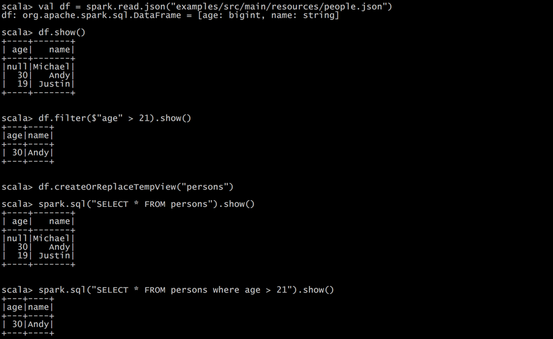

## 2.2 IDEA创建SparkSQL程序
IDEA中程序的打包和运行方式都和SparkCore类似，Maven依赖中需要添加新的依赖项：
```

<dependency>

    <groupId>org.apache.spark</groupId>

    <artifactId>spark-sql_2.11</artifactId>

    <version>2.1.1</version>

    <scope>provided</scope>
</dependency>
```

程序如下：
```

package com.atguigu.sparksql


import org.apache.spark.sql.SparkSession

import org.apache.spark.{SparkConf, SparkContext}

import org.slf4j.LoggerFactory



object HelloWorld {


  def main(args: Array[String]) {

    //创建SparkConf()并设置App名称

    val spark = SparkSession

      .builder()

      .appName("Spark SQL basic example")

      .config("spark.some.config.option", "some-value")

      .getOrCreate()


    // For implicit conversions like converting RDDs to DataFrames

     import spark.implicits._


    val df = spark.read.json("examples/src/main/resources/people.json")


    // Displays the content of the DataFrame to stdout

     df.show()


    df.filter($"age" > 21).show()


    df.createOrReplaceTempView("persons")


    spark.sql("SELECT * FROM persons where age > 21").show()


    spark.stop()

  }
}

```
# 第3章 SparkSQL解析
## 3.1 新的起始点SparkSession

在老的版本中，SparkSQL提供两种SQL查询起始点，一个叫SQLContext，用于Spark自己提供的SQL查询，一个叫HiveContext，用于连接Hive的查询，SparkSession是Spark最新的SQL查询起始点，实质上是SQLContext和HiveContext的组合，所以在SQLContext和HiveContext上可用的API在SparkSession上同样是可以使用的。SparkSession内部封装了sparkContext，所以计算实际上是由sparkContext完成的。
```

import org.apache.spark.sql.SparkSession


val spark = SparkSession

.builder()

.appName("Spark SQL basic example")

.config("spark.some.config.option", "some-value")

.getOrCreate()


// For implicit conversions like converting RDDs to DataFrames

import spark.implicits._
```
SparkSession.builder 用于创建一个SparkSession。

import spark.implicits._的引入是用于将DataFrames隐式转换成RDD，使df能够使用RDD中的方法。

如果需要Hive支持，则需要以下创建语句：
```
import org.apache.spark.sql.SparkSession
val spark = SparkSession

.builder()

.appName("Spark SQL basic example")

.config("spark.some.config.option", "some-value")

.enableHiveSupport()
.getOrCreate()


// For implicit conversions like converting RDDs to DataFrames

import spark.implicits._

```
## 3.2 创建DataFrames
在Spark SQL中SparkSession是创建DataFrames和执行SQL的入口，创建DataFrames有三种方式，一种是可以从一个存在的RDD进行转换，还可以从Hive Table进行查询返回，或者通过Spark的数据源进行创建。

从Spark数据源进行创建：
```
val df = spark.read.json("examples/src/main/resources/people.json")
// Displays the content of the DataFrame to stdout

df.show()

// +----+-------+

// | age|   name|

// +----+-------+

// |null|Michael|

// |  30|   Andy|

// |  19| Justin|

// +----+-------+
```

从RDD进行转换：
```

/**
Michael, 29
Andy, 30
Justin, 19
**/
scala> val peopleRdd = sc.textFile("examples/src/main/resources/people.txt")
peopleRdd: org.apache.spark.rdd.RDD[String] = examples/src/main/resources/people.txt MapPartitionsRDD[18] at textFile at <console>:24

scala> val peopleDF3 = peopleRdd.map(_.split(",")).map(paras => (paras(0),paras(1).trim().toInt)).toDF("name","age")
peopleDF3: org.apache.spark.sql.DataFrame = [name: string, age: int]

scala> peopleDF.show()
+-------+---+
|   name|age|
+-------+---+
|Michael| 29|
|   Andy| 30|
| Justin| 19|
+-------+---+
```
Hive我们在数据源章节介绍

## 3.3 DataFrame常用操作
### 3.3.1 DSL风格语法

```
// This import is needed to use the $-notation

import spark.implicits._

// Print the schema in a tree format

df.printSchema()

// root

// |-- age: long (nullable = true)

// |-- name: string (nullable = true)


// Select only the "name" column

df.select("name").show()

// +-------+

// |   name|

// +-------+

// |Michael|

// |   Andy|

// | Justin|

// +-------+


// Select everybody, but increment the age by 1

df.select($"name", $"age" + 1).show()

// +-------+---------+

// |   name|(age + 1)|

// +-------+---------+

// |Michael|     null|

// |   Andy|       31|

// | Justin|       20|

// +-------+---------+


// Select people older than 21

df.filter($"age" > 21).show()

// +---+----+

// |age|name|

// +---+----+

// | 30|Andy|
// +---+----+



// Count people by age

df.groupBy("age").count().show()

// +----+-----+

// | age|count|

// +----+-----+

// |  19|    1|

// |null|    1|

// |  30|    1|

// +----+-----+
```

### 3.3.2 SQL风格语法

```
// Register the DataFrame as a SQL temporary view

df.createOrReplaceTempView("people")


val sqlDF = spark.sql("SELECT * FROM people")

sqlDF.show()

// +----+-------+

// | age|   name|

// +----+-------+

// |null|Michael|

// |  30|   Andy|

// |  19| Justin|

// +----+-------+



// Register the DataFrame as a global temporary view

df.createGlobalTempView("people")


// Global temporary view is tied to a system preserved database `global_temp`

spark.sql("SELECT * FROM global_temp.people").show()

// +----+-------+

// | age|   name|

// +----+-------+

// |null|Michael|

// |  30|   Andy|

// |  19| Justin|

// +----+-------+


// Global temporary view is cross-session

spark.newSession().sql("SELECT * FROM global_temp.people").show()

// +----+-------+

// | age|   name|

// +----+-------+

// |null|Michael|

// |  30|   Andy|

// |  19| Justin|

// +----+-------+
```
临时表是Session范围内的，Session退出后，表就失效了。如果想应用范围内有效，可以使用全局表。注意使用全局表时需要全路径访问，如：global_temp.people

## 3.4 创建DataSet
Dataset是具有强类型的数据集合，需要提供对应的类型信息。

```
// Note: Case classes in Scala 2.10 can support only up to 22 fields. To work around this limit,

// you can use custom classes that implement the Product interface
case class Person(name: String, age: Long)


// Encoders are created for case classes

val caseClassDS = Seq(Person("Andy", 32)).toDS()

caseClassDS.show()

// +----+---+

// |name|age|

// +----+---+

// |Andy| 32|

// +----+---+


// Encoders for most common types are automatically provided by importing spark.implicits._

val primitiveDS = Seq(1, 2, 3).toDS()

primitiveDS.map(_ + 1).collect() 
// Returns: Array(2, 3, 4)


// DataFrames can be converted to a Dataset by providing a class. Mapping will be done by name

val path = "examples/src/main/resources/people.json"

val peopleDS = spark.read.json(path).as[Person]

peopleDS.show()

// +----+-------+

// | age|   name|

// +----+-------+

// |null|Michael|

// |  30|   Andy|

// |  19| Justin|

// +----+-------+
```

## 3.5 Dataset和RDD互操作
Spark SQL支持通过两种方式将存在的RDD转换为Dataset，转换的过程中需要让Dataset获取RDD中的Schema信息，主要有两种方式，一种是通过反射来获取RDD中的Schema信息。这种方式适合于列名已知的情况下。第二种是通过编程接口的方式将Schema信息应用于RDD，这种方式可以处理那种在运行时才能知道列的方式。

### 3.5.1 通过反射获取Scheam
SparkSQL能够自动将包含有case类的RDD转换成DataFrame，case类定义了table的结构，case类属性通过反射变成了表的列名。Case类可以包含诸如Seqs或者Array等复杂的结构。

```
// For implicit conversions from RDDs to DataFrames

import spark.implicits._


// Create an RDD of Person objects from a text file, convert it to a Dataframe

val peopleDF = spark.sparkContext

    .textFile("examples/src/main/resources/people.txt")

    .map(_.split(","))

    .map(attributes => 
        Person(attributes(0), 
        attributes(1).trim.toInt)
        ).toDF()

// Register the DataFrame as a temporary view

peopleDF.createOrReplaceTempView("people")


// SQL statements can be run by using the sql methods provided by Spark

val teenagersDF = spark.sql("SELECT name, age FROM people WHERE age BETWEEN 13 AND 19")


// The columns of a row in the result can be accessed by field index  ROW object

teenagersDF.map(teenager => "Name: " + teenager(0)).show()

// +------------+

// |       value|

// +------------+

// |Name: Justin|

// +------------+


// or by field name

teenagersDF.map(teenager => "Name: " + teenager.getAs[String]("name")).show()

// +------------+

// |       value|

// +------------+

// |Name: Justin|

// +------------+


// No pre-defined encoders for Dataset[Map[K,V]], define explicitly

implicit val mapEncoder = org.apache.spark.sql.Encoders.kryo[Map[String, Any]]

// Primitive types and case classes can be also defined as

// implicit val stringIntMapEncoder: Encoder[Map[String, Any]] = ExpressionEncoder()


// row.getValuesMap[T] retrieves multiple columns at once into a Map[String, T]

teenagersDF.map(teenager => 
            teenager.getValuesMap[Any](List("name", "age"))
            ).collect()

// Array(Map("name" -> "Justin", "age" -> 19))
```

### 3.5.2 通过编程设置Schema

1. 如果case类不能够提前定义，可以通过下面三个步骤定义一个DataFrame
2. 创建一个多行结构的RDD;
3. 创建用StructType来表示的行结构信息。
4. 通过SparkSession提供的createDataFrame方法来应用Schema 。

```
import org.apache.spark.sql.types._


// Create an RDD

val peopleRDD = spark.sparkContext.textFile("examples/src/main/resources/people.txt")


// The schema is encoded in a string,应该是动态通过程序生成的

val schemaString = "name age"


// Generate the schema based on the string of schema   Array[StructFiled]

val fields = schemaString.split(" ")

        .map(fieldName => StructField(fieldName, StringType, nullable = true))

// val filed = schemaString.split(" ").map(filename=> filename match{ case "name"=> StructField(filename,StringType,nullable = true); case "age"=>StructField(filename, IntegerType,nullable = true)} )

val schema = StructType(fields)


// Convert records of the RDD (people) to Rows
import org.apache.spark.sql._

val rowRDD = peopleRDD

                .map(_.split(","))

                .map(attributes => Row(attributes(0), attributes(1).trim))


// Apply the schema to the RDD

val peopleDF = spark.createDataFrame(rowRDD, schema)


// Creates a temporary view using the DataFrame

peopleDF.createOrReplaceTempView("people")


// SQL can be run over a temporary view created using DataFrames

val results = spark.sql("SELECT name FROM people")


// The results of SQL queries are DataFrames and support all the normal RDD operations

// The columns of a row in the result can be accessed by field index or by field name

results.map(attributes => "Name: " + attributes(0)).show()

// +-------------+

// |        value|

// +-------------+

// |Name: Michael|

// |   Name: Andy|

// | Name: Justin|

// +-------------+
```

## 3.6 类型之间的转换总结
RDD、DataFrame、Dataset三者有许多共性，有各自适用的场景常常需要在三者之间转换

DataFrame/Dataset转RDD：

这个转换很简单
```
    val rdd1=testDF.rdd
    val rdd2=testDS.rdd
```
    
RDD转DataFrame：
```
import spark.implicits._
val testDF = rdd.map {line=>
      (line._1,line._2)
    }.toDF("col1","col2")
```

一般用元组把一行的数据写在一起，然后在toDF中指定字段名

RDD转Dataset：
```
import spark.implicits._
case class Coltest(col1:String,col2:Int)extends Serializable //定义字段名和类型
val testDS = rdd.map {line=>
      Coltest(line._1,line._2)
    }.toDS
```
可以注意到，定义每一行的类型（case class）时，已经给出了字段名和类型，后面只要往case class里面添加值即可

Dataset转DataFrame：

这个也很简单，因为只是把case class封装成Row
```
import spark.implicits._
val testDF = testDS.toDF
```
DataFrame转Dataset：

```
import spark.implicits._

//定义字段名和类型
case class Coltest(col1:String,col2:Int)extends Serializable 
val testDS = testDF.as[Coltest]
```
这种方法就是在给出每一列的类型后，使用as方法，转成Dataset，这在数据类型是DataFrame又需要针对各个字段处理时极为方便。

在使用一些特殊的操作时，一定要加上 import spark.implicits._ 不然toDF、toDS无法使用


## 3.7 用户自定义函数
通过spark.udf功能用户可以自定义函数。

### 3.7.1 用户自定义UDF函数
```
scala> val df = spark.read.json("examples/src/main/resources/people.json")
df: org.apache.spark.sql.DataFrame = [age: bigint, name: string]

scala> df.show()
+----+-------+
| age|   name|
+----+-------+
|null|Michael|
|  30|   Andy|
|  19| Justin|
+----+-------+


scala> spark.udf.register("addName", (x:String)=> "Name:"+x)
res5: org.apache.spark.sql.expressions.UserDefinedFunction = UserDefinedFunction(<function1>,StringType,Some(List(StringType)))

scala> df.createOrReplaceTempView("people")

scala> spark.sql("Select addName(name), age from people").show()
+-----------------+----+
|UDF:addName(name)| age|
+-----------------+----+
|     Name:Michael|null|
|        Name:Andy|  30|
|      Name:Justin|  19|
+-----------------+----+
```

### 3.7.2 用户自定义聚合函数
强类型的Dataset和弱类型的DataFrame都提供了相关的聚合函数， 如 count()，countDistinct()，avg()，max()，min()。除此之外，用户可以设定自己的自定义聚合函数。

弱类型用户自定义聚合函数：通过继承UserDefinedAggregateFunction来实现用户自定义聚合函数。下面展示一个求平均工资的自定义聚合函数。
```
import org.apache.spark.sql.expressions.MutableAggregationBuffer

import org.apache.spark.sql.expressions.UserDefinedAggregateFunction

import org.apache.spark.sql.types._

import org.apache.spark.sql.Row

import org.apache.spark.sql.SparkSession


object MyAverage extends UserDefinedAggregateFunction {

    // 聚合函数输入参数的数据类型 

    def inputSchema: StructType = StructType(StructField("inputColumn", LongType) :: Nil)

    // 聚合缓冲区中值得数据类型
    def bufferSchema: StructType = {
StructType(StructField("sum", LongType) :: StructField("count", LongType) :: Nil)
}

    // 返回值的数据类型 
def dataType: DataType = DoubleType
// 对于相同的输入是否一直返回相同的输出。 

    def deterministic: Boolean = true

    // 初始化

    def initialize(buffer: MutableAggregationBuffer): Unit = {
        // 存工资的总额
buffer(0) = 0L
        // 存工资的个数
buffer(1) = 0L

    }

    // 相同Execute间的数据合并。

      def update(buffer: MutableAggregationBuffer, input: Row): Unit = {

        if (!input.isNullAt(0)) {

            buffer(0) = buffer.getLong(0) + input.getLong(0)

            buffer(1) = buffer.getLong(1) + 1

        }

    }

    // 不同Execute间的数据合并 

    def merge(buffer1: MutableAggregationBuffer, buffer2: Row): Unit = {

        buffer1(0) = buffer1.getLong(0) + buffer2.getLong(0)

        buffer1(1) = buffer1.getLong(1) + buffer2.getLong(1)

    }

   // 计算最终结果
    def evaluate(buffer: Row): Double = buffer.getLong(0).toDouble / buffer.getLong(1)

}


// 注册函数

spark.udf.register("myAverage", MyAverage)


val df = spark.read.json("examples/src/main/resources/employees.json")

df.createOrReplaceTempView("employees")

df.show()

// +-------+------+
    
// |   name|salary|

// +-------+------+

// |Michael|  3000|

// |   Andy|  4500|

// | Justin|  3500|

// |  Berta|  4000|

// +-------+------+


val result = spark.sql("SELECT myAverage(salary) as average_salary FROM employees")

result.show()

// +--------------+

// |average_salary|

// +--------------+

// |        3750.0|

// +--------------+

```

强类型用户自定义聚合函数：通过继承Aggregator来实现强类型自定义聚合函数，同样是求平均工资
```
import org.apache.spark.sql.expressions.Aggregator

import org.apache.spark.sql.Encoder

import org.apache.spark.sql.Encoders

import org.apache.spark.sql.SparkSession

// 既然是强类型，可能有case类

case class Employee(name: String, salary: Long)

case class Average(var sum: Long, var count: Long)


object MyAverage extends Aggregator[Employee, Average, Double] {

    // 定义一个数据结构，保存工资总数和工资总个数，初始都为0

    def zero: Average = Average(0L, 0L)

    // Combine two values to produce a new value. For performance, the function may modify `buffer`

    // and return it instead of constructing a new object

    def reduce(buffer: Average, employee: Employee): Average = {

        buffer.sum += employee.salary

        buffer.count += 1
buffer

    }

    // 聚合不同execute的结果

    def merge(b1: Average, b2: Average): Average = {

        b1.sum += b2.sum
b1.count += b2.count
b1

    }

    // 计算输出

    def finish(reduction: Average): Double = reduction.sum.toDouble / reduction.count

    // 设定之间值类型的编码器，要转换成case类
    // Encoders.product是进行scala元组和case类转换的编码器 

    def bufferEncoder: Encoder[Average] = Encoders.product

    // 设定最终输出值的编码器

    def outputEncoder: Encoder[Double] = Encoders.scalaDouble

}

import spark.implicits._
val ds = spark.read.json("examples/src/main/resources/employees.json")
                    .as[Employee]

ds.show()

// +-------+------+

// |   name|salary|

// +-------+------+

// |Michael|  3000|

// |   Andy|  4500|

// | Justin|  3500|

// |  Berta|  4000|

// +-------+------+


// Convert the function to a `TypedColumn` and give it a name

val averageSalary = MyAverage.toColumn.name("average_salary")

val result = ds.select(averageSalary)

result.show()

// +--------------+

// |average_salary|

// +--------------+

// |        3750.0|

// +--------------+


```


# 第4章 SparkSQL数据源
## 4.1 通用加载/保存方法
### 4.1.1 手动指定选项
Spark SQL的DataFrame接口支持多种数据源的操作。一个DataFrame可以进行RDDs方式的操作，也可以被注册为临时表。把DataFrame注册为临时表之后，就可以对该DataFrame执行SQL查询。

Spark SQL的默认数据源为Parquet格式。数据源为Parquet文件时，Spark SQL可以方便的执行所有的操作。修改配置项spark.sql.sources.default，可修改默认数据源格式。
```
val df = spark.read.load("examples/src/main/resources/users.parquet") 
df.select("name", "favorite_color").write.save("namesAndFavColors.parquet")
```

当数据源格式不是parquet格式文件时，需要手动指定数据源的格式。数据源格式需要指定全名（例如：org.apache.spark.sql.parquet），如果数据源格式为内置格式，则只需要指定简称定json, parquet, jdbc, orc, libsvm, csv, text来指定数据的格式。

可以通过SparkSession提供的read.load方法用于通用加载数据，使用write和save保存数据。 
```
val peopleDF = spark.read.format("json").load("examples/src/main/resources/people.json")

peopleDF.write.format("parquet").save("hdfs://hadoop102:9000/namesAndAges.parquet")
```

除此之外，可以直接运行SQL在文件上：
```
val sqlDF = spark.sql("SELECT * FROM parquet.`hdfs://hadoop102:9000/namesAndAges.parquet`")
sqlDF.show()
scala> val peopleDF = spark.read.format("json").load("examples/src/main/resources/people.json")
peopleDF: org.apache.spark.sql.DataFrame = [age: bigint, name: string]

scala> peopleDF.write.format("parquet").save("hdfs://hadoop102:9000/namesAndAges.parquet")

scala> peopleDF.show()
+----+-------+
| age|   name|
+----+-------+
|null|Michael|
|  30|   Andy|
|  19| Justin|
+----+-------+

scala> val sqlDF = spark.sql("SELECT * FROM parquet.`hdfs://master01:9000/namesAndAges.parquet`")
17/09/05 04:21:11 WARN ObjectStore: Failed to get database parquet, returning NoSuchObjectException
sqlDF: org.apache.spark.sql.DataFrame = [age: bigint, name: string]

scala> sqlDF.show()
+----+-------+
| age|   name|
+----+-------+
|null|Michael|
|  30|   Andy|
|  19| Justin|
+----+-------+
```


### 4.1.2 文件保存选项

可以采用SaveMode执行存储操作，SaveMode定义了对数据的处理模式。需要注意的是，这些保存模式不使用任何锁定，不是原子操作。此外，当使用Overwrite方式执行时，在输出新数据之前原数据就已经被删除。SaveMode详细介绍如下表：

| Scala/Java | Any Language | Meaning |
|----|:---|:---|
|SaveMode.ErrorIfExists(default)| "error"(default) | 如果文件存在，则报错 |
|SaveMode.Append | "append" | 追加 |
|SaveMode.Overwrite | "overwrite" | 覆写|
|SaveMode.Ignore | "ignore" | 数据存在，则忽略| 


## 4.2 Parquet文件
Parquet是一种流行的列式存储格式，可以高效地存储具有嵌套字段的记录。
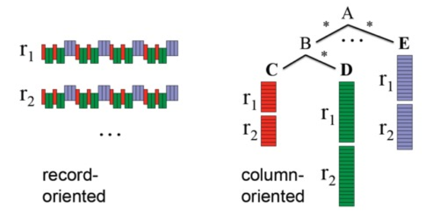

### 4.2.1 Parquet读写
Parquet格式经常在Hadoop生态圈中被使用，它也支持Spark SQL的全部数据类型。Spark SQL 提供了直接读取和存储 Parquet 格式文件的方法。 
```
// Encoders for most common types are automatically provided by importing spark.implicits._

import spark.implicits._


val peopleDF = spark.read.json("examples/src/main/resources/people.json")


// DataFrames can be saved as Parquet files, maintaining the schema information

peopleDF.write.parquet("hdfs://master01:9000/people.parquet")


// Read in the parquet file created above

// Parquet files are self-describing so the schema is preserved

// The result of loading a Parquet file is also a DataFrame

val parquetFileDF = spark.read.parquet("hdfs://master01:9000/people.parquet")


// Parquet files can also be used to create a temporary view and then used in SQL statements

parquetFileDF.createOrReplaceTempView("parquetFile")

val namesDF = spark.sql("SELECT name FROM parquetFile WHERE age BETWEEN 13 AND 19")

namesDF.map(attributes => "Name: " + attributes(0)).show()

// +------------+

// |       value|

// +------------+

// |Name: Justin|

// +------------+

```
### 4.2.2 解析分区信息
对表进行分区是对数据进行优化的方式之一。在分区的表内，数据通过分区列将数据存储在不同的目录下。Parquet数据源现在能够自动发现并解析分区信息。例如，对人口数据进行分区存储，分区列为gender和country，使用下面的目录结构：
```
    path
    └── to
        └── table
            ├── gender=male
            │   ├── ...
            │   │
            │   ├── country=US
            │   │   └── data.parquet
            │   ├── country=CN
            │   │   └── data.parquet
            │   └── ...
            └── gender=female
                ├── ...
                │
                ├── country=US
                │   └── data.parquet
                ├── country=CN
                │   └── data.parquet
                └── ...
```
通过传递path/to/table给 SQLContext.read.parquet或SQLContext.read.load，Spark SQL将自动解析分区信息。返回的DataFrame的Schema如下：
```
    root
    |-- name: string (nullable = true)
    |-- age: long (nullable = true)
    |-- gender: string (nullable = true)
    |-- country: string (nullable = true)
    
```
需要注意的是，数据的分区列的数据类型是自动解析的。当前，支持数值类型和字符串类型。自动解析分区类型的参数为：spark.sql.sources.partitionColumnTypeInference.enabled，默认值为true。如果想关闭该功能，直接将该参数设置为disabled。此时，分区列数据格式将被默认设置为string类型，不再进行类型解析。

### 4.2.3 Schema合并

像ProtocolBuffer、Avro和Thrift那样，Parquet也支持Schema evolution（Schema演变）。用户可以先定义一个简单的Schema，然后逐渐的向Schema中增加列描述。通过这种方式，用户可以获取多个有不同Schema但相互兼容的Parquet文件。现在Parquet数据源能自动检测这种情况，并合并这些文件的schemas。

因为Schema合并是一个高消耗的操作，在大多数情况下并不需要，所以Spark SQL从1.5.0开始默认关闭了该功能。可以通过下面两种方式开启该功能：

当数据源为Parquet文件时，将数据源选项mergeSchema设置为true

设置全局SQL选项spark.sql.parquet.mergeSchema为true

示例如下：
```
// sqlContext from the previous example is used in this example.

// This is used to implicitly convert an RDD to a DataFrame.


import spark.implicits._



// Create a simple DataFrame, stored into a partition directory

val df1 = sc.makeRDD(1 to 5).map(i => (i, i * 2)).toDF("single", "double")

df1.write.parquet("hdfs://master01:9000/data/test_table/key=1")



// Create another DataFrame in a new partition directory,

// adding a new column and dropping an existing column

val df2 = sc.makeRDD(6 to 10).map(i => (i, i * 3)).toDF("single", "triple")

df2.write.parquet("hdfs://master01:9000/data/test_table/key=2")


// Read the partitioned table

val df3 = spark.read.option("mergeSchema", "true").parquet("hdfs://master01:9000/data/test_table")

df3.printSchema()



// The final schema consists of all 3 columns in the Parquet files together

// with the partitioning column appeared in the partition directory paths.

// root

// |-- single: int (nullable = true)

// |-- double: int (nullable = true)

// |-- triple: int (nullable = true)

// |-- key : int (nullable = true)

```
## 4.3 Hive数据库
Apache Hive是Hadoop上的SQL引擎，Spark SQL编译时可以包含Hive支持，也可以不包含。包含Hive支持的Spark SQL可以支持Hive表访问、UDF(用户自定义函数)以及 Hive 查询语言(HiveQL/HQL)等。需要强调的 一点是，如果要在Spark SQL中包含Hive的库，并不需要事先安装Hive。一般来说，最好还是在编译Spark SQL时引入Hive支持，这样就可以使用这些特性了。如果你下载的是二进制版本的 Spark，它应该已经在编译时添加了 Hive 支持。 

若要把Spark SQL连接到一个部署好的Hive上，你必须把hive-site.xml复制到 Spark的配置文件目录中($SPARK_HOME/conf)。即使没有部署好Hive，Spark SQL也可以运行。 需要注意的是，如果你没有部署好Hive，Spark SQL会在当前的工作目录中创建出自己的Hive 元数据仓库，叫作 metastore_db。此外，如果你尝试使用 HiveQL 中的 CREATE TABLE (并非 CREATE EXTERNAL TABLE)语句来创建表，这些表会被放在你默认的文件系统中的 /user/hive/warehouse 目录中(如果你的 classpath 中有配好的 hdfs-site.xml，默认的文件系统就是 HDFS，否则就是本地文件系统)。
```
import java.io.File


import org.apache.spark.sql.Row

import org.apache.spark.sql.SparkSession


case class Record(key: Int, value: String)


// warehouseLocation points to the default location for managed databases and tables

val warehouseLocation = new File("spark-warehouse").getAbsolutePath


val spark = SparkSession

    .builder()

    .appName("Spark Hive Example")

   .config("spark.sql.warehouse.dir", warehouseLocation)

    .enableHiveSupport()

    .getOrCreate()



import spark.implicits._

import spark.sql


sql("CREATE TABLE IF NOT EXISTS src (key INT, value STRING)")

sql("LOAD DATA LOCAL INPATH 'examples/src/main/resources/kv1.txt' INTO TABLE src")


// Queries are expressed in HiveQL

sql("SELECT * FROM src").show()

// +---+-------+

// |key|  value|

// +---+-------+

// |238|val_238|

// | 86| val_86|

// |311|val_311|

// ...


// Aggregation queries are also supported.

sql("SELECT COUNT(*) FROM src").show()

// +--------+

// |count(1)|

// +--------+

// |    500 |

// +--------+


// The results of SQL queries are themselves DataFrames and support all normal functions.

val sqlDF = sql("SELECT key, value FROM src WHERE key < 10 ORDER BY key")


// The items in DataFrames are of type Row, which allows you to access each column by ordinal.

val stringsDS = sqlDF.map {
case Row(key: Int, value: String) => s"Key: $key, Value: $value"
}

stringsDS.show()

// +--------------------+

// |               value|

// +--------------------+

// |Key: 0, Value: val_0|

// |Key: 0, Value: val_0|

// |Key: 0, Value: val_0|

// ...



// You can also use DataFrames to create temporary views within a SparkSession.

val recordsDF = spark.createDataFrame((1 to 100).map(i => Record(i, s"val_$i")))

recordsDF.createOrReplaceTempView("records")


// Queries can then join DataFrame data with data stored in Hive.

sql("SELECT * FROM records r JOIN src s ON r.key = s.key").show()

// +---+------+---+------+

// |key| value|key| value|

// +---+------+---+------+

// |  2| val_2|  2| val_2|

// |  4| val_4|  4| val_4|

// |  5| val_5|  5| val_5|


```

### 4.3.1 内嵌Hive应用
如果要使用内嵌的Hive，什么都不用做，直接用就可以了。 

--conf : spark.sql.warehouse.dir=
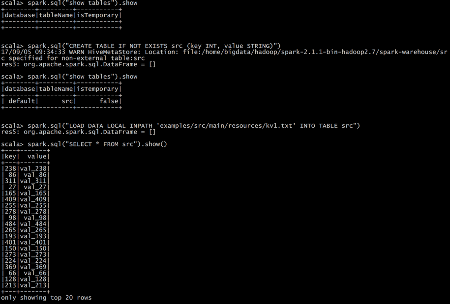

注意：如果你使用的是内部的Hive，在Spark2.0之后，spark.sql.warehouse.dir用于指定数据仓库的地址，如果你需要是用HDFS作为路径，那么需要将core-site.xml和hdfs-site.xml 加入到Spark conf目录，否则只会创建master节点上的warehouse目录，查询时会出现文件找不到的问题，这是需要向使用HDFS，则需要将metastore删除，重启集群。
 
### 4.3.2 外部Hive应用
如果想连接外部已经部署好的Hive，需要通过以下几个步骤。
1. 将Hive中的hive-site.xml拷贝或者软连接到Spark安装目录下的conf目录下。
2. 打开spark shell，注意带上访问Hive元数据库的JDBC客户端
```
$ bin/spark-shell --master spark://hadoop102:7077 --jars mysql-connector-java-5.1.27-bin.jar
```

## 4.4 JSON数据集

Spark SQL 能够自动推测 JSON数据集的结构，并将它加载为一个Dataset[Row]. 可以通过SparkSession.read.json()去加载一个 Dataset[String]或者一个JSON 文件.注意，这个JSON文件不是一个传统的JSON文件，每一行都得是一个JSON串。
```
{"name":"Michael"}

{"name":"Andy", "age":30}

{"name":"Justin", "age":19}

// Primitive types (Int, String, etc) and Product types (case classes) encoders are

// supported by importing this when creating a Dataset.

import spark.implicits._


// A JSON dataset is pointed to by path.

// The path can be either a single text file or a directory storing text files

val path = "examples/src/main/resources/people.json"

val peopleDF = spark.read.json(path)


// The inferred schema can be visualized using the printSchema() method

peopleDF.printSchema()


// root

//  |-- age: long (nullable = true)

//  |-- name: string (nullable = true)


// Creates a temporary view using the DataFrame

peopleDF.createOrReplaceTempView("people")


// SQL statements can be run by using the sql methods provided by spark

val teenagerNamesDF = spark.sql("SELECT name FROM people WHERE age BETWEEN 13 AND 19")

teenagerNamesDF.show()

// +------+

// |  name|

// +------+

// |Justin|

// +------+


// Alternatively, a DataFrame can be created for a JSON dataset represented by

// a Dataset[String] storing one JSON object per string

val otherPeopleDataset = spark.createDataset(
"""{"name":"Yin","address":{"city":"Columbus","state":"Ohio"}}""" :: Nil)

val otherPeople = spark.read.json(otherPeopleDataset)

otherPeople.show()

// +---------------+----+

// |        address|name|

// +---------------+----+

// |[Columbus,Ohio]| Yin|

// +---------------+----+

```


## 4.5 JDBC
Spark SQL可以通过JDBC从关系型数据库中读取数据的方式创建DataFrame，通过对DataFrame一系列的计算后，还可以将数据再写回关系型数据库中。

注意，需要将相关的数据库驱动放到spark的类路径下。
```
$ bin/spark-shell --master spark://hadoop102:7077 --jars mysql-connector-java-5.1.27-bin.jar
```
```
// Note: JDBC loading and saving can be achieved via either the load/save or jdbc methods

// Loading data from a JDBC source

val jdbcDF = spark.read.format("jdbc")
            .option("url", "jdbc:mysql://master01:3306/rdd")
            .option("dbtable", " rddtable")
            .option("user", "root")
            .option("password", "hive").load()



val connectionProperties = new Properties()

connectionProperties.put("user", "root")

connectionProperties.put("password", "hive")

val jdbcDF2 = spark.read

                    .jdbc("jdbc:mysql://master01:3306/rdd", "rddtable", connectionProperties)



// Saving data to a JDBC source

jdbcDF.write

     .format("jdbc")
    
.option("url", "jdbc:mysql://master01:3306/rdd")
    
.option("dbtable", "rddtable2")
    
.option("user", "root")
    
.option("password", "hive")
    
.save()


jdbcDF2.write
     .jdbc("jdbc:mysql://master01:3306/mysql", "db", connectionProperties)


// Specifying create table column data types on write

jdbcDF.write

        .option("createTableColumnTypes", "name CHAR(64), comments VARCHAR(1024)")

        .jdbc("jdbc:mysql://master01:3306/mysql", "db", connectionProperties)


```


# 第5章 JDBC/ODBC服务器

Spark SQL也提供JDBC连接支持，这对于让商业智能(BI)工具连接到Spark集群上以 及在多用户间共享一个集群的场景都非常有用。JDBC 服务器作为一个独立的 Spark 驱动 器程序运行，可以在多用户之间共享。任意一个客户端都可以在内存中缓存数据表，对表 进行查询。集群的资源以及缓存数据都在所有用户之间共享。 

Spark SQL的JDBC服务器与Hive中的HiveServer2相一致。由于使用了Thrift通信协议，它也被称为“Thrift server”。 

服务器可以通过 Spark 目录中的 sbin/start-thriftserver.sh 启动。这个 脚本接受的参数选项大多与 spark-submit 相同。默认情况下，服务器会在 localhost:10000 上进行监听，我们可以通过环境变量(HIVE_SERVER2_THRIFT_PORT 和 HIVE_SERVER2_THRIFT_BIND_HOST)修改这些设置，也可以通过 Hive配置选项(hive. server2.thrift.port 和 hive.server2.thrift.bind.host)来修改。你也可以通过命令行参 数--hiveconf property=value来设置Hive选项。
```
./sbin/start-thriftserver.sh \

--hiveconf hive.server2.thrift.port=<listening-port> \

--hiveconf hive.server2.thrift.bind.host=<listening-host> \

--master <master-uri>


...


./bin/beeline
beeline> 
!connect jdbc:hive2://hadoop102:10000 
```
在 Beeline 客户端中，你可以使用标准的 HiveQL 命令来创建、列举以及查询数据表。
```
[bigdata@master01 spark-2.1.1-bin-hadoop2.7]$ ./sbin/start-thriftserver.sh

starting org.apache.spark.sql.hive.thriftserver.HiveThriftServer2, logging to /home/bigdata/hadoop/spark-2.1.1-bin-hadoop2.7/logs/spark-bigdata-org.apache.spark.sql.hive.thriftserver.HiveThriftServer2-1-master01.out

[bigdata@master01 spark-2.1.1-bin-hadoop2.7]$ ./bin/beeline
Beeline version 1.2.1.spark2 by Apache Hive
beeline> !connect jdbc:hive2://master01:10000
Connecting to jdbc:hive2://master01:10000
Enter username for jdbc:hive2://master01:10000: bigdata
Enter password for jdbc:hive2://master01:10000: *******
log4j:WARN No appenders could be found for logger (org.apache.hive.jdbc.Utils).
log4j:WARN Please initialize the log4j system properly.
log4j:WARN See http://logging.apache.org/log4j/1.2/faq.html#noconfig for more info.
Connected to: Spark SQL (version 2.1.1)
Driver: Hive JDBC (version 1.2.1.spark2)
Transaction isolation: TRANSACTION_REPEATABLE_READ
0: jdbc:hive2://master01:10000> show tables;
+-----------+------------+--------------+--+
| database  | tableName  | isTemporary  |
+-----------+------------+--------------+--+
| default   | src        | false        |
+-----------+------------+--------------+--+
1 row selected (0.726 seconds)
0: jdbc:hive2://master01:10000>
```


# 第6章 运行Spark SQL CLI

Spark SQL CLI可以很方便的在本地运行Hive元数据服务以及从命令行执行查询任务。需要注意的是，Spark SQL CLI不能与Thrift JDBC服务交互。
在Spark目录下执行如下命令启动Spark SQL CLI：
```
    ./bin/spark-sql
    
    配置Hive需要替换 conf/ 下的 hive-site.xml 。
```
    
# 第7章 Spark SQL 的运行原理（了解）
## 7.1 Spark SQL运行架构

1. Spark SQL对SQL语句的处理和关系型数据库类似，即词法/语法解析、绑定、优化、执行。Spark SQL会先将SQL语句解析成一棵树，然后使用规则(Rule)对Tree进行绑定、优化等处理过程。Spark SQL由Core、Catalyst、Hive、Hive-ThriftServer四部分构成：
2. Core: 负责处理数据的输入和输出，如获取数据，查询结果输出成DataFrame等
3. Catalyst: 负责处理整个查询过程，包括解析、绑定、优化等
4. Hive: 负责对Hive数据进行处理
5. Hive-ThriftServer: 主要用于对hive的访问

### 7.1.1 TreeNode

逻辑计划、表达式等都可以用tree来表示，它只是在内存中维护，并不会进行磁盘的持久化，分析器和优化器对树的修改只是替换已有节点。

TreeNode有2个直接子类，QueryPlan和Expression。QueryPlam下又有LogicalPlan和SparkPlan. Expression是表达式体系，不需要执行引擎计算而是可以直接处理或者计算的节点，包括投影操作，操作符运算等

### 7.1.2 Rule & RuleExecutor
Rule就是指对逻辑计划要应用的规则，以到达绑定和优化。他的实现类就是RuleExecutor。优化器和分析器都需要继承RuleExecutor。每一个子类中都会定义Batch、Once、FixPoint. 其中每一个Batch代表着一套规则，Once表示对树进行一次操作，FixPoint表示对树进行多次的迭代操作。RuleExecutor内部提供一个Seq[Batch]属性，里面定义的是RuleExecutor的处理逻辑，具体的处理逻辑由具体的Rule子类实现。
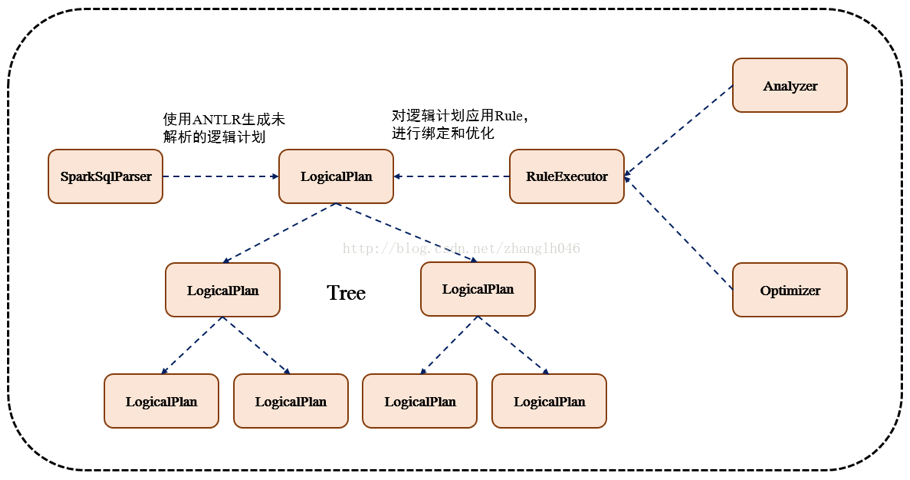

整个流程架构图：
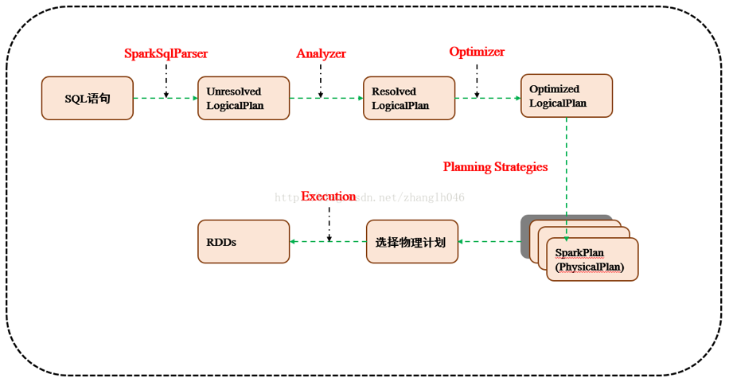

## 7.2 Spark SQL运行原理

### 7.2.1 使用SessionCatalog保存元数据

在解析SQL语句之前，会创建SparkSession，或者如果是2.0之前的版本初始化SQLContext，SparkSession只是封装了SparkContext和SQLContext的创建而已。会把元数据保存在SessionCatalog中，涉及到表名，字段名称和字段类型。创建临时表或者视图，其实就会往SessionCatalog注册

### 7.2.2 解析SQL,使用ANTLR生成未绑定的逻辑计划
当调用SparkSession的sql或者SQLContext的sql方法，我们以2.0为准，就会使用SparkSqlParser进行解析SQL. 使用的ANTLR进行词法解析和语法解析。它分为2个步骤来生成Unresolved LogicalPlan：

1. 词法分析：Lexical Analysis，负责将token分组成符号类
2. 构建一个分析树或者语法树AST

### 7.2.3 使用分析器Analyzer绑定逻辑计划
在该阶段，Analyzer会使用Analyzer Rules，并结合SessionCatalog，对未绑定的逻辑计划进行解析，生成已绑定的逻辑计划。
 
### 7.2.3 使用优化器Optimizer优化逻辑计划
优化器也是会定义一套Rules，利用这些Rule对逻辑计划和Exepression进行迭代处理，从而使得树的节点进行和并和优化
 
### 7.2.4 使用SparkPlanner生成物理计划
SparkSpanner使用Planning Strategies，对优化后的逻辑计划进行转换，生成可以执行的物理计划SparkPlan.
 
### 7.2.5 使用QueryExecution执行物理计划
此时调用SparkPlan的execute方法，底层其实已经再触发JOB了，然后返回RDD


# 8. 实战

## 8.1 数据说明
数据集是货品交易数据集。


每个订单可能包含多个货品，每个订单可以产生多次交易，不同的货品有不同的单价。

## 8.2 加载数据
```
tbStock：
scala> case class tbStock(ordernumber:String,locationid:String,dateid:String) extends Serializable
defined class tbStock

scala> val tbStockRdd = spark.sparkContext.textFile("tbStock.txt")
tbStockRdd: org.apache.spark.rdd.RDD[String] = tbStock.txt MapPartitionsRDD[1] at textFile at <console>:23

scala> val tbStockDS = tbStockRdd.map(_.split(",")).map(attr=>tbStock(attr(0),attr(1),attr(2))).toDS
tbStockDS: org.apache.spark.sql.Dataset[tbStock] = [ordernumber: string, locationid: string ... 1 more field]

scala> tbStockDS.show()
+------------+----------+---------+
| ordernumber|locationid|   dataid|
+------------+----------+---------+
|BYSL00000893|      ZHAO|2007-8-23|
|BYSL00000897|      ZHAO|2007-8-24|
|BYSL00000898|      ZHAO|2007-8-25|
|BYSL00000899|      ZHAO|2007-8-26|
|BYSL00000900|      ZHAO|2007-8-26|
|BYSL00000901|      ZHAO|2007-8-27|
|BYSL00000902|      ZHAO|2007-8-27|
|BYSL00000904|      ZHAO|2007-8-28|
|BYSL00000905|      ZHAO|2007-8-28|
|BYSL00000906|      ZHAO|2007-8-28|
|BYSL00000907|      ZHAO|2007-8-29|
|BYSL00000908|      ZHAO|2007-8-30|
|BYSL00000909|      ZHAO| 2007-9-1|
|BYSL00000910|      ZHAO| 2007-9-1|
|BYSL00000911|      ZHAO|2007-8-31|
|BYSL00000912|      ZHAO| 2007-9-2|
|BYSL00000913|      ZHAO| 2007-9-3|
|BYSL00000914|      ZHAO| 2007-9-3|
|BYSL00000915|      ZHAO| 2007-9-4|
|BYSL00000916|      ZHAO| 2007-9-4|
+------------+----------+---------+
only showing top 20 rows

tbStockDetail:
scala> case class tbStockDetail(ordernumber:String, rownum:Int, itemid:String, number:Int, price:Double, amount:Double) extends Serializable
defined class tbStockDetail

scala> val tbStockDetailRdd = spark.sparkContext.textFile("tbStockDetail.txt")
tbStockDetailRdd: org.apache.spark.rdd.RDD[String] = tbStockDetail.txt MapPartitionsRDD[13] at textFile at <console>:23

scala> val tbStockDetailDS = tbStockDetailRdd.map(_.split(",")).map(attr=> tbStockDetail(attr(0),attr(1).trim().toInt,attr(2),attr(3).trim().toInt,attr(4).trim().toDouble, attr(5).trim().toDouble)).toDS
tbStockDetailDS: org.apache.spark.sql.Dataset[tbStockDetail] = [ordernumber: string, rownum: int ... 4 more fields]

scala> tbStockDetailDS.show()
+------------+------+--------------+------+-----+------+
| ordernumber|rownum|        itemid|number|price|amount|
+------------+------+--------------+------+-----+------+
|BYSL00000893|     0|FS527258160501|    -1|268.0|-268.0|
|BYSL00000893|     1|FS527258169701|     1|268.0| 268.0|
|BYSL00000893|     2|FS527230163001|     1|198.0| 198.0|
|BYSL00000893|     3|24627209125406|     1|298.0| 298.0|
|BYSL00000893|     4|K9527220210202|     1|120.0| 120.0|
|BYSL00000893|     5|01527291670102|     1|268.0| 268.0|
|BYSL00000893|     6|QY527271800242|     1|158.0| 158.0|
|BYSL00000893|     7|ST040000010000|     8|  0.0|   0.0|
|BYSL00000897|     0|04527200711305|     1|198.0| 198.0|
|BYSL00000897|     1|MY627234650201|     1|120.0| 120.0|
|BYSL00000897|     2|01227111791001|     1|249.0| 249.0|
|BYSL00000897|     3|MY627234610402|     1|120.0| 120.0|
|BYSL00000897|     4|01527282681202|     1|268.0| 268.0|
|BYSL00000897|     5|84126182820102|     1|158.0| 158.0|
|BYSL00000897|     6|K9127105010402|     1|239.0| 239.0|
|BYSL00000897|     7|QY127175210405|     1|199.0| 199.0|
|BYSL00000897|     8|24127151630206|     1|299.0| 299.0|
|BYSL00000897|     9|G1126101350002|     1|158.0| 158.0|
|BYSL00000897|    10|FS527258160501|     1|198.0| 198.0|
|BYSL00000897|    11|ST040000010000|    13|  0.0|   0.0|
+------------+------+--------------+------+-----+------+
only showing top 20 rows

tbDate:
scala> case class tbDate(dateid:String, years:Int, theyear:Int, month:Int, day:Int, weekday:Int, week:Int, quarter:Int, period:Int, halfmonth:Int) extends Serializable
defined class tbDate

scala> val tbDateRdd = spark.sparkContext.textFile("tbDate.txt")
tbDateRdd: org.apache.spark.rdd.RDD[String] = tbDate.txt MapPartitionsRDD[20] at textFile at <console>:23

scala> val tbDateDS = tbDateRdd.map(_.split(",")).map(attr=> tbDate(attr(0),attr(1).trim().toInt, attr(2).trim().toInt,attr(3).trim().toInt, attr(4).trim().toInt, attr(5).trim().toInt, attr(6).trim().toInt, attr(7).trim().toInt, attr(8).trim().toInt, attr(9).trim().toInt)).toDS
tbDateDS: org.apache.spark.sql.Dataset[tbDate] = [dateid: string, years: int ... 8 more fields]

scala> tbDateDS.show()
+---------+------+-------+-----+---+-------+----+-------+------+---------+
|   dateid| years|theyear|month|day|weekday|week|quarter|period|halfmonth|
+---------+------+-------+-----+---+-------+----+-------+------+---------+
| 2003-1-1|200301|   2003|    1|  1|      3|   1|      1|     1|        1|
| 2003-1-2|200301|   2003|    1|  2|      4|   1|      1|     1|        1|
| 2003-1-3|200301|   2003|    1|  3|      5|   1|      1|     1|        1|
| 2003-1-4|200301|   2003|    1|  4|      6|   1|      1|     1|        1|
| 2003-1-5|200301|   2003|    1|  5|      7|   1|      1|     1|        1|
| 2003-1-6|200301|   2003|    1|  6|      1|   2|      1|     1|        1|
| 2003-1-7|200301|   2003|    1|  7|      2|   2|      1|     1|        1|
| 2003-1-8|200301|   2003|    1|  8|      3|   2|      1|     1|        1|
| 2003-1-9|200301|   2003|    1|  9|      4|   2|      1|     1|        1|
|2003-1-10|200301|   2003|    1| 10|      5|   2|      1|     1|        1|
|2003-1-11|200301|   2003|    1| 11|      6|   2|      1|     2|        1|
|2003-1-12|200301|   2003|    1| 12|      7|   2|      1|     2|        1|
|2003-1-13|200301|   2003|    1| 13|      1|   3|      1|     2|        1|
|2003-1-14|200301|   2003|    1| 14|      2|   3|      1|     2|        1|
|2003-1-15|200301|   2003|    1| 15|      3|   3|      1|     2|        1|
|2003-1-16|200301|   2003|    1| 16|      4|   3|      1|     2|        2|
|2003-1-17|200301|   2003|    1| 17|      5|   3|      1|     2|        2|
|2003-1-18|200301|   2003|    1| 18|      6|   3|      1|     2|        2|
|2003-1-19|200301|   2003|    1| 19|      7|   3|      1|     2|        2|
|2003-1-20|200301|   2003|    1| 20|      1|   4|      1|     2|        2|
+---------+------+-------+-----+---+-------+----+-------+------+---------+
only showing top 20 rows

注册表：
scala> tbStockDS.createOrReplaceTempView("tbStock")

scala> tbDateDS.createOrReplaceTempView("tbDate")

scala> tbStockDetailDS.createOrReplaceTempView("tbStockDetail")
```

## 8.3 计算所有订单中每年的销售单数、销售总额
统计所有订单中每年的销售单数、销售总额
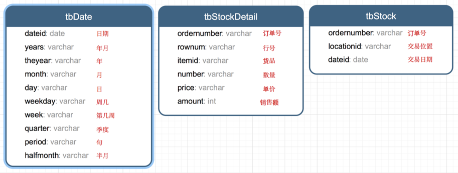

三个表连接后以count(distinct a.ordernumber)计销售单数，sum(b.amount)计销售总额
```
SELECT c.theyear, COUNT(DISTINCT a.ordernumber), SUM(b.amount)
FROM tbStock a
	JOIN tbStockDetail b ON a.ordernumber = b.ordernumber
	JOIN tbDate c ON a.dateid = c.dateid
GROUP BY c.theyear
ORDER BY c.theyear

spark.sql("SELECT c.theyear, COUNT(DISTINCT a.ordernumber), SUM(b.amount) FROM tbStock a JOIN tbStockDetail b ON a.ordernumber = b.ordernumber JOIN tbDate c ON a.dateid = c.dateid GROUP BY c.theyear ORDER BY c.theyear").show

结果如下：
+-------+---------------------------+--------------------+                      
|theyear|count(DISTINCT ordernumber)|         sum(amount)|
+-------+---------------------------+--------------------+
|   2004|                       1094|   3268115.499199999|
|   2005|                       3828|1.3257564149999991E7|
|   2006|                       3772|1.3680982900000006E7|
|   2007|                       4885|1.6719354559999993E7|
|   2008|                       4861| 1.467429530000001E7|
|   2009|                       2619|   6323697.189999999|
|   2010|                         94|  210949.65999999997|
+-------+---------------------------+--------------------+
```

8.4 计算所有订单每年最大金额订单的销售额
目标：统计每年最大金额订单的销售额:


1）统计每年，每个订单一共有多少销售额
```
SELECT a.dateid, a.ordernumber, SUM(b.amount) AS SumOfAmount
FROM tbStock a
	JOIN tbStockDetail b ON a.ordernumber = b.ordernumber
GROUP BY a.dateid, a.ordernumber

spark.sql("SELECT a.dateid, a.ordernumber, SUM(b.amount) AS SumOfAmount FROM tbStock a JOIN tbStockDetail b ON a.ordernumber = b.ordernumber GROUP BY a.dateid, a.ordernumber").show
结果如下：
+----------+------------+------------------+
|    dateid| ordernumber|       SumOfAmount|
+----------+------------+------------------+
|  2008-4-9|BYSL00001175|             350.0|
| 2008-5-12|BYSL00001214|             592.0|
| 2008-7-29|BYSL00011545|            2064.0|
|  2008-9-5|DGSL00012056|            1782.0|
| 2008-12-1|DGSL00013189|             318.0|
|2008-12-18|DGSL00013374|             963.0|
|  2009-8-9|DGSL00015223|            4655.0|
| 2009-10-5|DGSL00015585|            3445.0|
| 2010-1-14|DGSL00016374|            2934.0|
| 2006-9-24|GCSL00000673|3556.1000000000004|
| 2007-1-26|GCSL00000826| 9375.199999999999|
| 2007-5-24|GCSL00001020| 6171.300000000002|
|  2008-1-8|GCSL00001217|            7601.6|
| 2008-9-16|GCSL00012204|            2018.0|
| 2006-7-27|GHSL00000603|            2835.6|
|2006-11-15|GHSL00000741|           3951.94|
|  2007-6-6|GHSL00001149|               0.0|
| 2008-4-18|GHSL00001631|              12.0|
| 2008-7-15|GHSL00011367|             578.0|
|  2009-5-8|GHSL00014637|            1797.6|
+----------+------------+------------------+
```

2）以上一步查询结果为基础表，和表tbDate使用dateid join，求出每年最大金额订单的销售额
```
SELECT theyear, MAX(c.SumOfAmount) AS SumOfAmount
FROM (SELECT a.dateid, a.ordernumber, SUM(b.amount) AS SumOfAmount
	FROM tbStock a
		JOIN tbStockDetail b ON a.ordernumber = b.ordernumber
	GROUP BY a.dateid, a.ordernumber
	) c
	JOIN tbDate d ON c.dateid = d.dateid
GROUP BY theyear
ORDER BY theyear DESC

spark.sql("SELECT theyear, MAX(c.SumOfAmount) AS SumOfAmount FROM (SELECT a.dateid, a.ordernumber, SUM(b.amount) AS SumOfAmount FROM tbStock a JOIN tbStockDetail b ON a.ordernumber = b.ordernumber GROUP BY a.dateid, a.ordernumber ) c JOIN tbDate d ON c.dateid = d.dateid GROUP BY theyear ORDER BY theyear DESC").show
结果如下：
+-------+------------------+                                                    
|theyear|       SumOfAmount|
+-------+------------------+
|   2010|13065.280000000002|
|   2009|25813.200000000008|
|   2008|           55828.0|
|   2007|          159126.0|
|   2006|           36124.0|
|   2005|38186.399999999994|
|   2004| 23656.79999999997|
+-------+------------------+
```

## 8.5 计算所有订单中每年最畅销货品
目标：统计每年最畅销货品（哪个货品销售额amount在当年最高，哪个就是最畅销货品）

第一步、求出每年每个货品的销售额
```
SELECT c.theyear, b.itemid, SUM(b.amount) AS SumOfAmount
FROM tbStock a
	JOIN tbStockDetail b ON a.ordernumber = b.ordernumber
	JOIN tbDate c ON a.dateid = c.dateid
GROUP BY c.theyear, b.itemid

spark.sql("SELECT c.theyear, b.itemid, SUM(b.amount) AS SumOfAmount FROM tbStock a JOIN tbStockDetail b ON a.ordernumber = b.ordernumber JOIN tbDate c ON a.dateid = c.dateid GROUP BY c.theyear, b.itemid").show
结果如下：
+-------+--------------+------------------+                                     
|theyear|        itemid|       SumOfAmount|
+-------+--------------+------------------+
|   2004|43824480810202|           4474.72|
|   2006|YA214325360101|             556.0|
|   2006|BT624202120102|             360.0|
|   2007|AK215371910101|24603.639999999992|
|   2008|AK216169120201|29144.199999999997|
|   2008|YL526228310106|16073.099999999999|
|   2009|KM529221590106| 5124.800000000001|
|   2004|HT224181030201|2898.6000000000004|
|   2004|SG224308320206|           7307.06|
|   2007|04426485470201|14468.800000000001|
|   2007|84326389100102|           9134.11|
|   2007|B4426438020201|           19884.2|
|   2008|YL427437320101|12331.799999999997|
|   2008|MH215303070101|            8827.0|
|   2009|YL629228280106|           12698.4|
|   2009|BL529298020602|            2415.8|
|   2009|F5127363019006|             614.0|
|   2005|24425428180101|          34890.74|
|   2007|YA214127270101|             240.0|
|   2007|MY127134830105|          11099.92|
+-------+--------------+------------------+
```

第二步、在第一步的基础上，统计每年单个货品中的最大金额
```
SELECT d.theyear, MAX(d.SumOfAmount) AS MaxOfAmount
FROM (SELECT c.theyear, b.itemid, SUM(b.amount) AS SumOfAmount
	FROM tbStock a
		JOIN tbStockDetail b ON a.ordernumber = b.ordernumber
		JOIN tbDate c ON a.dateid = c.dateid
	GROUP BY c.theyear, b.itemid
	) d
GROUP BY d.theyear

spark.sql("SELECT d.theyear, MAX(d.SumOfAmount) AS MaxOfAmount FROM (SELECT c.theyear, b.itemid, SUM(b.amount) AS SumOfAmount FROM tbStock a JOIN tbStockDetail b ON a.ordernumber = b.ordernumber JOIN tbDate c ON a.dateid = c.dateid GROUP BY c.theyear, b.itemid ) d GROUP BY d.theyear").show
结果如下：
+-------+------------------+                                                    
|theyear|       MaxOfAmount|
+-------+------------------+
|   2007|           70225.1|
|   2006|          113720.6|
|   2004|53401.759999999995|
|   2009|           30029.2|
|   2005|56627.329999999994|
|   2010|            4494.0|
|   2008| 98003.60000000003|
+-------+------------------+
```

第三步、用最大销售额和统计好的每个货品的销售额join，以及用年join，集合得到最畅销货品那一行信息
```
SELECT DISTINCT e.theyear, e.itemid, f.MaxOfAmount
FROM (SELECT c.theyear, b.itemid, SUM(b.amount) AS SumOfAmount
	FROM tbStock a
		JOIN tbStockDetail b ON a.ordernumber = b.ordernumber
		JOIN tbDate c ON a.dateid = c.dateid
	GROUP BY c.theyear, b.itemid
	) e
	JOIN (SELECT d.theyear, MAX(d.SumOfAmount) AS MaxOfAmount
		FROM (SELECT c.theyear, b.itemid, SUM(b.amount) AS SumOfAmount
			FROM tbStock a
				JOIN tbStockDetail b ON a.ordernumber = b.ordernumber
				JOIN tbDate c ON a.dateid = c.dateid
			GROUP BY c.theyear, b.itemid
			) d
		GROUP BY d.theyear
		) f ON e.theyear = f.theyear
		AND e.SumOfAmount = f.MaxOfAmount
ORDER BY e.theyear

spark.sql("SELECT DISTINCT e.theyear, e.itemid, f.maxofamount FROM (SELECT c.theyear, b.itemid, SUM(b.amount) AS sumofamount FROM tbStock a JOIN tbStockDetail b ON a.ordernumber = b.ordernumber JOIN tbDate c ON a.dateid = c.dateid GROUP BY c.theyear, b.itemid ) e JOIN (SELECT d.theyear, MAX(d.sumofamount) AS maxofamount FROM (SELECT c.theyear, b.itemid, SUM(b.amount) AS sumofamount FROM tbStock a JOIN tbStockDetail b ON a.ordernumber = b.ordernumber JOIN tbDate c ON a.dateid = c.dateid GROUP BY c.theyear, b.itemid ) d GROUP BY d.theyear ) f ON e.theyear = f.theyear AND e.sumofamount = f.maxofamount ORDER BY e.theyear").show

# 结果如下：

+-------+--------------+------------------+                                     
|theyear|        itemid|       maxofamount|
+-------+--------------+------------------+
|   2004|JY424420810101|53401.759999999995|
|   2005|24124118880102|56627.329999999994|
|   2006|JY425468460101|          113720.6|
|   2007|JY425468460101|           70225.1|
|   2008|E2628204040101| 98003.60000000003|
|   2009|YL327439080102|           30029.2|
|   2010|SQ429425090101|            4494.0|
+-------+--------------+------------------+

```


### [跳至下一章](./A6_spark-streaming.md)


