# 6. Spark-streaming

### [跳至上一章](./A5_spark-sql.md)

# 第1章	Spark Streaming概述
## 1.1	什么是Spark Streaming
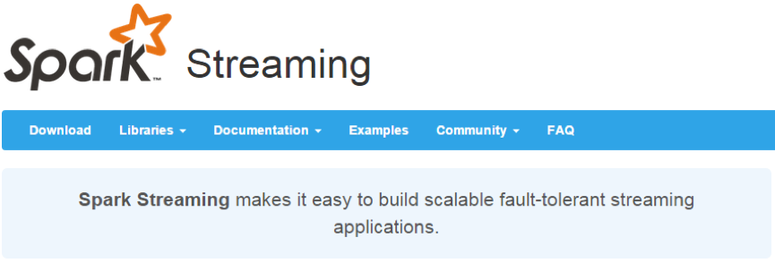

Spark Streaming类似于Apache Storm，用于流式数据的处理。根据其官方文档介绍，Spark Streaming有高吞吐量和容错能力强等特点。Spark Streaming支持的数据输入源很多，例如：Kafka、Flume、Twitter、ZeroMQ和简单的TCP套接字等等。数据输入后可以用Spark的高度抽象原语如：map、reduce、join、window等进行运算。而结果也能保存在很多地方，如HDFS，数据库等。另外Spark Streaming也能和MLlib（机器学习）以及Graphx完美融合。


和Spark基于RDD的概念很相似，Spark Streaming使用离散化流(discretized stream)作为抽象表示，叫作DStream。DStream 是随时间推移而收到的数据的序列。在内部，每个时间区间收到的数据都作为 RDD 存在，而 DStream 是由这些 RDD 所组成的序列(因此 得名“离散化”)。


DStream 可以从各种输入源创建，比如 Flume、Kafka 或者 HDFS。创建出来的DStream 支持两种操作，一种是转化操作(transformation)，会生成一个新的DStream，另一种是输出操作(output operation)，可以把数据写入外部系统中。DStream 提供了许多与 RDD 所支持的操作相类似的操作支持，还增加了与时间相关的新操作，比如滑动窗口。 

## 1.2	为什么要学习Spark Streaming

易用
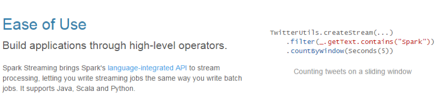

容错
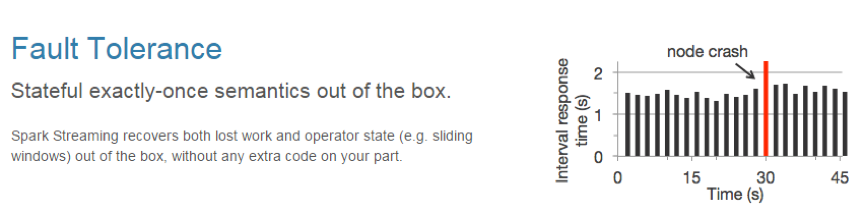

易整合到Spark体系


## 1.3	Spark与Storm的对比
| Spark | Storm |
|----|----|
|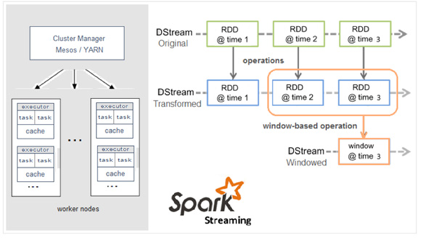|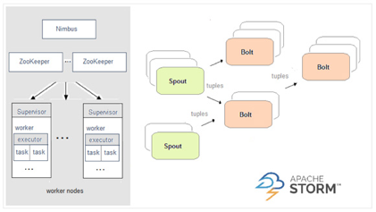|
| 开发语言：Scala  | 开发语言：Clojure |
| 编程模型：DStream| 编程模型：Spout/Bolt|
|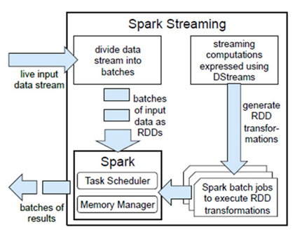|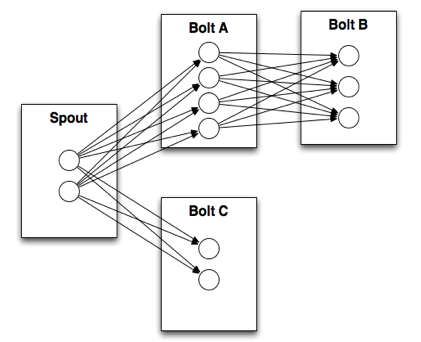|


# 第2章	运行Spark Streaming
## 2.1	IDEA编写程序
Pom.xml 加入以下依赖：
```
<dependency>

    <groupId>org.apache.spark</groupId>

    <artifactId>spark-streaming_2.11</artifactId>

    <version>${spark.version}</version>

    <scope>provided</scope>
</dependency>
```
```
package com.atguigu.streaming

import org.apache.spark.SparkConf

import org.apache.spark.streaming.{Seconds, StreamingContext}



object WorldCount {
  def main(args: Array[String]) {


   val conf = new SparkConf().setMaster("local[2]").setAppName("NetworkWordCount")

    val ssc = new StreamingContext(conf, Seconds(1))


   // Create a DStream that will connect to hostname:port, like localhost:9999

    val lines = ssc.socketTextStream("master01", 9999)


   // Split each line into words

    val words = lines.flatMap(_.split(" "))


   //import org.apache.spark.streaming.StreamingContext._ // not necessary since Spark 1.3

    // Count each word in each batch

     val pairs = words.map(word => (word, 1))

     val wordCounts = pairs.reduceByKey(_ + _)


   // Print the first ten elements of each RDD generated in this DStream to the console

    wordCounts.print()


   ssc.start()             
     // Start the computation
    
     ssc.awaitTermination()  
    // Wait for the computation to terminate
  
    }

}
```
按照Spark Core中的方式进行打包，并将程序上传到Spark机器上。并运行：
```
bin/spark-submit --class com.atguigu.streaming.WorldCount ~/wordcount-jar-with-dependencies.jar
```
通过Netcat发送数据：
```
# TERMINAL 1:

# Running Netcat



$ nc -lk 9999

hello world
```

如果程序运行时，log日志太多，可以将spark conf目录下的log4j文件里面的日志级别改成WARN。


# 第3章	架构与抽象
 Spark Streaming使用“微批次”的架构，把流式计算当作一系列连续的小规模批处理来对待。Spark Streaming从各种输入源中读取数据，并把数据分组为小的批次。新的批次按均匀的时间间隔创建出来。在每个时间区间开始的时候，一个新的批次就创建出来，在该区间内收到的数据都会被添加到这个批次中。在时间区间结束时，批次停止增长。时间区间的大小是由批次间隔这个参数决定的。批次间隔一般设在500毫秒到几秒之间，由应用开发者配置。每个输入批次都形成一个RDD，以 Spark 作业的方式处理并生成其他的 RDD。 处理的结果可以以批处理的方式传给外部系统。高层次的架构如图 

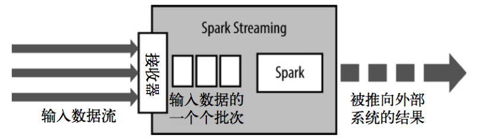
Spark Streaming的编程抽象是离散化流，也就是DStream。它是一个 RDD 序列，每个RDD代表数据流中一个时间片内的数据。 
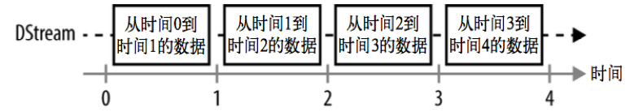

Spark Streaming在Spark的驱动器程序—工作节点的结构的执行过程如下图所示。Spark Streaming为每个输入源启动对 应的接收器。接收器以任务的形式运行在应用的执行器进程中，从输入源收集数据并保存为 RDD。它们收集到输入数据后会把数据复制到另一个执行器进程来保障容错性(默 认行为)。数据保存在执行器进程的内存中，和缓存 RDD 的方式一样。驱动器程序中的 StreamingContext 会周期性地运行 Spark 作业来处理这些数据，把数据与之前时间区间中的 RDD 进行整合。 


第4章	Spark Streaming解析
4.1	初始化StreamingContext
```
import org.apache.spark._

import org.apache.spark.streaming._


val conf = new SparkConf().setAppName(appName).setMaster(master)

val ssc = new StreamingContext(conf, Seconds(1))

// 可以通过ssc.sparkContext 来访问SparkContext

// 或者通过已经存在的SparkContext来创建StreamingContext

import org.apache.spark.streaming._


val sc = ...                
// existing SparkContext

val ssc = new StreamingContext(sc, Seconds(1))
```

初始化完Context之后：
1)	定义消息输入源来创建DStreams.
2)	定义DStreams的转化操作和输出操作。
3)	通过 streamingContext.start()来启动消息采集和处理.
4)	等待程序终止，可以通过streamingContext.awaitTermination()来设置
5)	通过streamingContext.stop()来手动终止处理程序。

StreamingContext和SparkContext什么关系？
```
import org.apache.spark.streaming._
val sc = ...                // existing SparkContext
val ssc = new StreamingContext(sc, Seconds(1))
```


注意：
1. StreamingContext一旦启动，对DStreams的操作就不能修改了。
2. 在同一时间一个JVM中只有一个StreamingContext可以启动
3. stop() 方法将同时停止SparkContext，可以传入参数stopSparkContext用于只停止StreamingContext
4. 在Spark1.4版本后，如何优雅的停止SparkStreaming而不丢失数据，通过设置sparkConf.set("spark.streaming.stopGracefullyOnShutdown","true") 即可。在StreamingContext的start方法中已经注册了Hook方法。

## 4.2	什么是DStreams
Discretized Stream是Spark Streaming的基础抽象，代表持续性的数据流和经过各种Spark原语操作后的结果数据流。在内部实现上，DStream是一系列连续的RDD来表示。每个RDD含有一段时间间隔内的数据，如下图：
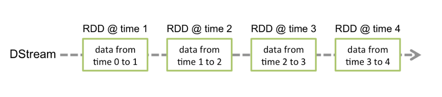
对数据的操作也是按照RDD为单位来进行的
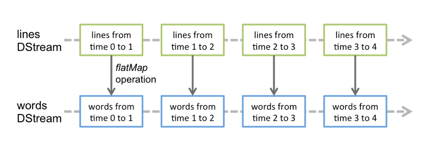

计算过程由Spark engine来完成
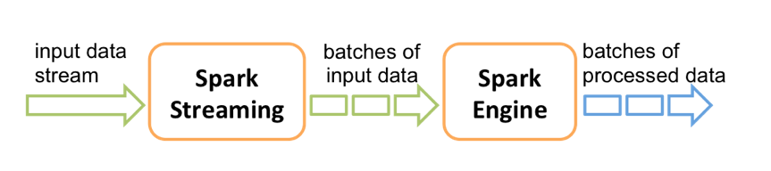

## 4.3	DStreams输入
Spark Streaming原生支持一些不同的数据源。一些“核心”数据源已经被打包到Spark Streaming 的 Maven 工件中，而其他的一些则可以通过 spark-streaming-kafka 等附加工件获取。每个接收器都以 Spark 执行器程序中一个长期运行的任务的形式运行，因此会占据分配给应用的 CPU 核心。此外，我们还需要有可用的 CPU 核心来处理数据。这意味着如果要运行多个接收器，就必须至少有和接收器数目相同的核心数，还要加上用来完成计算所需要的核心数。例如，如果我们想要在流计算应用中运行 10 个接收器，那么至少需要为应用分配 11 个 CPU 核心。所以如果在本地模式运行，不要使用local或者local[1]。

### 4.3.1	基本数据源
#### 4.3.1.1 	文件数据源
Socket数据流前面的例子已经看到过。
文件数据流：能够读取所有HDFS API兼容的文件系统文件，通过fileStream方法进行读取
```
streamingContext.fileStream[KeyClass, ValueClass, InputFormatClass](dataDirectory)
```

Spark Streaming 将会监控 dataDirectory 目录并不断处理移动进来的文件，记住目前不支持嵌套目录。

文件需要有相同的数据格式

文件进入 dataDirectory的方式需要通过移动或者重命名来实现。

一旦文件移动进目录，则不能再修改，即便修改了也不会读取新数据。

如果文件比较简单，则可以使用 streamingContext.textFileStream(dataDirectory)方法来读取文件。文件流不需要接收器，不需要单独分配CPU核。

Hdfs读取实例：提前需要在HDFS上建好目录。
```
scala> import org.apache.spark.streaming._
import org.apache.spark.streaming._

scala> val ssc = new StreamingContext(sc, Seconds(1))
ssc: org.apache.spark.streaming.StreamingContext = org.apache.spark.streaming.StreamingContext@4027edeb

scala> val lines = ssc.textFileStream("hdfs://master01:9000/data/")
lines: org.apache.spark.streaming.dstream.DStream[String] = org.apache.spark.streaming.dstream.MappedDStream@61d9dd15

scala> val words = lines.flatMap(_.split(" "))
words: org.apache.spark.streaming.dstream.DStream[String] = org.apache.spark.streaming.dstream.FlatMappedDStream@1e084a26

scala> val wordCounts = words.map(x => (x, 1)).reduceByKey(_ + _)
wordCounts: org.apache.spark.streaming.dstream.DStream[(String, Int)] = org.apache.spark.streaming.dstream.ShuffledDStream@8947a4b

scala> wordCounts.print()

scala> ssc.start()
```
上传文件上去：
```
[bigdata@master01 hadoop-2.7.3]$ ls
 bin  data  etc  include  lib  libexec  LICENSE.txt  logs  NOTICE.txt  README.txt  sbin  sdata  share
[bigdata@master01 hadoop-2.7.3]$ bin/hdfs dfs -put ./LICENSE.txt /data/
[bigdata@master01 hadoop-2.7.3]$ bin/hdfs dfs -put ./README.txt /data/


获取计算结果：
-------------------------------------------
Time: 1504665716000 ms
-------------------------------------------
-------------------------------------------
Time: 1504665717000 ms
-------------------------------------------
-------------------------------------------
Time: 1504665718000 ms
-------------------------------------------
(227.7202-1,2)
(created,2)
(offer,8)
(BUSINESS,11)
(agree,10)
(hereunder,,1)
(“control”,1)
(Grant,2)
(2.2.,2)
(include,11)
...
-------------------------------------------
Time: 1504665719000 ms
-------------------------------------------
Time: 1504665739000 ms
-------------------------------------------
-------------------------------------------
Time: 1504665740000 ms
-------------------------------------------
(under,1)
(Technology,1)
(distribution,2)
(http://hadoop.apache.org/core/,1)
(Unrestricted,1)
(740.13),1)
(check,1)
(have,1)
(policies,1)
(uses,1)
...
-------------------------------------------
Time: 1504665741000 ms
-------------------------------------------
```

#### 4.3.1.2 	自定义数据源
通过继承Receiver，并实现onStart、onStop方法来自定义数据源采集。

```
class CustomReceiver(host: String, port: Int) extends Receiver[String](StorageLevel.MEMORY_AND_DISK_2) with Logging {
  def onStart() {
    // Start the thread that receives data over a connection

    new Thread("Socket Receiver") {
      override def run() {
        receive()
      }
    }.start()
  }

  /** Create a socket connection and receive data until receiver is stopped */
  private def receive() {
    var socket: Socket = null
    var userInput: String = null
    try {
      // Connect to host:port
      
      socket = new Socket(host, port)
      // Until stopped or connection broken continue reading
      
      val reader = new BufferedReader(
        new InputStreamReader(socket.getInputStream(), StandardCharsets.UTF_8))
      userInput = reader.readLine()
      while (!isStopped && userInput != null) {
        store(userInput)
        userInput = reader.readLine()
      }
      reader.close()
      socket.close()
      // Restart in an attempt to connect again when server is active again

      restart("Trying to connect again")
    } catch {
      case e: java.net.ConnectException =>
        // restart if could not connect to server
        
        restart("Error connecting to " + host + ":" + port, e)
      case t: Throwable =>
        // restart if there is any other error

        restart("Error receiving data", t)
    }
  }

  def onStop() {
    // There is nothing much to do as the thread calling receive()

    // is designed to stop by itself if isStopped() returns false

  }
}

```
可以通过streamingContext.receiverStream(<instance of custom receiver>)
来使用自定义的数据采集源
```
// Assuming ssc is the StreamingContext

val customReceiverStream = ssc.receiverStream(new CustomReceiver(host, port))

val words = lines.flatMap(_.split(" "))

...
```

模拟Spark内置的Socket链接：
```
import java.io.{BufferedReader, InputStreamReader}
import java.net.Socket
import java.nio.charset.StandardCharsets
import org.apache.spark.SparkConf
import org.apache.spark.storage.StorageLevel
import org.apache.spark.streaming.{Seconds, StreamingContext}
import org.apache.spark.streaming.receiver.Receiver

class CustomReceiver(host: String, port: Int) extends Receiver[String](StorageLevel.MEMORY_AND_DISK_2) {
  override def onStart(): Unit = {
    // Start the thread that receives data over a connection

    new Thread("Socket Receiver") {
      override def run() {

        receive()
      }
    }.start()
  }

  override def onStop(): Unit = {
    // There is nothing much to do as the thread calling
    receive()
    // is designed to stop by itself
    if isStopped() returns false
  }

  /** Create a socket connection and receive data until receiver is stopped */
  private

  def receive() {
    var socket: Socket = null
    var userInput: String = null
    try {
      // Connect to host:port

      socket = new Socket(host, port)
      // Until stopped or connection broken continue reading
      val reader = new BufferedReader(new InputStreamReader(socket.getInputStream(), StandardCharsets.UTF_8))
      userInput = reader.readLine()
      while (!isStopped && userInput != null) {
        // 传送出来

        store(userInput)
        userInput = reader.readLine()
      }
      reader.close()
      socket.close()
      // Restart in an attempt to connect again when server is active again

      restart("Trying to connect again")
    } catch {
      case e: java.net.ConnectException =>
        // restart if could not connect to server

        restart("Error connecting to " + host + ":" + port, e)
      case t: Throwable => // restart if there is any other error
        restart("Error receiving data", t)
    }
  }
}

object CustomReceiver {
  def main(args: Array[String]) {
    val conf = new SparkConf().setMaster("local[2]").setAppName("NetworkWordCount")
    val ssc = new StreamingContext(conf, Seconds(1))
    // Create a DStream that will connect to hostname:port, like localhost:9999

    val lines = ssc.receiverStream(new CustomReceiver("master01", 9999))
    // Split each line into words

    val words = lines.flatMap(_.split(" "))
    //import org.apache.spark.streaming.StreamingContext._
    // not necessary since Spark 1.3

    // Count each word in each batch

    val pairs = words.map(word => (word, 1))
    val wordCounts = pairs.reduceByKey(_ + _)
    // Print the first ten elements of each RDD generated in this DStream to the console

    wordCounts.print()
    ssc.start()
    // Start the computation

    ssc.awaitTermination()
    // Wait for the computation to terminate
    //ssc.stop()

  }
}

```
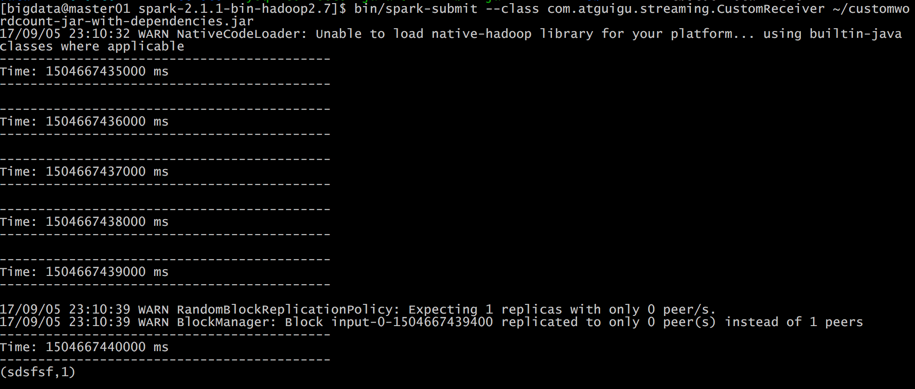
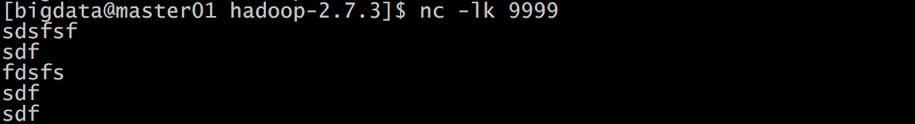


#### 4.3.1.3 	RDD队列
 测试过程中，可以通过使用streamingContext.queueStream(queueOfRDDs)来创建DStream，每一个推送到这个队列中的RDD，都会作为一个DStream处理。
```

import org.apache.spark.SparkConf
import org.apache.spark.rdd.RDD
import org.apache.spark.streaming.{Seconds, StreamingContext}
import scala.collection.mutable

object QueueRdd {
  def main(args: Array[String]) {
    val conf = new SparkConf().setMaster("local[2]").setAppName("QueueRdd")
    val ssc = new StreamingContext(conf, Seconds(1))
    // Create the queue through which RDDs can be pushed to

    // a QueueInputDStream

    // 创建RDD队列

    val rddQueue = new mutable.SynchronizedQueue[RDD[Int]]()
    // Create the QueueInputDStream and use it do some processing

    // 创建QueueInputDStream

    val inputStream = ssc.queueStream(rddQueue)
    //处理队列中的RDD数据

    val mappedStream = inputStream.map(x => (x % 10, 1))
    val reducedStream = mappedStream.reduceByKey(_ + _)
    //打印结果

    reducedStream.print()
    //启动计算

    ssc.start()
    // Create and push some RDDs into

    for (i <- 1 to 30) {
      rddQueue += ssc.sparkContext.makeRDD(1 to 300, 10)
      Thread.sleep(2000)
      //通过程序停止StreamingContext的运行
      //ssc.stop()

    }
  }
}

```

```
[bigdata@master01 spark-2.1.1-bin-hadoop2.7]$ bin/spark-submit --class com.atguigu.streaming.QueueRdd ~/queueRdd-jar-with-dependencies.jar
17/09/05 23:28:03 WARN NativeCodeLoader: Unable to load native-hadoop library for your platform... using builtin-java classes where applicable
-------------------------------------------
Time: 1504668485000 ms
-------------------------------------------
(4,30)
(0,30)
(6,30)
(8,30)
(2,30)
(1,30)
(3,30)
(7,30)
(9,30)
(5,30)

-------------------------------------------
Time: 1504668486000 ms
-------------------------------------------

-------------------------------------------
Time: 1504668487000 ms
-------------------------------------------
(4,30)
(0,30)
(6,30)
(8,30)
(2,30)
(1,30)
(3,30)
(7,30)
(9,30)
(5,30)
```

### 4.3.2	高级数据源
除核心数据源外，还可以用附加数据源接收器来从一些知名数据获取系统中接收的数据，这些接收器都作为Spark Streaming的组件进行独立打包了。它们仍然是Spark的一部分，不过你需要在构建文件中添加额外的包才能使用它们。现有的接收器包括 Twitter、Apache Kafka、Amazon Kinesis、Apache Flume，以及ZeroMQ。可以通过添加与Spark版本匹配 的 Maven 工件 spark-streaming-[projectname]_2.10 来引入这些附加接收器。 
#### 4.3.2.1 	Apache Kafka
在工程中需要引入 Maven 工件 spark- streaming-kafka_2.10 来使用它。包内提供的 KafkaUtils 对象可以在 StreamingContext 和 JavaStreamingContext 中以你的 Kafka 消息创建出 DStream。由于 KafkaUtils 可以订阅多个主题，因此它创建出的 DStream 由成对的主题和消息组成。要创建出一个流数据，需 要使用 StreamingContext 实例、一个由逗号隔开的 ZooKeeper 主机列表字符串、消费者组的名字(唯一名字)，以及一个从主题到针对这个主题的接收器线程数的映射表来调用 createStream() 方法
```

import org.apache.spark.streaming.kafka._

...


// 创建一个从主题到接收器线程数的映射表


val topics = List(("pandas", 1), ("logs", 1)).toMap


val topicLines = KafkaUtils.createStream(ssc, zkQuorum, group, topics) 

topicLines.map(_._2)
```
下面我们进行一个实例，演示SparkStreaming如何从Kafka读取消息，如果通过连接池方法把消息处理完成后再写会Kafka：
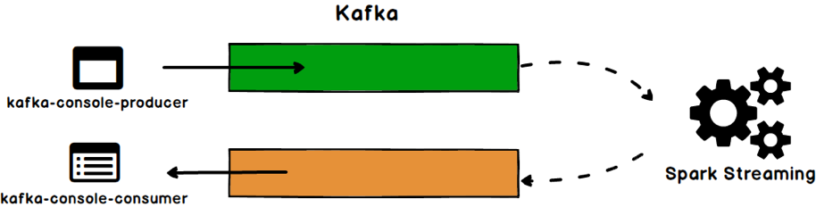

kafka Connection Pool程序：
```
package com.atguigu.streaming
import java.util.Properties
import org.apache.commons.pool2.impl.DefaultPooledObject
import org.apache.commons.pool2.{BasePooledObjectFactory, PooledObject}
import org.apache.kafka.clients.producer.{KafkaProducer, ProducerRecord}

case class KafkaProducerProxy(brokerList: String,
                            producerConfig: Properties = new Properties,
                            defaultTopic: Option[String] = None,
                            producer: Option[KafkaProducer[String, String]] = None) {

  type Key = String
  type Val = String

  require(brokerList == null || !brokerList.isEmpty, "Must set broker list")

  private val p = producer getOrElse {

    var props:Properties= new Properties();
    props.put("bootstrap.servers", brokerList);
    props.put("key.serializer", "org.apache.kafka.common.serialization.StringSerializer");
    props.put("value.serializer", "org.apache.kafka.common.serialization.StringSerializer");

    new KafkaProducer[String,String](props)
  }


  private def toMessage(value: Val, key: Option[Key] = None, topic: Option[String] = None): ProducerRecord[Key, Val] = {
    val t = topic.getOrElse(defaultTopic.getOrElse(throw new IllegalArgumentException("Must provide topic or default topic")))
    require(!t.isEmpty, "Topic must not be empty")
    key match {
      case Some(k) => new ProducerRecord(t, k, value)
      case _ => new ProducerRecord(t, value)
    }
  }

  def send(key: Key, value: Val, topic: Option[String] = None) {
    p.send(toMessage(value, Option(key), topic))
  }

  def send(value: Val, topic: Option[String]) {
    send(null, value, topic)
  }

  def send(value: Val, topic: String) {
    send(null, value, Option(topic))
  }

  def send(value: Val) {
    send(null, value, None)
  }

  def shutdown(): Unit = p.close()

}


abstract class KafkaProducerFactory(brokerList: String, config: Properties, topic: Option[String] = None) extends Serializable {

  def newInstance(): KafkaProducerProxy
}

class BaseKafkaProducerFactory(brokerList: String,
                                  config: Properties = new Properties,
                                  defaultTopic: Option[String] = None)
  extends KafkaProducerFactory(brokerList, config, defaultTopic) {

  override def newInstance() = new KafkaProducerProxy(brokerList, config, defaultTopic)

}


class PooledKafkaProducerAppFactory(val factory: KafkaProducerFactory)
  extends BasePooledObjectFactory[KafkaProducerProxy] with Serializable {

  override def create(): KafkaProducerProxy = factory.newInstance()

  override def wrap(obj: KafkaProducerProxy): PooledObject[KafkaProducerProxy] = new DefaultPooledObject(obj)

  override def destroyObject(p: PooledObject[KafkaProducerProxy]): Unit = {
    p.getObject.shutdown()
    super.destroyObject(p)
  }
}
```
KafkaStreaming main:
```
package com.atguigu.streaming

import org.apache.commons.pool2.impl.{GenericObjectPool, GenericObjectPoolConfig}
import org.apache.kafka.clients.consumer.ConsumerRecord
import org.apache.kafka.common.serialization.StringDeserializer
import org.apache.spark.SparkConf
import org.apache.spark.api.java.function.VoidFunction
import org.apache.spark.rdd.RDD
import org.apache.spark.streaming.kafka010.{ConsumerStrategies, KafkaUtils, LocationStrategies}
import org.apache.spark.streaming.{Seconds, StreamingContext}

object createKafkaProducerPool{

  def apply(brokerList: String, topic: String):  GenericObjectPool[KafkaProducerProxy] = {
    val producerFactory = new BaseKafkaProducerFactory(brokerList, defaultTopic = Option(topic))
    val pooledProducerFactory = new PooledKafkaProducerAppFactory(producerFactory)
    val poolConfig = {
      val c = new GenericObjectPoolConfig
      val maxNumProducers = 10
      c.setMaxTotal(maxNumProducers)
      c.setMaxIdle(maxNumProducers)
      c
    }
    new GenericObjectPool[KafkaProducerProxy](pooledProducerFactory, poolConfig)
  }
}

object KafkaStreaming{

  def main(args: Array[String]) {

    val conf = new SparkConf().setMaster("local[4]").setAppName("NetworkWordCount")
    val ssc = new StreamingContext(conf, Seconds(1))

    //创建topic
    val brobrokers = "172.16.148.150:9092,172.16.148.151:9092,172.16.148.152:9092"
    val sourcetopic="source";
    val targettopic="target";

    //创建消费者组
    var group="con-consumer-group"
    //消费者配置
    val kafkaParam = Map(
      "bootstrap.servers" -> brobrokers,//用于初始化链接到集群的地址
      "key.deserializer" -> classOf[StringDeserializer],
      "value.deserializer" -> classOf[StringDeserializer],
      //用于标识这个消费者属于哪个消费团体
      "group.id" -> group,
      //如果没有初始化偏移量或者当前的偏移量不存在任何服务器上，可以使用这个配置属性
      //可以使用这个配置，latest自动重置偏移量为最新的偏移量
      "auto.offset.reset" -> "latest",
      //如果是true，则这个消费者的偏移量会在后台自动提交
      "enable.auto.commit" -> (false: java.lang.Boolean)
    );



    //ssc.sparkContext.broadcast(pool)

    //创建DStream，返回接收到的输入数据
    var stream=KafkaUtils.createDirectStream[String,String](ssc, LocationStrategies.PreferConsistent,ConsumerStrategies.Subscribe[String,String](Array(sourcetopic),kafkaParam))


    //每一个stream都是一个ConsumerRecord
    stream.map(s =>("id:" + s.key(),">>>>:"+s.value())).foreachRDD(rdd => {
      rdd.foreachPartition(partitionOfRecords => {
        // Get a producer from the shared pool
        val pool = createKafkaProducerPool(brobrokers, targettopic)
        val p = pool.borrowObject()

        partitionOfRecords.foreach {message => System.out.println(message._2);p.send(message._2,Option(targettopic))}

        // Returning the producer to the pool also shuts it down
        pool.returnObject(p)

      })
    })

    ssc.start()
    ssc.awaitTermination()

  }
}
```

程序部署：
    1、启动zookeeper和kafka。
```
bin/kafka-server-start.sh -deamon ./config/server.properties
```    

   2、创建两个topic，一个为source，一个为target
   ```
bin/kafka-topics.sh --create --zookeeper 192.168.56.150:2181,192.168.56.151:2181,192.168.56.152:2181 --replication-factor 2 --partitions 2 --topic source

bin/kafka-topics.sh --create --zookeeper 172.16.148.150:2181,172.16.148.151:2181,172.16.148.152:2181 --replication-factor 2 --partitions 2 --topic target
```
   3、启动kafka console producer 写入source topic
   ```
bin/kafka-console-producer.sh --broker-list 192.168.56.150:9092, 192.168.56.151:9092, 192.168.56.152:9092 --topic source
```
   4、启动kafka console consumer 监听target topic
   ```
bin/kafka-console-consumer.sh --bootstrap-server 192.168.56.150:9092, 192.168.56.151:9092, 192.168.56.152:9092 --topic source
```
   5、启动kafkaStreaming程序：
   ```
[bigdata@master01 ~]$ ./hadoop/spark-2.1.1-bin-hadoop2.7/bin/spark-submit --class com.atguigu.streaming.KafkaStreaming ./kafkastreaming-jar-with-dependencies.jar
```
   6、程序运行截图：
   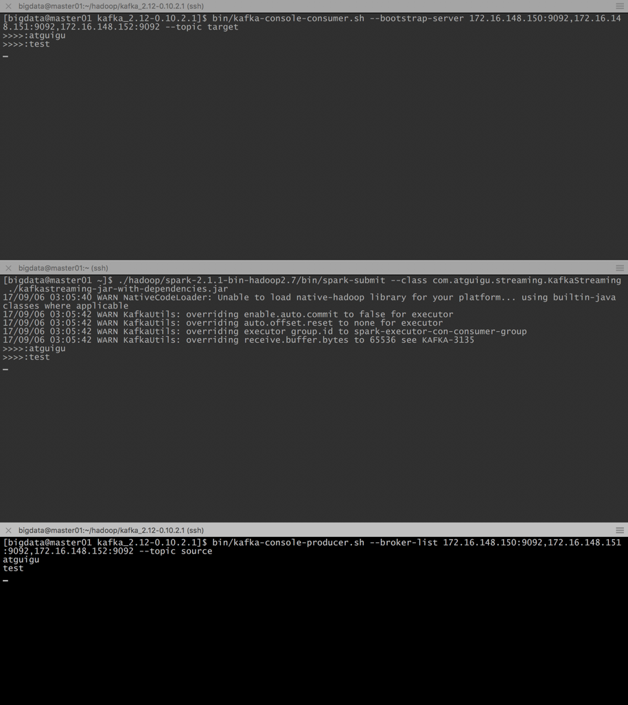

#### 4.3.2.2 	Spark对Kafka两种连接方式的对比
Spark对于Kafka的连接主要有两种方式，一种是DirectKafkaInputDStream，另外一种是KafkaInputDStream。DirectKafkaInputDStream 只在 driver 端接收数据，所以继承了 InputDStream，是没有 receivers 的。

主要通过KafkaUtils#createDirectStream以及KafkaUtils#createStream这两个 API 来创建，除了要传入的参数不同外，接收 kafka 数据的节点、拉取数据的时机也完全不同。

KafkaUtils#createStream【Receiver-based】

这种方法使用一个 Receiver 来接收数据。在该 Receiver 的实现中使用了 Kafka high-level consumer API。Receiver 从 kafka 接收的数据将被存储到 Spark executor 中，随后启动的 job 将处理这些数据。

在默认配置下，该方法失败后会丢失数据（保存在 executor 内存里的数据在 application 失败后就没了），若要保证数据不丢失，需要启用 WAL（即预写日志至 HDFS、S3等），这样再失败后可以从日志文件中恢复数据。

在该函数中，会新建一个 KafkaInputDStream对象，KafkaInputDStream继承于 ReceiverInputDStream。KafkaInputDStream实现了getReceiver方法，返回接收器的实例：
```
  def getReceiver(): Receiver[(K, V)] = {
    if (!useReliableReceiver) {
      //< 不启用 WAL
      new KafkaReceiver[K, V, U, T](kafkaParams, topics, storageLevel)
    } else {
      //< 启用 WAL
      new ReliableKafkaReceiver[K, V, U, T](kafkaParams, topics, storageLevel)
    }
  }
```

根据是否启用 WAL，receiver 分为 KafkaReceiver 和 ReliableKafkaReceiver。下图描述了 KafkaReceiver 

接收数据的具体流程：
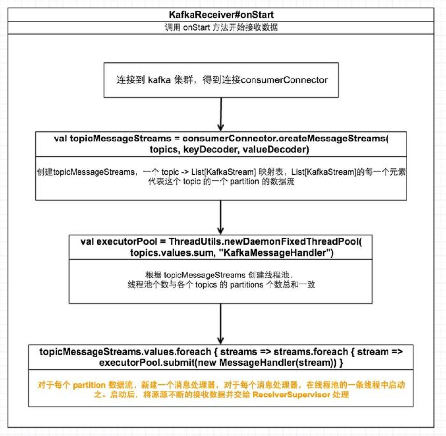

需要注意的点：
1. Kafka Topic 的 partitions 与RDD 的 partitions 没有直接关系，不能一一对应。如果增加 topic 的 partition 个数的话仅仅会增加单个 Receiver 接收数据的线程数。事实上，使用这种方法只会在一个 executor 上启用一个 Receiver，该 Receiver 包含一个线程池，线程池的线程个数与所有 topics 的 partitions 个数总和一致，每条线程接收一个 topic 的一个 partition 的数据。而并不会增加处理数据时的并行度。

2. 对于一个 topic，可以使用多个 groupid 相同的 input DStream 来使用多个 Receivers 来增加并行度，然后 union 他们；对于多个 topics，除了可以用上个办法增加并行度外，还可以对不同的 topic 使用不同的 input DStream 然后 union 他们来增加并行度

3. 如果你启用了 WAL，为能将接收到的数据将以 log 的方式在指定的存储系统备份一份，需要指定输入数据的存储等级为 StorageLevel.MEMORY_AND_DISK_SER 或 StorageLevel.MEMORY_AND_DISK_SER_2

KafkaUtils#createDirectStream【WithOut Receiver】

自 Spark-1.3.0 起，提供了不需要 Receiver 的方法。替代了使用 receivers 来接收数据，该方法定期查询每个 topic+partition 的 lastest offset，并据此决定每个 batch 要接收的 offsets 范围。

KafkaUtils#createDirectStream调用中，会新建DirectKafkaInputDStream，DirectKafkaInputDStream#compute(validTime: Time)会从 kafka 拉取数据并生成 RDD，流程如下：
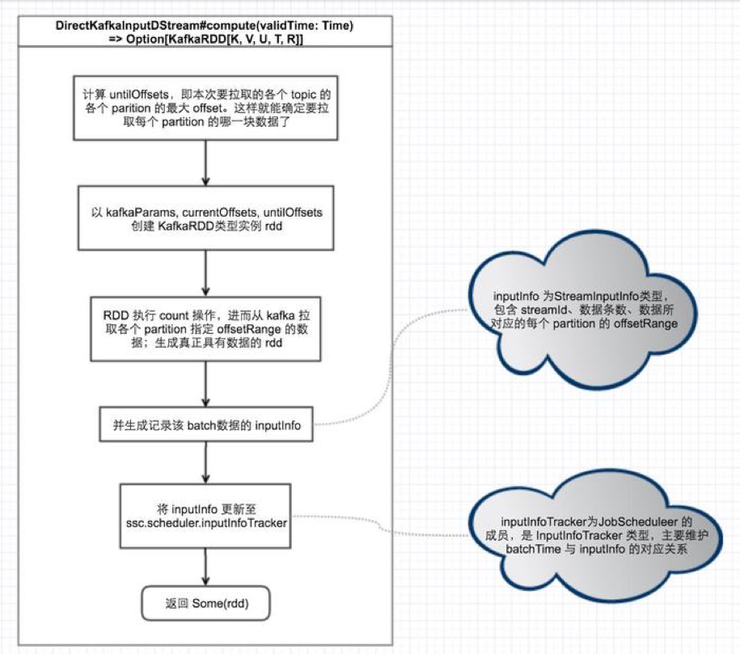

如上图所示，该函数主要做了以下三个事情：

确定要接收的 partitions 的 offsetRange，以作为第2步创建的 RDD 的数据来源

创建 RDD 并执行 count 操作，使 RDD 真实具有数据

以 streamId、数据条数，offsetRanges 信息初始化 inputInfo 并添加到 JobScheduler 中

进一步看 KafkaRDD 的 getPartitions 实现：
```

  override def getPartitions: Array[Partition] = {
    offsetRanges.zipWithIndex.map { case (o, i) =>
        val (host, port) = leaders(TopicAndPartition(o.topic, o.partition))
        new KafkaRDDPartition(i, o.topic, o.partition, o.fromOffset, o.untilOffset, host, port)
    }.toArray
  }
```

从上面的代码可以很明显看到，KafkaRDD 的 partition 数据与 Kafka topic 的某个 partition 的 o.fromOffset 至 o.untilOffset 数据是相对应的，也就是说 KafkaRDD 的 partition 与 Kafka partition 是一一对应的

该方式相比使用 Receiver 的方式有以下好处：

简化并行：不再需要创建多个 kafka input DStream 然后再 union 这些 input DStream。使用 directStream，Spark Streaming会创建与 Kafka partitions 相同数量的 paritions 的 RDD，RDD 的 partition与 Kafka 的 partition 一一对应，这样更易于理解及调优

高效：在方式一中要保证数据零丢失需要启用 WAL（预写日志），这会占用更多空间。而在方式二中，可以直接从 Kafka 指定的 topic 的指定 offsets 处恢复数据，不需要使用 WAL

恰好一次语义保证：基于Receiver方式使用了 Kafka 的 high level API 来在 Zookeeper 中存储已消费的 offsets。这在某些情况下会导致一些数据被消费两次，比如 streaming app 在处理某个 batch  内已接受到的数据的过程中挂掉，但是数据已经处理了一部分，但这种情况下无法将已处理数据的 offsets 更新到 Zookeeper 中，下次重启时，这批数据将再次被消费且处理。基于direct的方式，使用kafka的简单api，Spark Streaming自己就负责追踪消费的offset，并保存在checkpoint中。Spark自己一定是同步的，因此可以保证数据是消费一次且仅消费一次。这种方式中，只要将 output 操作和保存 offsets 操作封装成一个原子操作就能避免失败后的重复消费和处理，从而达到恰好一次的语义（Exactly-once）

通过以上分析，我们可以对这两种方式的区别做一个总结：

createStream会使用 Receiver；而createDirectStream不会

createStream使用的 Receiver 会分发到某个 executor 上去启动并接受数据；而createDirectStream直接在 driver 上接收数据

createStream使用 Receiver 源源不断的接收数据并把数据交给 ReceiverSupervisor 处理最终存储为 blocks 作为 RDD 的输入，从 kafka 拉取数据与计算消费数据相互独立；而createDirectStream会在每个 batch 拉取数据并就地消费，到下个 batch 再次拉取消费，周而复始，从 kafka 拉取数据与计算消费数据是连续的，没有独立开

createStream中创建的KafkaInputDStream 每个 batch 所对应的 RDD 的 partition 不与 Kafka partition 一一对应；而createDirectStream中创建的 DirectKafkaInputDStream 每个 batch 所对应的 RDD 的 partition 与 Kafka partition 一一对应

#### 4.3.2.3 	Flume-ng
Spark提供两个不同的接收器来使用Apache Flume(http://flume.apache.org/，见图10-8)。 两个接收器简介如下。 

1. 推式接收器该接收器以 Avro 数据池的方式工作，由 Flume 向其中推数据。 
2. 拉式接收器该接收器可以从自定义的中间数据池中拉数据，而其他进程可以使用 Flume 把数据推进 该中间数据池。 

两种方式都需要重新配置 Flume，并在某个节点配置的端口上运行接收器(不是已有的 Spark 或者 Flume 使用的端口)。要使用其中任何一种方法，都需要在工程中引入 Maven 工件 spark-streaming-flume_2.10。
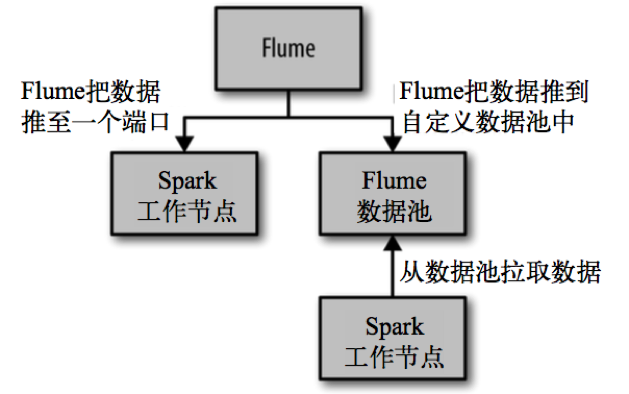

推式接收器的方法设置起来很容易，但是它不使用事务来接收数据。在这种方式中，接收 器以 Avro 数据池的方式工作，我们需要配置 Flume 来把数据发到 Avro 数据池。我们提供的 FlumeUtils 对象会把接收器配置在一个特定的工作节点的主机名及端口号上。这些设置必须和 Flume 配置相匹配。 


虽然这种方式很简洁，但缺点是没有事务支持。这会增加运行接收器的工作节点发生错误 时丢失少量数据的几率。不仅如此，如果运行接收器的工作节点发生故障，系统会尝试从 另一个位置启动接收器，这时需要重新配置 Flume 才能将数据发给新的工作节点。这样配 置会比较麻烦。 
较新的方式是拉式接收器(在Spark 1.1中引入)，它设置了一个专用的Flume数据池供 Spark Streaming读取，并让接收器主动从数据池中拉取数据。这种方式的优点在于弹性较 好，Spark Streaming通过事务从数据池中读取并复制数据。在收到事务完成的通知前，这 些数据还保留在数据池中。 
我们需要先把自定义数据池配置为 Flume 的第三方插件。安装插件的最新方法请参考 Flume 文档的相关部分(https://flume.apache.org/FlumeUserGuide.html#installing-third-party- plugins)。由于插件是用 Scala 写的，因此需要把插件本身以及 Scala 库都添加到 Flume 插件 中。Spark 1.1 中对应的 Maven 索引如例 10-37 所示。
```
<dependency>

    <groupId>org.apache.spark</groupId>

    <artifactId>spark-streaming-flume-sink_2.11</artifactId>

    <version>1.2.0</version>

</dependency>

<dependency>

    <groupId>org.scala-lang</groupId>

    <artifactId>scala-library</artifactId>

    <version>2.11.11</version>

</dependency>

```

当你把自定义 Flume 数据池添加到一个节点上之后，就需要配置 Flume 来把数据推送到这个数据池中， 
```
a1.sinks = spark

a1.sinks.spark.type = org.apache.spark.streaming.flume.sink.SparkSink

a1.sinks.spark.hostname = receiver-hostname

a1.sinks.spark.port = port-used-for-sync-not-spark-port

a1.sinks.spark.channel = memoryChannel
```
等到数据已经在数据池中缓存起来，就可以调用 FlumeUtils 来读取数据了 
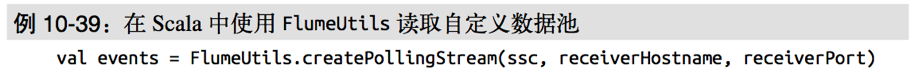


## 4.4	DStreams转换
DStream上的原语与RDD的类似，分为Transformations（转换）和Output Operations（输出）两种，此外转换操作中还有一些比较特殊的原语，如：updateStateByKey()、transform()以及各种Window相关的原语。


| Transformation | Meaning | 
|----|----|
| map(func) | 将源DStream中的每个元素通过一个函数func从而得到新的DStreams。|
| flatMap(func) | 和map类似，但是每个输入的项可以被映射为0或更多项。|
| filter(func) | 选择源DStream中函数func判为true的记录作为新DStreams |
| repartition(numPartitions) | 通过创建更多或者更少的partition来改变此DStream的并行级别。|
| union(otherStream) | 联合源DStreams和其他DStreams来得到新DStream |
| count() |  统计源DStreams中每个RDD所含元素的个数得到单元素RDD的新DStreams。| 
| reduce(func) | 通过函数func(两个参数一个输出)来整合源DStreams中每个RDD元素得到单元素RDD的DStreams。这个函数需要关联从而可以被并行计算。|
| countByValue() | 对于DStreams中元素类型为K调用此函数，得到包含(K,Long)对的新DStream，其中Long值表明相应的K在源DStream中每个RDD出现的频率。|
|reduceByKey(func, [numTasks])	|对(K,V)对的DStream调用此函数，返回同样（K,V)对的新DStream，但是新DStream中的对应V为使用reduce函数整合而来。Note：默认情况下，这个操作使用Spark默认数量的并行任务（本地模式为2，集群模式中的数量取决于配置参数spark.default.parallelism）。你也可以传入可选的参数numTaska来设置不同数量的任务。 |
|join(otherStream, [numTasks]) |两DStream分别为(K,V)和(K,W)对，返回(K,(V,W))对的新DStream。 |
|cogroup(otherStream, [numTasks])|两DStream分别为(K,V)和(K,W)对，返回(K,(Seq[V],Seq[W])对新DStreams |
|transform(func)|将RDD到RDD映射的函数func作用于源DStream中每个RDD上得到新DStream。这个可用于在DStream的RDD上做任意操作。 |
|updateStateByKey(func) |得到”状态”DStream，其中每个key状态的更新是通过将给定函数用于此key的上一个状态和新值而得到。这个可用于保存每个key值的任意状态数据。 |


DStream 的转化操作可以分为无状态(stateless)和有状态(stateful)两种。 

1. 在无状态转化操作中，每个批次的处理不依赖于之前批次的数据。常见的 RDD 转化操作，例如 map()、filter()、reduceByKey() 等，都是无状态转化操作。 
2. 相对地，有状态转化操作需要使用之前批次的数据或者是中间结果来计算当前批次的数据。有状态转化操作包括基于滑动窗口的转化操作和追踪状态变化的转化操作。 

### 4.4.1	无状态转化操作
无状态转化操作就是把简单的 RDD 转化操作应用到每个批次上，也就是转化 DStream 中的每一个 RDD。部分无状态转化操作列在了下表中。 注意，针对键值对的 DStream 转化操作(比如 reduceByKey())要添加import StreamingContext._ 才能在 Scala中使用。 
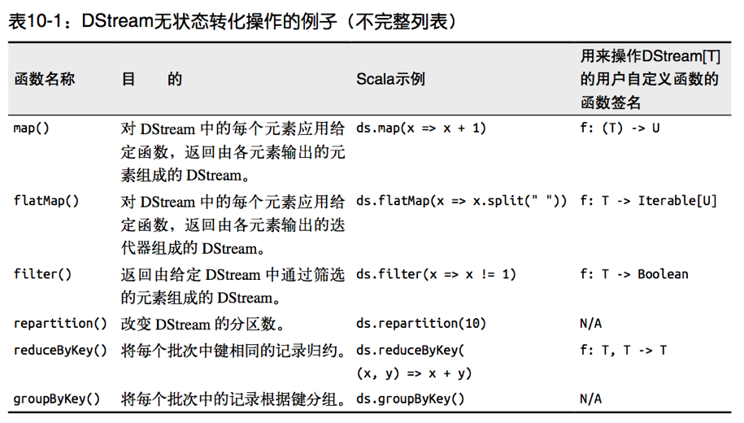

需要记住的是，尽管这些函数看起来像作用在整个流上一样，但事实上每个 DStream 在内部是由许多 RDD(批次)组成，且无状态转化操作是分别应用到每个 RDD 上的。例如， reduceByKey() 会归约每个时间区间中的数据，但不会归约不同区间之间的数据。 

举个例子，在之前的wordcount程序中，我们只会统计1秒内接收到的数据的单词个数，而不会累加。 

无状态转化操作也能在多个 DStream 间整合数据，不过也是在各个时间区间内。例如，键 值对 DStream 拥有和 RDD 一样的与连接相关的转化操作，也就是 cogroup()、join()、 leftOuterJoin() 等。我们可以在 DStream 上使用这些操作，这样就对每个批次分别执行了对应的 RDD 操作。

我们还可以像在常规的 Spark 中一样使用 DStream 的 union() 操作将它和另一个 DStream 的内容合并起来，也可以使用 StreamingContext.union() 来合并多个流。 

### 4.4.2	有状态转化操作
特殊的Transformations

#### 4.4.2.1 	追踪状态变化UpdateStateByKey
UpdateStateByKey原语用于记录历史记录，有时，我们需要在 DStream 中跨批次维护状态(例如流计算中累加wordcount)。针对这种情况，updateStateByKey() 为我们提供了对一个状态变量的访问，用于键值对形式的 DStream。给定一个由(键，事件)对构成的 DStream，并传递一个指定如何根据新的事件 更新每个键对应状态的函数，它可以构建出一个新的 DStream，其内部数据为(键，状态) 对。 

updateStateByKey() 的结果会是一个新的 DStream，其内部的 RDD 序列是由每个时间区间对应的(键，状态)对组成的。

updateStateByKey操作使得我们可以在用新信息进行更新时保持任意的状态。为使用这个功能，你需要做下面两步： 

1. 定义状态，状态可以是一个任意的数据类型。 

2. 定义状态更新函数，用此函数阐明如何使用之前的状态和来自输入流的新值对状态进行更新。

使用updateStateByKey需要对检查点目录进行配置，会使用检查点来保存状态。

更新版的wordcount：
```
package com.atguigu.streaming

import org.apache.spark.SparkConf
import org.apache.spark.streaming.{Seconds, StreamingContext}

object WorldCount {

  def main(args: Array[String]) {

    // 定义更新状态方法，参数values为当前批次单词频度，state为以往批次单词频度
    val updateFunc = (values: Seq[Int], state: Option[Int]) => {
      val currentCount = values.foldLeft(0)(_ + _)
      val previousCount = state.getOrElse(0)
      Some(currentCount + previousCount)
    }


    val conf = new SparkConf().setMaster("local[2]").setAppName("NetworkWordCount")
    val ssc = new StreamingContext(conf, Seconds(3))
    ssc.checkpoint(".")

    // Create a DStream that will connect to hostname:port, like localhost:9999
    val lines = ssc.socketTextStream("master01", 9999)

    // Split each line into words
    val words = lines.flatMap(_.split(" "))

    //import org.apache.spark.streaming.StreamingContext._ // not necessary since Spark 1.3
    // Count each word in each batch
    val pairs = words.map(word => (word, 1))


    // 使用updateStateByKey来更新状态，统计从运行开始以来单词总的次数
    val stateDstream = pairs.updateStateByKey[Int](updateFunc)
    stateDstream.print()

    //val wordCounts = pairs.reduceByKey(_ + _)

    // Print the first ten elements of each RDD generated in this DStream to the console
    //wordCounts.print()

    ssc.start()             // Start the computation
    ssc.awaitTermination()  // Wait for the computation to terminate
    //ssc.stop()
  }

}
```
```
   启动nc –lk 9999
[bigdata@master01 ~]$ nc -lk 9999
ni shi shui
ni hao ma
```

启动统计程序：
```
[bigdata@master01 ~]$ ./hadoop/spark-2.1.1-bin-hadoop2.7/bin/spark-submit --class com.atguigu.streaming.WorldCount ./statefulwordcount-jar-with-dependencies.jar
17/09/06 04:06:09 WARN NativeCodeLoader: Unable to load native-hadoop library for your platform... using builtin-java classes where applicable
-------------------------------------------
Time: 1504685175000 ms
-------------------------------------------
-------------------------------------------
Time: 1504685181000 ms
-------------------------------------------
(shi,1)
(shui,1)
(ni,1)
-------------------------------------------
Time: 1504685187000 ms
-------------------------------------------
(shi,1)
(ma,1)
(hao,1)
(shui,1)
(ni,2)

[bigdata@master01 ~]$ ls
2df8e0c3-174d-401a-b3a7-f7776c3987db  checkpoint-1504685205000     data
backup                                checkpoint-1504685205000.bk  debug.log
checkpoint-1504685199000              checkpoint-1504685208000     hadoop
checkpoint-1504685199000.bk           checkpoint-1504685208000.bk  receivedBlockMetadata
checkpoint-1504685202000              checkpoint-1504685211000     software
checkpoint-1504685202000.bk           checkpoint-1504685211000.bk  statefulwordcount-jar-with-dependencies.jar
```

#### 4.4.2.2 	Window Operations
Window Operations有点类似于Storm中的State，可以设置窗口的大小和滑动窗口的间隔来动态的获取当前Steaming的允许状态。

基于窗口的操作会在一个比 StreamingContext 的批次间隔更长的时间范围内，通过整合多个批次的结果，计算出整个窗口的结果。 
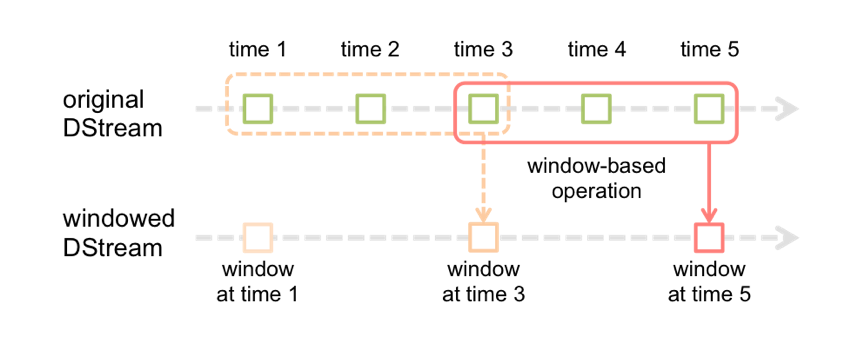

所有基于窗口的操作都需要两个参数，分别为窗口时长以及滑动步长，两者都必须是 StreamContext 的批次间隔的整数倍。窗口时长控制每次计算最近的多少个批次的数据，其实就是最近的 windowDuration/batchInterval 个批次。如果有一个以 10 秒为批次间隔的源 DStream，要创建一个最近 30 秒的时间窗口(即最近 3 个批次)，就应当把 windowDuration 设为 30 秒。而滑动步长的默认值与批次间隔相等，用来控制对新的 DStream 进行计算的间隔。如果源 DStream 批次间隔为 10 秒，并且我们只希望每两个批次计算一次窗口结果， 就应该把滑动步长设置为 20 秒。 

假设，你想拓展前例从而每隔十秒对持续30秒的数据生成word count。为做到这个，我们需要在持续30秒数据的(word,1)对DStream上应用reduceByKey。使用操作reduceByKeyAndWindow.
```
# reduce last 30 seconds of data, every 10 second
windowedWordCounts = pairs.reduceByKeyAndWindow(lambda x, y: x + y, lambda x, y: x -y, 30, 20)
```

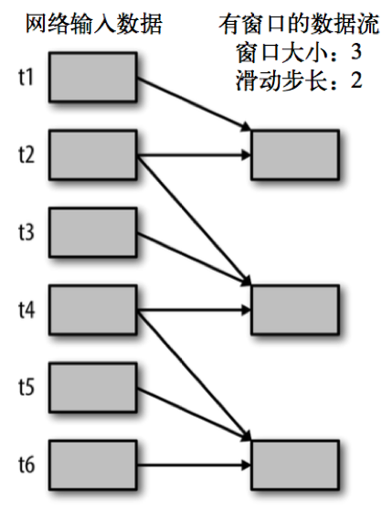


|Transformation|Meaning|
|----|----|
|window(windowLength, slideInterval)|基于对源DStream窗化的批次进行计算返回一个新的DStream|
|countByWindow(windowLength, slideInterval)|返回一个滑动窗口计数流中的元素。|
|reduceByWindow(func, windowLength, slideInterval)|通过使用自定义函数整合滑动区间流元素来创建一个新的单元素流。|
|reduceByKeyAndWindow(func, windowLength, slideInterval, \[numTasks]) |当在一个(K,V)对的DStream上调用此函数，会返回一个新(K,V)对的DStream，此处通过对滑动窗口中批次数据使用reduce函数来整合每个key的value值。Note:默认情况下，这个操作使用Spark的默认数量并行任务(本地是2)，在集群模式中依据配置属性(spark.default.parallelism)来做grouping。你可以通过设置可选参数numTasks来设置不同数量的tasks。 |
|reduceByKeyAndWindow(func, invFunc, windowLength, slideInterval, \[numTasks])|这个函数是上述函数的更高效版本，每个窗口的reduce值都是通过用前一个窗的reduce值来递增计算。通过reduce进入到滑动窗口数据并”反向reduce”离开窗口的旧数据来实现这个操作。一个例子是随着窗口滑动对keys的“加”“减”计数。通过前边介绍可以想到，这个函数只适用于”可逆的reduce函数”，也就是这些reduce函数有相应的”反reduce”函数(以参数invFunc形式传入)。如前述函数，reduce任务的数量通过可选参数来配置。注意：为了使用这个操作，检查点必须可用。 |
|countByValueAndWindow(windowLength,slideInterval, \[numTasks])|对(K,V)对的DStream调用，返回(K,Long)对的新DStream，其中每个key的值是其在滑动窗口中频率。如上，可配置reduce任务数量。|

reduceByWindow() 和 reduceByKeyAndWindow() 让我们可以对每个窗口更高效地进行归约操作。它们接收一个归约函数，在整个窗口上执行，比如 +。除此以外，它们还有一种特殊形式，通过只考虑新进入窗口的数据和离开窗 口的数据，让 Spark 增量计算归约结果。这种特殊形式需要提供归约函数的一个逆函数，比 如 + 对应的逆函数为 -。对于较大的窗口，提供逆函数可以大大提高执行效率 
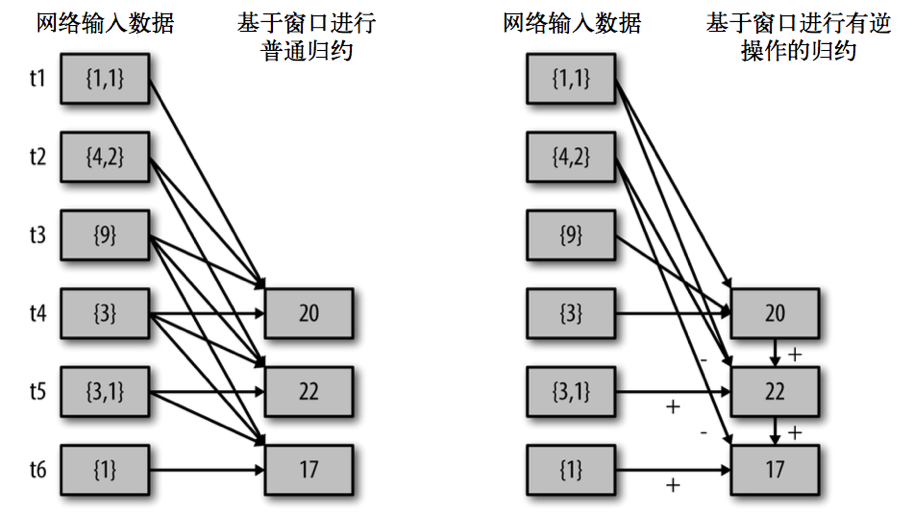

```
val ipDStream = accessLogsDStream.map(logEntry => (logEntry.getIpAddress(), 1))

val ipCountDStream = ipDStream.reduceByKeyAndWindow(

  {(x, y) => x + y},

  {(x, y) => x - y},

  Seconds(30),

  Seconds(10))

  // 加上新进入窗口的批次中的元素
 // 移除离开窗口的老批次中的元素
 // 窗口时长

// 滑动步长 
```
countByWindow() 和 countByValueAndWindow() 作为对数据进行 计数操作的简写。countByWindow() 返回一个表示每个窗口中元素个数的 DStream，而 countByValueAndWindow() 返回的 DStream 则包含窗口中每个值的个数， 
```
val ipDStream = accessLogsDStream.map{entry => entry.getIpAddress()}


val ipAddressRequestCount = ipDStream.countByValueAndWindow(Seconds(30), Seconds(10))
 
val requestCount = accessLogsDStream.countByWindow(Seconds(30), Seconds(10))
```


WordCount第三版：3秒一个批次，窗口12秒，滑步6秒。
```
package com.atguigu.streaming

import org.apache.spark.SparkConf
import org.apache.spark.streaming.{Seconds, StreamingContext}

object WorldCount {

  def main(args: Array[String]) {


    // 定义更新状态方法，参数values为当前批次单词频度，state为以往批次单词频度
    val updateFunc = (values: Seq[Int], state: Option[Int]) => {
      val currentCount = values.foldLeft(0)(_ + _)
      val previousCount = state.getOrElse(0)
      Some(currentCount + previousCount)
    }


    val conf = new SparkConf().setMaster("local[2]").setAppName("NetworkWordCount")
    val ssc = new StreamingContext(conf, Seconds(3))
    ssc.checkpoint(".")

    // Create a DStream that will connect to hostname:port, like localhost:9999
    val lines = ssc.socketTextStream("master01", 9999)

    // Split each line into words
    val words = lines.flatMap(_.split(" "))

    //import org.apache.spark.streaming.StreamingContext._ // not necessary since Spark 1.3
    // Count each word in each batch
    val pairs = words.map(word => (word, 1))

    val wordCounts = pairs.reduceByKeyAndWindow((a:Int,b:Int) => (a + b),Seconds(12), Seconds(6))

    // Print the first ten elements of each RDD generated in this DStream to the console
    wordCounts.print()

    ssc.start()             // Start the computation
    ssc.awaitTermination()  // Wait for the computation to terminate
    //ssc.stop()
  }

}
```
### 4.4.3	重要操作
#### 4.4.3.1 	Transform Operation
Transform原语允许DStream上执行任意的RDD-to-RDD函数。即使这些函数并没有在DStream的API中暴露出来，通过该函数可以方便的扩展Spark API。 

该函数每一批次调度一次。

比如下面的例子，在进行单词统计的时候，想要过滤掉spam的信息。

其实也就是对DStream中的RDD应用转换。
```
val spamInfoRDD = ssc.sparkContext.newAPIHadoopRDD(...) 
// RDD containing spam information


val cleanedDStream = wordCounts.transform { rdd =>

  rdd.join(spamInfoRDD).filter(...)
    // join data stream with spam information to do data cleaning

  ...

}
```

4.4.3.2 	Join 操作
连接操作（leftOuterJoin, rightOuterJoin, fullOuterJoin也可以），可以连接Stream-Stream，windows-stream to windows-stream、stream-dataset

Stream-Stream Joins
```
val stream1: DStream[String, String] = ...

val stream2: DStream[String, String] = ...

val joinedStream = stream1.join(stream2)


val windowedStream1 = stream1.window(Seconds(20))

val windowedStream2 = stream2.window(Minutes(1))

val joinedStream = windowedStream1.join(windowedStream2)
```

Stream-dataset joins
```
val dataset: RDD[String, String] = ...

val windowedStream = stream.window(Seconds(20))...

val joinedStream = windowedStream.transform { 
                        rdd => rdd.join(dataset) 
                    }
```

## 4.5	DStreams输出
 输出操作指定了对流数据经转化操作得到的数据所要执行的操作(例如把结果推入外部数据库或输出到屏幕上)。与 RDD 中的惰性求值类似，如果一个 DStream 及其派生出的 DStream 都没有被执行输出操作，那么这些 DStream 就都不会被求值。如果 StreamingContext 中没有设定输出操作，整个 context 就都不会启动。 
| Output Operation | Meaning | 
|----|----|
|print()|在运行流程序的驱动结点上打印DStream中每一批次数据的最开始10个元素。这用于开发和调试。在Python API中，同样的操作叫pprint()。 |
|saveAsTextFiles(prefix, \[suffix])|以text文件形式存储这个DStream的内容。每一批次的存储文件名基于参数中的prefix和suffix。”prefix-Time_IN_MS\[.suffix]”. |
|saveAsObjectFiles(prefix, \[suffix])|以Java对象序列化的方式将Stream中的数据保存为 SequenceFiles . 每一批次的存储文件名基于参数中的为"prefix-TIME_IN_MS\[.suffix]". Python中目前不可用。|
|saveAsHadoopFiles(prefix, \[suffix]) | 将Stream中的数据保存为 Hadoop files. 每一批次的存储文件名基于参数中的为"prefix-TIME_IN_MS\[.suffix]". 
Python API Python中目前不可用。|
|foreachRDD(func)|这是最通用的输出操作，即将函数func用于产生于stream的每一个RDD。其中参数传入的函数func应该实现将每一个RDD中数据推送到外部系统，如将RDD存入文件或者通过网络将其写入数据库。注意：函数func在运行流应用的驱动中被执行，同时其中一般函数RDD操作从而强制其对于流RDD的运算。|

通用的输出操作 foreachRDD()，它用来对 DStream 中的 RDD 运行任意计算。这和transform() 有些类似，都可以让我们访问任意 RDD。在 foreachRDD() 中，可以重用我们在 Spark 中实现的所有行动操作。比如，常见的用例之一是把数据写到诸如 MySQL 的外部数据库中。 

需要注意的：

连接不能写在driver层面

如果写在foreach则每个RDD都创建，得不偿失

增加foreachPartition，在分区创建

可以考虑使用连接池优化
```
dstream.foreachRDD { rdd =>
  
    // error val connection = createNewConnection()  
    // executed at the driver 序列化错误


  rdd.foreachPartition { 
        partitionOfRecords =>
    
            // ConnectionPool is a static, lazily initialized pool of connections
        
   val connection = ConnectionPool.getConnection()
        
   partitionOfRecords.foreach(
                record => connection.send(record) 
                // executed at the worker
    
            )
        
   ConnectionPool.returnConnection(connection)
            // return to the pool for future reuse
    
  }
}
```

## 4.6	累加器和广播变量
累加器(Accumulators)和广播变量(Broadcast variables)不能从Spark Streaming的检查点中恢复。如果你启用检查并也使用了累加器和广播变量，那么你必须创建累加器和广播变量的延迟单实例从而在驱动因失效重启后他们可以被重新实例化。如下例述：
```
object WordBlacklist {


  @volatile private var instance: Broadcast[Seq[String]] = null


  def getInstance(sc: SparkContext): Broadcast[Seq[String]] = {

    if (instance == null) {

      synchronized {

        if (instance == null) {

          val wordBlacklist = Seq("a", "b", "c")

          instance = sc.broadcast(wordBlacklist)

        }

      }

    }

    instance

  }

}


object DroppedWordsCounter {


  @volatile private var instance: LongAccumulator = null


  def getInstance(sc: SparkContext): LongAccumulator = {

    if (instance == null) {

      synchronized {

        if (instance == null) {

          instance = sc.longAccumulator("WordsInBlacklistCounter")

        }

      }
    }

    instance

  }

}
wordCounts.foreachRDD {
 (rdd: RDD[(String, Int)], time: Time) =>

  // Get or register the blacklist Broadcast

  val blacklist = WordBlacklist.getInstance(rdd.sparkContext)

  // Get or register the droppedWordsCounter Accumulator

  val droppedWordsCounter = DroppedWordsCounter.getInstance(rdd.sparkContext)

  // Use blacklist to drop words and use droppedWordsCounter to count them

  val counts = rdd.filter { case (word, count) =>

    if (blacklist.value.contains(word)) {

      droppedWordsCounter.add(count)

      false

    } else {

      true

    }

  }.collect().mkString("[", ", ", "]")

  val output = "Counts at time " + time + " " + counts
})

```

## 4.7	DataFrame ans SQL Operations
你可以很容易地在流数据上使用DataFrames和SQL。你必须使用SparkContext来创建StreamingContext要用的SQLContext。此外，这一过程可以在驱动失效后重启。我们通过创建一个实例化的SQLContext单实例来实现这个工作。如下例所示。我们对前例word count进行修改从而使用DataFrames和SQL来产生word counts。每个RDD被转换为DataFrame，以临时表格配置并用SQL进行查询。
```
val words: DStream[String] = ...



words.foreachRDD { rdd =>



  // Get the singleton instance of SparkSession

  val spark = SparkSession.builder.config(rdd.sparkContext.getConf).getOrCreate()


  import spark.implicits._


  // Convert RDD[String] to DataFrame

  val wordsDataFrame = rdd.toDF("word")


  // Create a temporary view

  wordsDataFrame.createOrReplaceTempView("words")


  // Do word count on DataFrame using SQL and print it

  val wordCountsDataFrame =
  spark.sql("select word, count(*) as total from words group by word")

  wordCountsDataFrame.show()

}
```
你也可以从不同的线程在定义于流数据的表上运行SQL查询（也就是说，异步运行StreamingContext）。仅确定你设置StreamingContext记住了足够数量的流数据以使得查询操作可以运行。否则，StreamingContext不会意识到任何异步的SQL查询操作，那么其就会在查询完成之后删除旧的数据。例如，如果你要查询最后一批次，但是你的查询会运行5分钟，那么你需要调用streamingContext.remember(Minutes(5))(in Scala, 或者其他语言的等价操作)。

## 4.8	Caching / Persistence
和RDDs类似，DStreams同样允许开发者将流数据保存在内存中。也就是说，在DStream上使用persist()方法将会自动把DStreams中的每个RDD保存在内存中。当DStream中的数据要被多次计算时，这个非常有用（如在同样数据上的多次操作）。对于像reduceByWindow和reduceByKeyAndWindow以及基于状态的(updateStateByKey)这种操作，保存是隐含默认的。因此，即使开发者没有调用persist()，由基于窗操作产生的DStreams会自动保存在内存中。 

## 4.9	7x24 不间断运行
### 4.9.1	检查点机制

检查点机制是我们在Spark Streaming中用来保障容错性的主要机制。与应用程序逻辑无关的错误（即系统错位，JVM崩溃等）有迅速恢复的能力.

它可以使Spark Streaming阶段性地把应用数据存储到诸如HDFS或Amazon S3这样的可靠存储系统中， 以供恢复时使用。具体来说，检查点机制主要为以下两个目的服务。 

控制发生失败时需要重算的状态数。SparkStreaming可以通 过转化图的谱系图来重算状态，检查点机制则可以控制需要在转化图中回溯多远。 

提供驱动器程序容错。如果流计算应用中的驱动器程序崩溃了，你可以重启驱动器程序 并让驱动器程序从检查点恢复，这样Spark Streaming就可以读取之前运行的程序处理 数据的进度，并从那里继续。 


 了实现这个，Spark Streaming需要为容错存储系统checkpoint足够的信息从而使得其可以从失败中恢复过来。有两种类型的数据设置检查点。 
    Metadata checkpointing：将定义流计算的信息存入容错的系统如HDFS。元数据包括： 
    配置 – 用于创建流应用的配置。 
    DStreams操作 – 定义流应用的DStreams操作集合。 
    不完整批次 – 批次的工作已进行排队但是并未完成。 
    Data checkpointing： 将产生的RDDs存入可靠的存储空间。对于在多批次间合并数据的状态转换，这个很有必要。在这样的转换中，RDDs的产生基于之前批次的RDDs，这样依赖链长度随着时间递增。为了避免在恢复期这种无限的时间增长（和链长度成比例），状态转换中间的RDDs周期性写入可靠地存储空间（如HDFS）从而切短依赖链。 
    总而言之，元数据检查点在由驱动失效中恢复是首要需要的。而数据或者RDD检查点甚至在使用了状态转换的基础函数中也是必要的。
 
出于这些原因，检查点机制对于任何生产环境中的流计算应用都至关重要。你可以通过向 ssc.checkpoint() 方法传递一个路径参数(HDFS、S3 或者本地路径均可)来配置检查点机制,同时你的应用应该能够使用检查点的数据

1. 当程序首次启动，其将创建一个新的StreamingContext，设置所有的流并调用start()。 
   
2. 当程序在失效后重启，其将依据检查点目录的检查点数据重新创建一个StreamingContext。 

通过使用StraemingContext.getOrCreate很容易获得这个性能。
```
ssc.checkpoint("hdfs://...") 


# 创建和设置一个新的StreamingContext
def functionToCreateContext():
    sc = SparkContext(...) # new context
    ssc = new StreamingContext(...)
    lines = ssc.socketTextStream(...) # create DStreams
    ...
    ssc.checkpoint(checkpointDirectory) # 设置检查点目录
    return ssc
# 从检查点数据中获取StreamingContext或者重新创建一个
context = StreamingContext.getOrCreate(checkpointDirectory, functionToCreateContext)

# 在需要完成的context上做额外的配置
# 无论其有没有启动
context ...
# 启动context
context.start()
contaxt.awaitTermination()
```

1. 如果检查点目录(checkpointDirectory)存在，那么context将会由检查点数据重新创建。如果目录不存在（首次运行），那么函数functionToCreateContext将会被调用来创建一个新的context并设置DStreams。
2. 注意RDDs的检查点引起存入可靠内存的开销。在RDDs需要检查点的批次里，处理的时间会因此而延长。所以，检查点的间隔需要很仔细地设置。在小尺寸批次（1秒钟）。每一批次检查点会显著减少操作吞吐量。反之，检查点设置的过于频繁导致“血统”和任务尺寸增长，这会有很不好的影响对于需要RDD检查点设置的状态转换，默认间隔是批次间隔的乘数一般至少为10秒钟。可以通过dstream.checkpoint(checkpointInterval)。通常，检查点设置间隔是5-10个DStream的滑动间隔。


### 4.9.2	WAL预写日志
WAL 即 write ahead log（预写日志），是在 1.2 版本中就添加的特性。作用就是，将数据通过日志的方式写到可靠的存储，比如 HDFS、s3，在 driver 或 worker failure 时可以从在可靠存储上的日志文件恢复数据。WAL 在 driver 端和 executor 端都有应用。

#### 4.9.2.1 WAL在 driver 端的应用

用于写日志的对象 writeAheadLogOption: WriteAheadLog。在 StreamingContext 中的 JobScheduler 中的 ReceiverTracker 的 ReceivedBlockTracker 构造函数中被创建，ReceivedBlockTracker 用于管理已接收到的 blocks 信息。需要注意的是，这里只需要启用 checkpoint 就可以创建该 driver 端的 WAL 管理实例，而不需要将 spark.streaming.receiver.writeAheadLog.enable 设置为 true。

#### 4.9.2.2 写什么、何时写、写什么

首选需要明确的是，ReceivedBlockTracker 通过 WAL 写入 log 文件的内容是3种事件（当然，会进行序列化）：

1. case class BlockAdditionEvent(receivedBlockInfo: ReceivedBlockInfo)；即新增了一个 block 及该 block 的具体信息，包括 streamId、blockId、数据条数等
2. case class BatchAllocationEvent(time: Time, allocatedBlocks: AllocatedBlocks)；即为某个 batchTime 分配了哪些 blocks 作为该 batch RDD 的数据源
3. case class BatchCleanupEvent(times: Seq\[Time])；即清理了哪些 batchTime 对应的 block
4. 知道了写了什么内容，结合源码，也不难找出是什么时候写了这些内容。需要再次注意的是，写上面这三种事件，也不需要将 spark.streaming.receiver.writeAheadLog.enable 设置为 true。

#### 4.9.2.3 WAL 在 executor 端的应用
1. Receiver 接收到的数据会源源不断的传递给 ReceiverSupervisor，是否启用 WAL 机制（即是否将 spark.streaming.receiver.writeAheadLog.enable 设置为 true）会影响 ReceiverSupervisor 在存储 block 时的行为：
2. 不启用 WAL：你设置的StorageLevel是什么，就怎么存储。比如MEMORY_ONLY只会在内存中存一份，MEMORY_AND_DISK会在内存和磁盘上各存一份等
3. 启用 WAL：在StorageLevel指定的存储的基础上，写一份到 WAL 中。存储一份在 WAL 上，更不容易丢数据但性能损失也比较大
4. 关于是否要启用 WAL，要视具体的业务而定：
5. 若可以接受一定的数据丢失，则不需要启用 WAL，因为对性能影响较大
6. 若完全不能接受数据丢失，那就需要同时启用 checkpoint 和 WAL，checkpoint 保存着执行进度（比如已生成但未完成的 jobs），WAL 中保存着 blocks 及 blocks 元数据（比如保存着未完成的 jobs 对应的 blocks 信息及 block 文件）。同时，这种情况可能要在数据源和 Streaming Application 中联合来保证 exactly once 语义
7. 预写日志功能的流程是：  
    7.1 一个SparkStreaming应用开始时（也就是driver开始时），相关的StreamingContext使用SparkContext启动接收器成为长驻运行任务。这些接收器接收并保存流数据到Spark内存中以供处理。  
    7.2 接收器通知driver。  
    7.3 接收块中的元数据（metadata）被发送到driver的StreamingContext。  
    
8. 这个元数据包括：  
 （a）定位其在executor内存中数据的块referenceid，  
 （b）块数据在日志中的偏移信息（如果启用了）。  
 
9. 用户传送数据的生命周期如下图所示。
    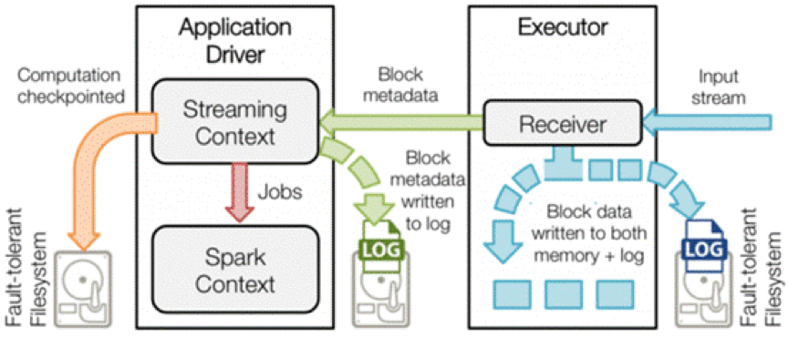 
10. 类似Kafka这样的系统可以通过复制数据保持可靠性。

### 4.9.3	背压机制
默认情况下，Spark Streaming通过Receiver以生产者生产数据的速率接收数据，计算过程中会出现batch processing time > batch interval的情况，其中batch processing time 为实际计算一个批次花费时间， batch interval为Streaming应用设置的批处理间隔。这意味着Spark Streaming的数据接收速率高于Spark从队列中移除数据的速率，也就是数据处理能力低，在设置间隔内不能完全处理当前接收速率接收的数据。如果这种情况持续过长的时间，会造成数据在内存中堆积，导致Receiver所在Executor内存溢出等问题（如果设置StorageLevel包含disk, 则内存存放不下的数据会溢写至disk, 加大延迟）。Spark 1.5以前版本，用户如果要限制Receiver的数据接收速率，可以通过设置静态配制参数“spark.streaming.receiver.maxRate”的值来实现，此举虽然可以通过限制接收速率，来适配当前的处理能力，防止内存溢出，但也会引入其它问题。比如：producer数据生产高于maxRate，当前集群处理能力也高于maxRate，这就会造成资源利用率下降等问题。为了更好的协调数据接收速率与资源处理能力，Spark Streaming 从v1.5开始引入反压机制（back-pressure）,通过动态控制数据接收速率来适配集群数据处理能力。

Spark Streaming Backpressure:  根据JobScheduler反馈作业的执行信息来动态调整Receiver数据接收率。通过属性“spark.streaming.backpressure.enabled”来控制是否启用backpressure机制，默认值false，即不启用。

Streaming架构如下图所示
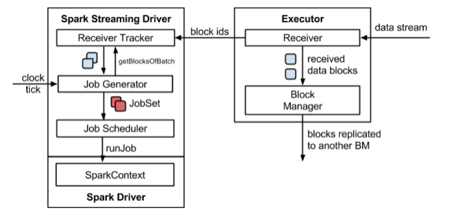 

在原架构的基础上加上一个新的组件RateController,这个组件负责监听“OnBatchCompleted”事件，然后从中抽取processingDelay 及schedulingDelay信息.  Estimator依据这些信息估算出最大处理速度（rate），最后由基于Receiver的Input Stream将rate通过ReceiverTracker与ReceiverSupervisorImpl转发给BlockGenerator（继承自RateLimiter）.
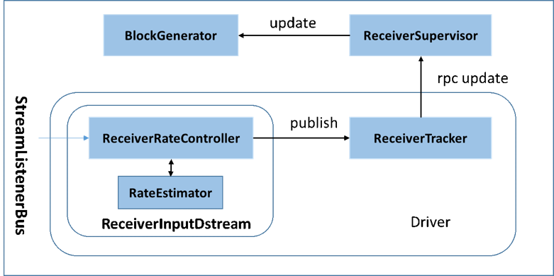 

流量控制点  
当Receiver开始接收数据时，会通过supervisor.pushSingle()方法将接收的数据存入currentBuffer等待BlockGenerator定时将数据取走，包装成block. 在将数据存放入currentBuffer之时，要获取许可（令牌）。如果获取到许可就可以将数据存入buffer, 否则将被阻塞，进而阻塞Receiver从数据源拉取数据。

其令牌投放采用令牌桶机制进行， 原理如下图所示:
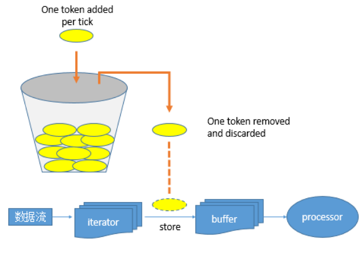 

令牌桶机制： 大小固定的令牌桶可自行以恒定的速率源源不断地产生令牌。如果令牌不被消耗，或者被消耗的速度小于产生的速度，令牌就会不断地增多，直到把桶填满。后面再产生的令牌就会从桶中溢出。最后桶中可以保存的最大令牌数永远不会超过桶的大小。当进行某操作时需要令牌时会从令牌桶中取出相应的令牌数，如果获取到则继续操作，否则阻塞。用完之后不用放回。

### 4.9.4	驱动器程序容错
驱动器程序的容错要求我们以特殊的方式创建 StreamingContext。我们需要把检查点目录提供给 StreamingContext。与直接调用 new StreamingContext 不同，应该使用 StreamingContext.getOrCreate() 函数。 

配置过程如下：  
1、	启动Driver自动重启功能  
•	standalone: 提交任务时添加 --supervise 参数  
•	yarn:设置yarn.resourcemanager.am.max-attempts 或者spark.yarn.maxAppAttempts  
•	mesos: 提交任务时添加 --supervise 参数  

2、	设置checkpoint  
StreamingContext.setCheckpoint(hdfsDirectory)  

3、	支持从checkpoint中重启配置  
```
def createContext(checkpointDirectory: String): StreamingContext = {  
    val ssc = new StreamingContext
    ssc.checkpoint(checkpointDirectory)
    ssc
}
val ssc = StreamingContext.getOrCreate(checkpointDirectory, createContext(checkpointDirectory))
```

### 4.9.5	工作节点容错
为了应对工作节点失败的问题，Spark Streaming使用与Spark的容错机制相同的方法。所 有从外部数据源中收到的数据都在多个工作节点上备份。所有从备份数据转化操作的过程 中创建出来的 RDD 都能容忍一个工作节点的失败，因为根据 RDD 谱系图，系统可以把丢 失的数据从幸存的输入数据备份中重算出来。对于reduceByKey等Stateful操作重做的lineage较长的，强制启动checkpoint，减少重做几率

### 4.9.6	接收器容错
运行接收器的工作节点的容错也是很重要的。如果这样的节点发生错误，Spark Streaming 会在集群中别的节点上重启失败的接收器。然而，这种情况会不会导致数据的丢失取决于 数据源的行为(数据源是否会重发数据)以及接收器的实现(接收器是否会向数据源确认 收到数据)。举个例子，使用 Flume 作为数据源时，两种接收器的主要区别在于数据丢失 时的保障。在“接收器从数据池中拉取数据”的模型中，Spark 只会在数据已经在集群中 备份时才会从数据池中移除元素。而在“向接收器推数据”的模型中，如果接收器在数据 备份之前失败，一些数据可能就会丢失。总的来说，对于任意一个接收器，你必须同时考 虑上游数据源的容错性(是否支持事务)来确保零数据丢失。 

一般主要是通过将接收到数据后先写日志（WAL）到可靠文件系统中，后才写入实际的RDD。如果后续处理失败则成功写入WAL的数据通过WAL进行恢复，未成功写入WAL的数据通过可回溯的Source进行重放

总的来说，接收器提供以下保证。  
• 所有从可靠文件系统中读取的数据(比如通过StreamingContext.hadoopFiles读取的) 都是可靠的，因为底层的文件系统是有备份的。Spark Streaming会记住哪些数据存放到 了检查点中，并在应用崩溃后从检查点处继续执行。   
• 对于像Kafka、推式Flume、Twitter这样的不可靠数据源，Spark会把输入数据复制到其 他节点上，但是如果接收器任务崩溃，Spark 还是会丢失数据。在 Spark 1.1 以及更早的版 本中，收到的数据只被备份到执行器进程的内存中，所以一旦驱动器程序崩溃(此时所 有的执行器进程都会丢失连接)，数据也会丢失。在 Spark 1.2 中，收到的数据被记录到诸 如 HDFS 这样的可靠的文件系统中，这样即使驱动器程序重启也不会导致数据丢失。   
综上所述，确保所有数据都被处理的最佳方式是使用可靠的数据源(例如 HDFS、拉式 Flume 等)。如果你还要在批处理作业中处理这些数据，使用可靠数据源是最佳方式，因为 这种方式确保了你的批处理作业和流计算作业能读取到相同的数据，因而可以得到相同的结果。  
操作过程如下：  
•	启用checkpoint  
ssc.setCheckpoint(checkpointDir)  
•	启用WAL  
sparkConf.set("spark.streaming.receiver.writeAheadLog.enable", "true")  
•	对Receiver使用可靠性存储StoreageLevel.MEMORY_AND_DISK_SER or StoreageLevel.MEMORY_AND_DISK_SER2  


### 4.9.7	处理保证  
由于Spark Streaming工作节点的容错保障，Spark Streaming可以为所有的转化操作提供 “精确一次”执行的语义，即使一个工作节点在处理部分数据时发生失败，最终的转化结 

果(即转化操作得到的 RDD)仍然与数据只被处理一次得到的结果一样。 

然而，当把转化操作得到的结果使用输出操作推入外部系统中时，写结果的任务可能因故 障而执行多次，一些数据可能也就被写了多次。由于这引入了外部系统，因此我们需要专 门针对各系统的代码来处理这样的情况。我们可以使用事务操作来写入外部系统(即原子 化地将一个 RDD 分区一次写入)，或者设计幂等的更新操作(即多次运行同一个更新操作 仍生成相同的结果)。比如 Spark Streaming 的 saveAs...File 操作会在一个文件写完时自动 将其原子化地移动到最终位置上，以此确保每个输出文件只存在一份。 

## 4.10	性能考量
最常见的问题是Spark Streaming可以使用的最小批次间隔是多少。总的来说，500毫秒已经被证实为对许多应用而言是比较好的最小批次大小。寻找最小批次大小的最佳实践是从一个比较大的批次大小(10 秒左右)开始，不断使用更小的批次大小。如果 Streaming 用 户界面中显示的处理时间保持不变，你就可以进一步减小批次大小。如果处理时间开始增 加，你可能已经达到了应用的极限。 

相似地，对于窗口操作，计算结果的间隔(也就是滑动步长)对于性能也有巨大的影响。 当计算代价巨大并成为系统瓶颈时，就应该考虑提高滑动步长了。 

减少批处理所消耗时间的常见方式还有提高并行度。有以下三种方式可以提高并行度：

• 增加接收器数目 有时如果记录太多导致单台机器来不及读入并分发的话，接收器会成为系统瓶颈。这时 你就需要通过创建多个输入 DStream(这样会创建多个接收器)来增加接收器数目，然 后使用 union 来把数据合并为一个数据源。   
• 将收到的数据显式地重新分区如果接收器数目无法再增加，你可以通过使用 DStream.repartition 来显式重新分区输 入流(或者合并多个流得到的数据流)来重新分配收到的数据。   
• 提高聚合计算的并行度
对于像 reduceByKey() 这样的操作，你可以在第二个参数中指定并行度，我们在介绍 RDD 时提到过类似的手段。   

# 第5章	高级解析
## 5.1	DStreamGraph对象解析
在 Spark Streaming 中，DStreamGraph 是一个非常重要的组件，主要用来：

1.	通过成员 inputStreams 持有 Spark Streaming 输入源及接收数据的方式
2.	通过成员 outputStreams 持有 Streaming app 的 output 操作，并记录 DStream 依赖关系
3.	生成每个 batch 对应的 jobs

下面，通过分析一个简单的例子，结合源码分析来说明 DStreamGraph 是如何发挥作用的。例子如下：
```
val sparkConf = new SparkConf().setAppName("HdfsWordCount")
val ssc = new StreamingContext(sparkConf, Seconds(2))

val lines = ssc.textFileStream(args(0))
val words = lines.flatMap(_.split(" "))
val wordCounts = words.map(x => (x, 1)).reduceByKey(_ + _)
wordCounts.print()
ssc.start()
ssc.awaitTermination()

```
创建 DStreamGraph 实例
代码val ssc = new StreamingContext(sparkConf, Seconds(2))创建了  
StreamingContext 实例，StreamingContext 包含了 DStreamGraph 类型的成员graph，graph 在 StreamingContext主构造函数中被创建，  
如下
```
  private[streaming] val graph: DStreamGraph = {
    if (isCheckpointPresent) {
      cp_.graph.setContext(this)
      cp_.graph.restoreCheckpointData()
      cp_.graph
    } else {
      require(batchDur_ != null, "Batch duration for StreamingContext cannot be null")
      val newGraph = new DStreamGraph()
      newGraph.setBatchDuration(batchDur_)
      newGraph
    }
  }
```


可以看到，若当前 checkpoint 可用，会优先从 checkpoint 恢复 graph，否则新建一个。还可以从这里知道的一点是：graph 是运行在 driver 上的

DStreamGraph记录输入源及如何接收数据

DStreamGraph有和application 输入数据相关的成员和方法，如下：
```
  private val inputStreams = new ArrayBuffer[InputDStream[_]]()
  def addInputStream(inputStream: InputDStream[_]) {
    this.synchronized {
      inputStream.setGraph(this)
      inputStreams += inputStream
    }
  }
```

成员inputStreams为 InputDStream 类型的数组，InputDStream是所有 input streams(数据输入流) 的虚基类。该类提供了 start() 和 stop()方法供 streaming 系统来开始和停止接收数据。那些只需要在 driver 端接收数据并转成 RDD 的 input streams 可以直接继承 InputDStream，例如 FileInputDStream是 InputDStream 的子类，它监控一个 HDFS 目录并将新文件转成RDDs。而那些需要在 workers 上运行receiver 来接收数据的 Input DStream，需要继承 ReceiverInputDStream，比如 KafkaReceiver。

我们来看看val lines = ssc.textFileStream(args(0))调用。

为了更容易理解，我画出了val lines = ssc.textFileStream(args(0))的调用流程
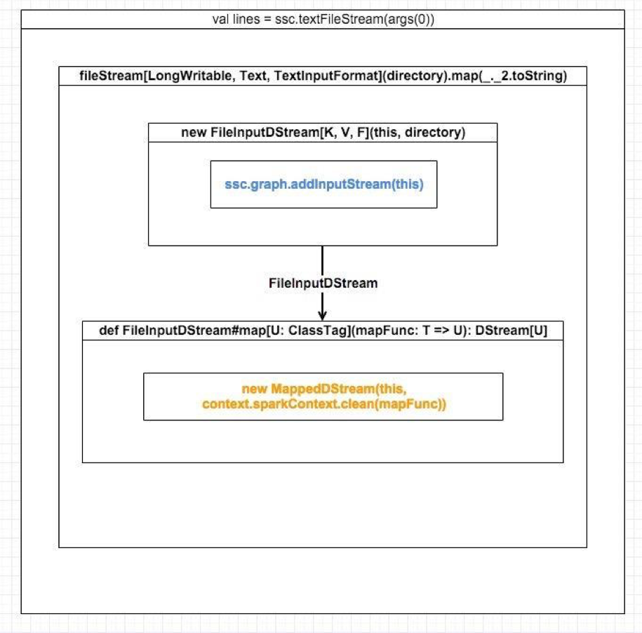 

从上面的调用流程图我们可以知道：

ssc.textFileStream会触发新建一个FileInputDStream。FileInputDStream继承于InputDStream，其start()方法定义了数据源及如何接收数据

在FileInputDStream构造函数中，会调用ssc.graph.addInputStream(this)，将自身添加到 DStreamGraph 的 inputStreams: ArrayBuffer[InputDStream[_]] 中，这样 DStreamGraph 就知道了这个 Streaming App 的输入源及如何接收数据。可能你会奇怪为什么inputStreams 是数组类型，举个例子，这里再来一个 val lines1 = ssc.textFileStream(args(0))，那么又将生成一个 FileInputStream 实例添加到inputStreams，所以这里需要集合类型

生成FileInputDStream调用其 map 方法，将以 FileInputDStream 本身作为 partent 来构造新的 MappedDStream。对于 DStream 的 transform 操作，都将生成一个新的 DStream，和 RDD transform 生成新的 RDD 类似

与MappedDStream 不同，所有继承了 InputDStream 的定义了输入源及接收数据方式的 sreams 都没有 parent，因为它们就是最初的 streams。

DStream 的依赖链

每个 DStream 的子类都会继承 def dependencies: List[DStream[_]] = List()方法，该方法用来返回自己的依赖的父 DStream 列表。比如，没有父DStream 的 InputDStream 的 dependencies方法返回List()。

MappedDStream 的实现如下：
```
class MappedDStream[T: ClassTag, U: ClassTag] (
    parent: DStream[T],
    mapFunc: T => U
  ) extends DStream[U](parent.ssc) {

  override def dependencies: List[DStream[_]] = List(parent)

  ...
}
```
在上例中，构造函数参数列表中的 parent 即在 ssc.textFileStream 中new 的定义了输入源及数据接收方式的最初的 FileInputDStream实例，这里的 dependencies方法将返回该FileInputDStream实例，这就构成了第一条依赖。可用如下图表示，这里特地将 input streams 用蓝色表示，以强调其与普通由 transform 产生的 DStream 的不同：
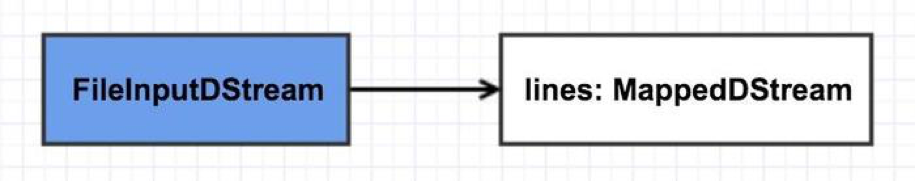 


继续来看val words = lines.flatMap(_.split(" "))，flatMap如下：
```
  def flatMap[U: ClassTag](flatMapFunc: T => Traversable[U]): DStream[U] = ssc.withScope {
    new FlatMappedDStream(this, context.sparkContext.clean(flatMapFunc))
  }
```
    
每一个 transform 操作都将创建一个新的 DStream，flatMap 操作也不例外，它会创建一个FlatMappedDStream，FlatMappedDStream的实现如下：
```
class FlatMappedDStream[T: ClassTag, U: ClassTag](
    parent: DStream[T],
    flatMapFunc: T => Traversable[U]
  ) extends DStream[U](parent.ssc) {

  override def dependencies: List[DStream[_]] = List(parent)

  ...
}
```
与 MappedDStream 相同，FlatMappedDStream#dependencies也返回其依赖的父 DStream，及 lines，到这里，依赖链就变成了下图：
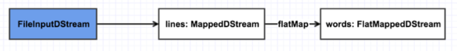 

之后的几步操作不再这样具体分析，到生成wordCounts时，依赖图将变成下面这样：
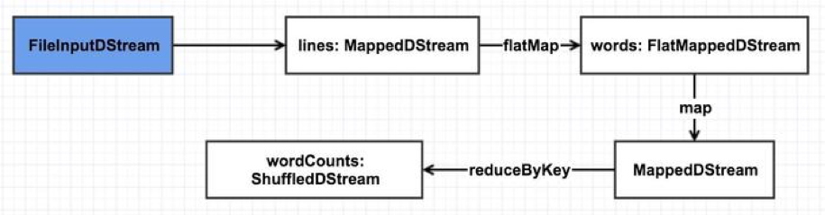 

在 DStream 中，与 transofrm 相对应的是 output 操作，包括 print, saveAsTextFiles, saveAsObjectFiles, saveAsHadoopFiles, foreachRDD。output 操作中，会创建ForEachDStream实例并调用register方法将自身添加到DStreamGraph.outputStreams成员中，该ForEachDStream实例也会持有是调用的哪个 output 操作。本例的代码调用如下，只需看箭头所指几行代码
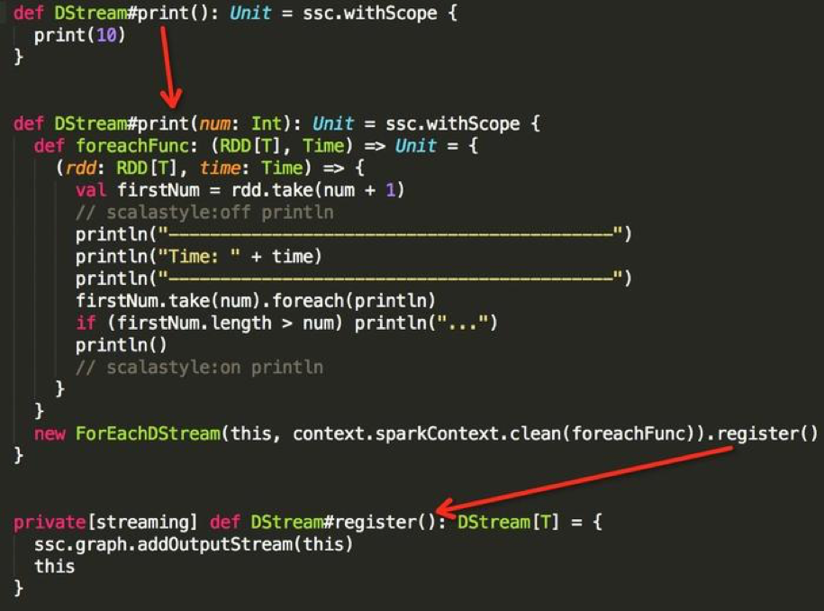 

与 DStream transform 操作返回一个新的 DStream 不同，output 操作不会返回任何东西，只会创建一个ForEachDStream作为依赖链的终结。

至此，生成了完成的依赖链，也就是 DAG，如下图（这里将 ForEachDStream 标为黄色以显示其与众不同）：
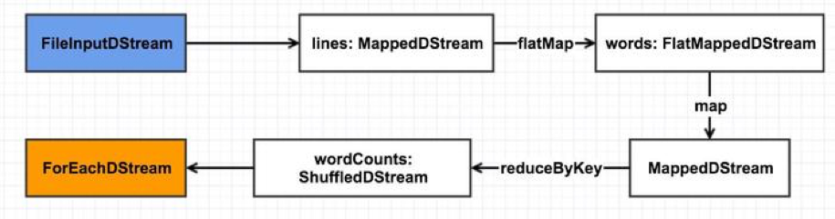 

## 5.2	ReceiverTracker 与数据导入
Spark Streaming 在数据接收与导入方面需要满足有以下三个特点：

兼容众多输入源，包括HDFS, Flume, Kafka, Twitter and ZeroMQ。还可以自定义数据源

要能为每个 batch 的 RDD 提供相应的输入数据

为适应 7*24h 不间断运行，要有接收数据挂掉的容错机制

#### 有容乃大，兼容众多数据源

InputDStream是所有 input streams(数据输入流) 的虚基类。该类提供了 start() 和 stop()方法供 streaming 系统来开始和停止接收数据。那些只需要在 driver 端接收数据并转成 RDD 的 input streams 可以直接继承 InputDStream，例如 FileInputDStream是 InputDStream 的子类，它监控一个 HDFS 目录并将新文件转成RDDs。而那些需要在 workers 上运行receiver 来接收数据的 Input DStream，需要继承 ReceiverInputDStream，比如 KafkaReceiver

只需在 driver 端接收数据的 input stream 一般比较简单且在生产环境中使用的比较少，本文不作分析，只分析继承了 ReceiverInputDStream 的 input stream 是如何导入数据的。

ReceiverInputDStream有一个def getReceiver(): Receiver[T]方法，每个继承了ReceiverInputDStream的 input stream 都必须实现这个方法。该方法用来获取将要分发到各个 worker 节点上用来接收数据的 receiver（接收器）。不同的 ReceiverInputDStream 子类都有它们对应的不同的 receiver，如KafkaInputDStream对应KafkaReceiver，FlumeInputDStream对应FlumeReceiver，TwitterInputDStream对应TwitterReceiver，如果你要实现自己的数据源，也需要定义相应的 receiver。

继承 ReceiverInputDStream 并定义相应的 receiver，就是 Spark Streaming 能兼容众多数据源的原因。

为每个 batch 的 RDD 提供输入数据

在 StreamingContext 中，有一个重要的组件叫做 ReceiverTracker，它是 Spark Streaming 作业调度器 JobScheduler 的成员，负责启动、管理各个 receiver 及管理各个 receiver 接收到的数据。

确定 receiver 要分发到哪些 executors 上执行

创建 ReceiverTracker 实例
我们来看 StreamingContext#start() 方法部分调用实现，如下：
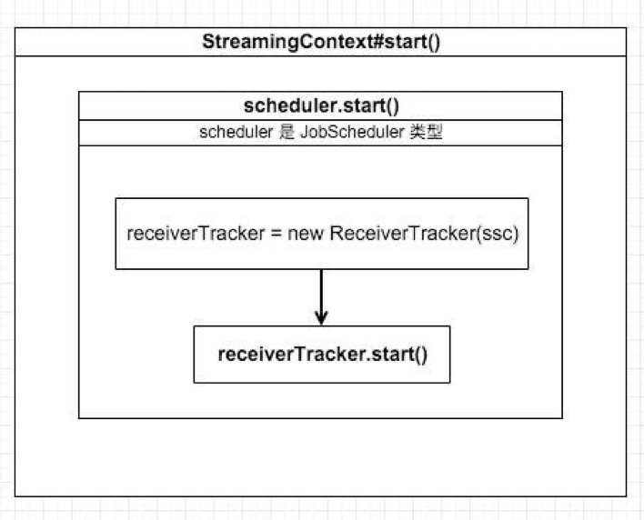 

可以看到，StreamingContext#start() 会调用 JobScheduler#start() 方法，在 JobScheduler#start() 中，会创建一个新的 ReceiverTracker 实例 receiverTracker，并调用其 start() 方法。

#### ReceiverTracker#start()
继续跟进 ReceiverTracker#start()，如下图，它主要做了两件事：

初始化一个 endpoint: ReceiverTrackerEndpoint，用来接收和处理来自 ReceiverTracker 和 receivers 发送的消息

调用 launchReceivers 来自将各个 receivers 分发到 executors 上
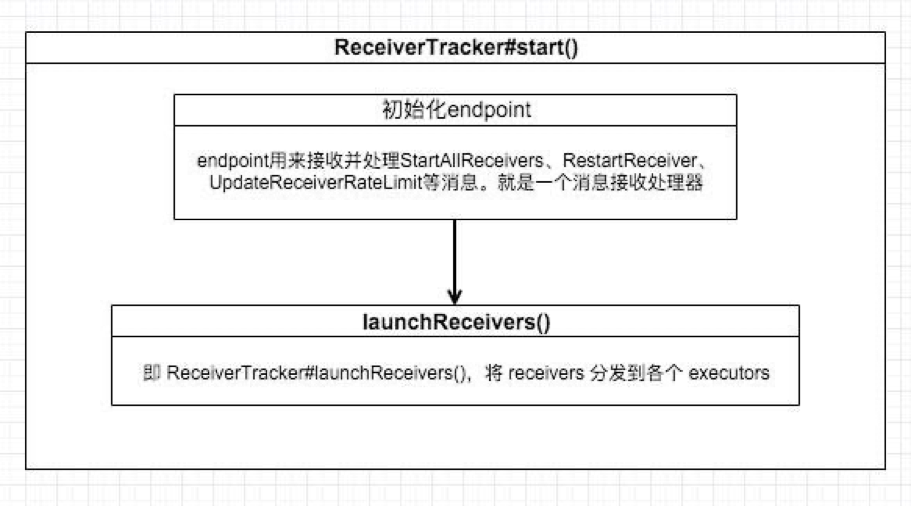 


ReceiverTracker#launchReceivers()
继续跟进 launchReceivers，它也主要干了两件事：
1.	获取 DStreamGraph.inputStreams 中继承了 ReceiverInputDStream 的 input streams 的 receivers。也就是数据接收器
2.	给消息接收处理器 endpoint 发送 StartAllReceivers(receivers)消息。直接返回，不等待消息被处理
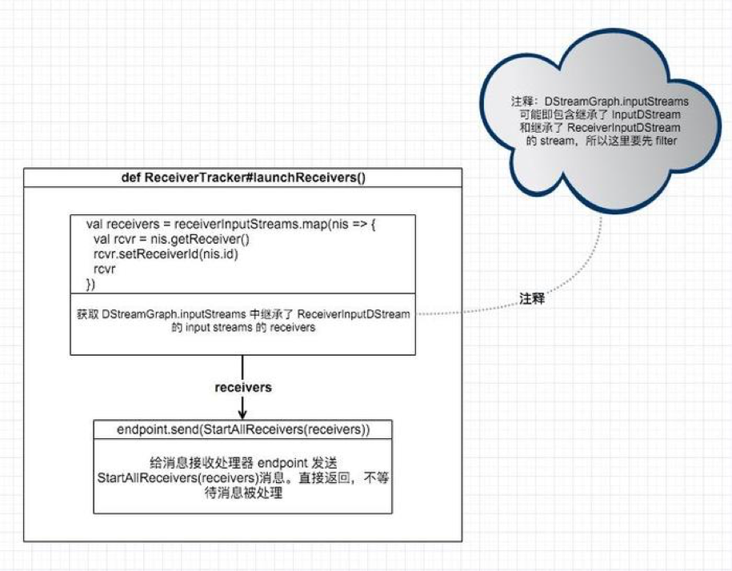 

#### 处理StartAllReceivers消息
endpoint 在接收到消息后，会先判断消息类型，对不同的消息做不同处理。对于StartAllReceivers消息，处理流程如下：

计算每个 receiver 要分发的目的 executors。遵循两条原则：

将 receiver 分布的尽量均匀

如果 receiver 的preferredLocation本身不均匀，以preferredLocation为准

遍历每个 receiver，根据第1步中得到的目的 executors 调用 startReceiver 方法
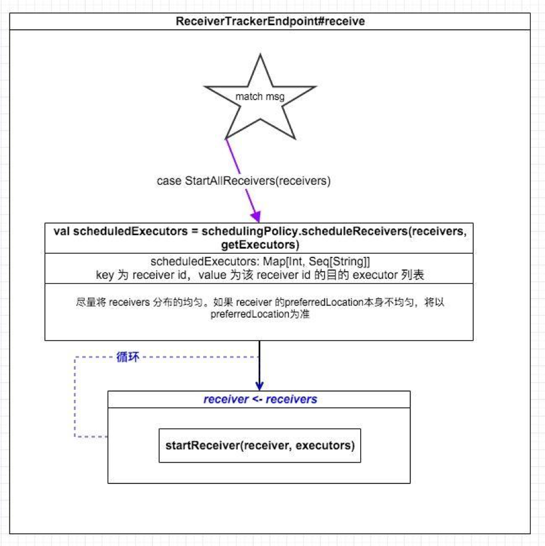 

到这里，已经确定了每个 receiver 要分发到哪些 executors 上

启动 receivers

接上，通过 ReceiverTracker#startReceiver(receiver: Receiver[_], scheduledExecutors: Seq[String]) 来启动 receivers，我们来看具体流程：
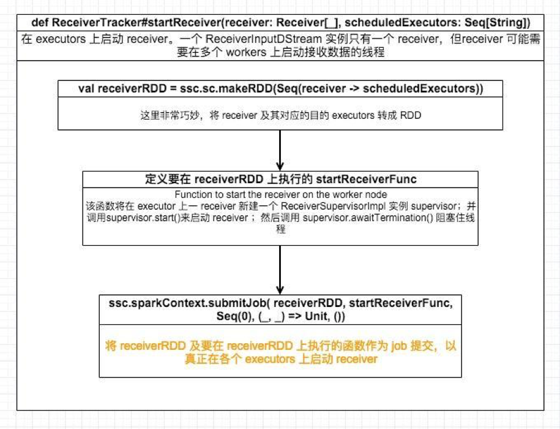 

如上流程图所述，分发和启动 receiver 的方式不可谓不精彩。其中，startReceiverFunc 函数主要实现如下：
```
val supervisor = new ReceiverSupervisorImpl(
  receiver, SparkEnv.get, serializableHadoopConf.value, checkpointDirOption)
supervisor.start()
supervisor.awaitTermination()
```

supervisor.start() 中会调用 receiver#onStart 后立即返回。receiver#onStart 一般自行新建线程或线程池来接收数据，比如在 KafkaReceiver 中，就新建了线程池，在线程池中接收 topics 的数据。

supervisor.start() 返回后，由 supervisor.awaitTermination() 阻塞住线程，以让这个 task 一直不退出，从而可以源源不断接收数据。

数据流转
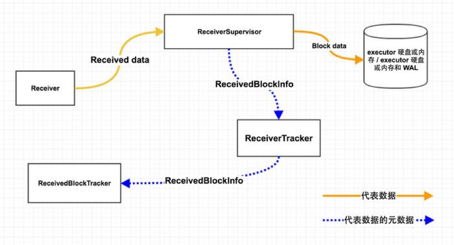 

上图为 receiver 接收到的数据的流转过程，让我们来逐一分析

#### Step1: Receiver -> ReceiverSupervisor


这一步中，Receiver 将接收到的数据源源不断地传给 ReceiverSupervisor。Receiver 调用其 store(...) 方法，store 方法中继续调用 supervisor.pushSingle 或 supervisor.pushArrayBuffer 等方法来传递数据。Receiver#store 有多重形式， ReceiverSupervisor 也有 pushSingle、pushArrayBuffer、pushIterator、pushBytes 方法与不同的 store 对应。

pushSingle: 对应单条小数据

pushArrayBuffer: 对应数组形式的数据

pushIterator: 对应 iterator 形式数据

pushBytes: 对应 ByteBuffer 形式的块数据

对于细小的数据，存储时需要 BlockGenerator 聚集多条数据成一块，然后再成块存储；反之就不用聚集，直接成块存储。当然，存储操作并不在 Step1 中执行，只为说明之后不同的操作逻辑。


#### Step2.1: ReceiverSupervisor -> BlockManager -> disk/memory

在这一步中，主要将从 receiver 收到的数据以 block（数据块）的形式存储

存储 block 的是receivedBlockHandler: ReceivedBlockHandler，根据参数spark.streaming.receiver.writeAheadLog.enable配置的不同，默认为 false，receivedBlockHandler对象对应的类也不同，如下：
```
private val receivedBlockHandler: ReceivedBlockHandler = {
  if (WriteAheadLogUtils.enableReceiverLog(env.conf)) {
    //< 先写 WAL，再存储到 executor 的内存或硬盘
    new WriteAheadLogBasedBlockHandler(env.blockManager, receiver.streamId,
      receiver.storageLevel, env.conf, hadoopConf, checkpointDirOption.get)
  } else {
    //< 直接存到 executor 的内存或硬盘
    new BlockManagerBasedBlockHandler(env.blockManager, receiver.storageLevel)
  }
}
```

启动 WAL 的好处就是在application 挂掉之后，可以恢复数据。
```
//< 调用 receivedBlockHandler.storeBlock 方法存储 block，并得到一个 blockStoreResult
val blockStoreResult = receivedBlockHandler.storeBlock(blockId, receivedBlock)
//< 使用blockStoreResult初始化一个ReceivedBlockInfo实例
val blockInfo = ReceivedBlockInfo(streamId, numRecords, metadataOption, blockStoreResult)
//< 发送消息通知 ReceiverTracker 新增并存储了 block
trackerEndpoint.askWithRetry[Boolean](AddBlock(blockInfo))
```
不管是 WriteAheadLogBasedBlockHandler 还是 BlockManagerBasedBlockHandler 最终都是通过 BlockManager 将 block 数据存储 execuor 内存或磁盘或还有 WAL 方式存入。

这里需要说明的是 streamId，每个 InputDStream 都有它自己唯一的 id，即 streamId，blockInfo包含 streamId 是为了区分block 是哪个 InputDStream 的数据。之后为 batch 分配 blocks 时，需要知道每个 InputDStream 都有哪些未分配的 blocks。

#### Step2.2: ReceiverSupervisor -> ReceiverTracker
将 block 存储之后，获得 block 描述信息 blockInfo: ReceivedBlockInfo，这里面包含：streamId、数据位置、数据条数、数据 size 等信息。

之后，封装以 block 作为参数的 AddBlock(blockInfo) 消息并发送给 ReceiverTracker 以通知其有新增 block 数据块。

#### Step3: ReceiverTracker -> ReceivedBlockTracker

ReceiverTracker 收到 ReceiverSupervisor 发来的 AddBlock(blockInfo) 消息后，直接调用以下代码将 block 信息传给 ReceivedBlockTracker：
```
  private def addBlock(receivedBlockInfo: ReceivedBlockInfo): Boolean = {
    receivedBlockTracker.addBlock(receivedBlockInfo)
  }
```

receivedBlockTracker.addBlock中，如果启用了 WAL，会将新增的 block 信息以 WAL 方式保存。
无论 WAL 是否启用，都会将新增的 block 信息保存到 streamIdToUnallocatedBlockQueues: mutable.HashMap[Int, ReceivedBlockQueue]中，该变量 key 为 InputDStream 的唯一 id，value 为已存储未分配的 block 信息。之后为 batch 分配blocks，会访问该结构来获取每个 InputDStream 对应的未消费的 blocks。

## 5.3	动态生成JOB
JobScheduler有两个重要成员，一是ReceiverTracker，负责分发 receivers 及源源不断地接收数据；二是JobGenerator，负责定时的生成 jobs 并 checkpoint。

### 定时逻辑
在 JobScheduler 的主构造函数中，会创建 JobGenerator 对象。在 JobGenerator 的主构造函数中，会创建一个定时器：
```
  private val timer = new RecurringTimer(clock, ssc.graph.batchDuration.milliseconds,
    longTime => eventLoop.post(GenerateJobs(new Time(longTime))), "JobGenerator")
```
该定时器每隔 ssc.graph.batchDuration.milliseconds 会执行一次 eventLoop.post(GenerateJobs(new Time(longTime))) 向 eventLoop 发送 GenerateJobs(new Time(longTime))消息，eventLoop收到消息后会进行这个 batch 对应的 jobs 的生成及提交执行，eventLoop 是一个消息接收处理器。

需要注意的是，timer 在创建之后并不会马上启动，将在 StreamingContext#start() 启动 Streaming Application 时间接调用到 timer.start(restartTime.milliseconds)才启动。

为 batch 生成 jobs
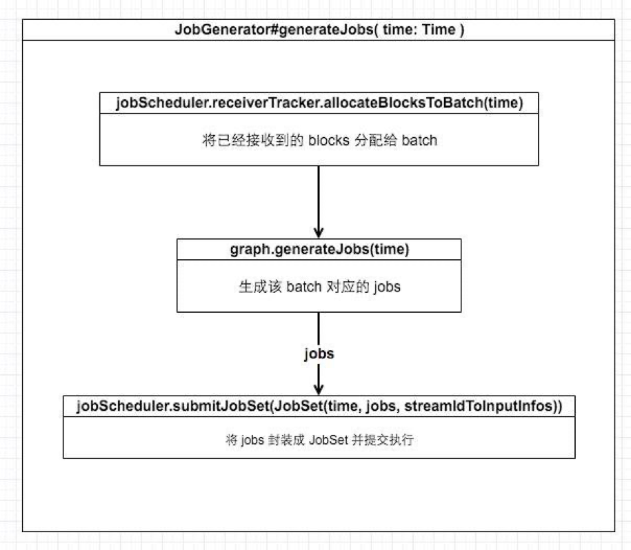 

eventLoop 在接收到 GenerateJobs(new Time(longTime))消息后的主要处理流程有以上图中三步：

将已接收到的 blocks 分配给 batch  
生成该 batch 对应的 jobs  
将 jobs 封装成 JobSet 并提交执行  
接下来我们就将逐一展开这三步进行分析  

将已接受到的 blocks 分配给 batch
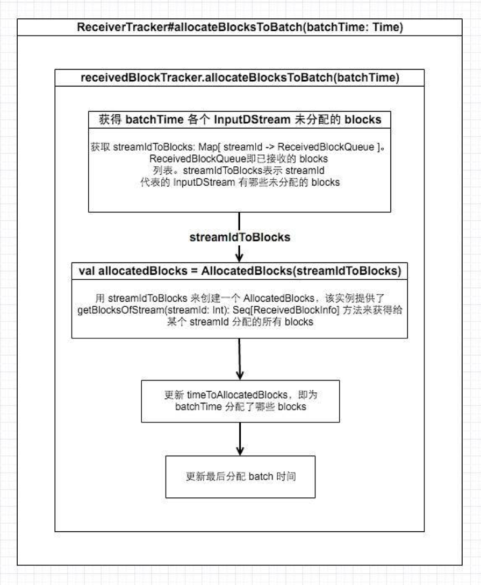 


上图是根据源码画出的为 batch 分配 blocks 的流程图，这里对 『获得 batchTime 各个 InputDStream 未分配的 blocks』作进一步说明：


我们知道了各个 ReceiverInputDStream 对应的 receivers 接收并保存的 blocks 信息会保存在 ReceivedBlockTracker#streamIdToUnallocatedBlockQueues，该成员 key 为 streamId，value 为该 streamId 对应的 InputDStream 已接收保存但尚未分配的 blocks 信息。

所以获取某 InputDStream 未分配的 blocks 只要以该 InputDStream 的 streamId 来从 streamIdToUnallocatedBlockQueues 来 get 就好。获取之后，会清楚该 streamId 对应的value，以保证 block 不会被重复分配。

在实际调用中，为 batchTime 分配 blocks 时，会从streamIdToUnallocatedBlockQueues取出未分配的 blocks 塞进 timeToAllocatedBlocks: mutable.HashMap[Time, AllocatedBlocks] 中，以在之后作为该 batchTime 对应的 RDD 的输入数据。

通过以上步骤，就可以为 batch 的所有 InputDStream 分配 blocks。也就是为 batch 分配了 blocks。

生成该 batch 对应的 jobs
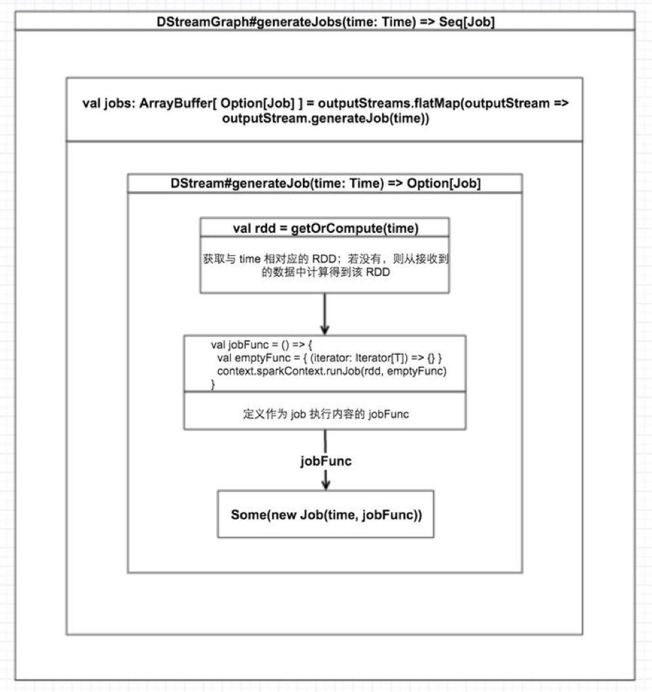 

为指定 batchTime 生成 jobs 的逻辑如上图所示。你可能会疑惑，为什么 DStreamGraph#generateJobs(time: Time)为什么返回 Seq[Job]，而不是单个 job。这是因为，在一个 batch 内，可能会有多个 OutputStream 执行了多次 output 操作，每次 output 操作都将产生一个 Job，最终就会产生多个 Jobs。

我们结合上图对执行流程进一步分析。

在DStreamGraph#generateJobs(time: Time)中，对于DStreamGraph成员ArrayBuffer[DStream[_]]的每一项，调用DStream#generateJob(time: Time)来生成这个 outputStream 在该 batchTime 的 job。该生成过程主要有三步：

#### Step1: 获取该 outputStream 在该 batchTime 对应的 RDD

每个 DStream 实例都有一个 generatedRDDs: HashMap[Time, RDD[T]] 成员，用来保存该 DStream 在每个 batchTime 生成的 RDD，当 DStream#getOrCompute(time: Time)调用时
1. 首先会查看generatedRDDs中是否已经有该 time 对应的 RDD，若有则直接返回
2. 若无，则调用compute(validTime: Time)来生成 RDD，这一步根据每个 InputDStream继承 compute 的实现不同而不同。例如，对于 FileInputDStream，其 compute 实现逻辑如下：
    1.	先通过一个 findNewFiles() 方法，找到多个新 file
    2.	对每个新 file，都将其作为参数调用 sc.newAPIHadoopFile(file)，生成一个 RDD 实例
    3.	将 2 中的多个新 file 对应的多个 RDD 实例进行 union，返回一个 union 后的 UnionRDD
    
    
#### Step2: 根据 Step1中得到的 RDD 生成最终 job 要执行的函数 jobFunc

jobFunc定义如下：
```
val jobFunc = () => {
  val emptyFunc = { (iterator: Iterator[T]) => {} }
  context.sparkContext.runJob(rdd, emptyFunc)
}
```
可以看到，每个 outputStream 的 output 操作生成的 Job 其实与 RDD action 一样，最终调用 SparkContext#runJob 来提交 RDD DAG 定义的任务

#### Step3: 根据 Step2中得到的 jobFunc 生成最终要执行的 Job 并返回
Step2中得到了定义 Job 要干嘛的函数-jobFunc，这里便以 jobFunc及 batchTime 生成 Job 实例：

Some(new Job(time, jobFunc))

该Job实例将最终封装在 JobHandler 中被执行

至此，我们搞明白了 JobScheduler 是如何通过一步步调用来动态生成每个 batchTime 的 jobs。下文我们将分析这些动态生成的 jobs 如何被分发及如何执行。

## 5.4	job 的提交与执行
我们分析了 JobScheduler 是如何动态为每个 batch生成 jobs，那么生成的 jobs 是如何被提交的。

在 JobScheduler 生成某个 batch 对应的 Seq[Job] 之后，会将 batch 及 Seq[Job] 封装成一个 JobSet 对象，JobSet 持有某个 batch 内所有的 jobs，并记录各个 job 的运行状态。

之后，调用JobScheduler#submitJobSet(jobSet: JobSet)来提交 jobs，在该函数中，除了一些状态更新，主要任务就是执行

jobSet.jobs.foreach(job => jobExecutor.execute(new JobHandler(job)))

即，对于 jobSet 中的每一个 job，执行jobExecutor.execute(new JobHandler(job))，要搞懂这行代码干了什么，就必须了解 JobHandler 及 jobExecutor。

### JobHandler
JobHandler 继承了 Runnable，为了说明与 job 的关系，其精简后的实现如下：
```
private class JobHandler(job: Job) extends Runnable with Logging {
  import JobScheduler._

  def run() {
    _eventLoop.post(JobStarted(job))
    PairRDDFunctions.disableOutputSpecValidation.withValue(true) {
      job.run()
    }
    _eventLoop = eventLoop
    if (_eventLoop != null) {
      _eventLoop.post(JobCompleted(job))
    }
  }

}
```

JobHandler#run 方法主要执行了 job.run()，该方法最终将调用到

『生成该 batch 对应的 jobs的Step2 定义的 jobFunc』，jonFunc 将提交对应 RDD DAG 定义的 job。

### JobExecutor
知道了 JobHandler 是用来执行 job 的，那么 JobHandler 将在哪里执行 job 呢？答案是

jobExecutor，jobExecutor为 JobScheduler 成员，是一个线程池，在JobScheduler 主构造函数中创建，如下：
```
private val numConcurrentJobs = ssc.conf.getInt("spark.streaming.concurrentJobs", 1)
private val jobExecutor = ThreadUtils.newDaemonFixedThreadPool(numConcurrentJobs, "streaming-job-executor")
```

JobHandler 将最终在 线程池jobExecutor 的线程中被调用，jobExecutor的线程数可通过spark.streaming.concurrentJobs配置，默认为1。若配置多个线程，就能让多个 job 同时运行，若只有一个线程，那么同一时刻只能有一个 job 运行。

以上，即 jobs 被执行的逻辑。


## 5.5	Block 的生成与存储
    ReceiverSupervisorImpl共提供了4个将从 receiver 传递过来的数据转换成 block 并存储的方法，分别是：
    pushSingle: 处理单条数据
    pushArrayBuffer: 处理数组形式数据
    pushIterator: 处理 iterator 形式处理
    pushBytes: 处理 ByteBuffer 形式数据
    
其中，pushArrayBuffer、pushIterator、pushBytes最终调用pushAndReportBlock；而pushSingle将调用defaultBlockGenerator.addData(data)，我们分别就这两种形式做说明

### pushAndReportBlock
我们针对存储 block 简化 pushAndReportBlock 后的代码如下：
```
def pushAndReportBlock(
  receivedBlock: ReceivedBlock,
  metadataOption: Option[Any],
  blockIdOption: Option[StreamBlockId]
) {
  ...
  val blockId = blockIdOption.getOrElse(nextBlockId)
  receivedBlockHandler.storeBlock(blockId, receivedBlock)
  ...
}
```


首先获取一个新的 blockId，之后调用 receivedBlockHandler.storeBlock, receivedBlockHandler 在 ReceiverSupervisorImpl 构造函数中初始化。当启用了 checkpoint 且 spark.streaming.receiver.writeAheadLog.enable 为 true 时，receivedBlockHandler 被初始化为 WriteAheadLogBasedBlockHandler 类型；否则将初始化为 BlockManagerBasedBlockHandler类型。

WriteAheadLogBasedBlockHandler#storeBlock 将 ArrayBuffer, iterator, bytes 类型的数据序列化后得到的 serializedBlock

交由 BlockManager 根据设置的 StorageLevel 存入 executor 的内存或磁盘中

通过 WAL 再存储一份

而BlockManagerBasedBlockHandler#storeBlock将 ArrayBuffer, iterator, bytes 类型的数据交由 BlockManager 根据设置的 StorageLevel 存入 executor 的内存或磁盘中，并不再通过 WAL 存储一份

### pushSingle
pushSingle将调用 BlockGenerator#addData(data: Any) 通过积攒的方式来存储数据。接下来对 BlockGenerator 是如何积攒一条一条数据最后写入 block 的逻辑
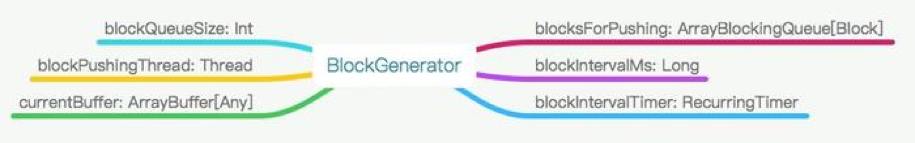 

上图为 BlockGenerator 的各个成员，首选对各个成员做介绍：

### currentBuffer
变长数组，当 receiver 接收的一条一条的数据将会添加到该变长数组的尾部

可能会有一个 receiver 的多个线程同时进行添加数据，这里是同步操作

添加前，会由 rateLimiter 检查一下速率，是否加入的速度过快。如果过快的话就需要 block 住，等到下一秒再开始添加。最高频率由 spark.streaming.receiver.maxRate 控制，默认值为 Long.MaxValue，具体含义是单个 Receiver 每秒钟允许添加的条数。

blockIntervalTimer & blockIntervalMs

    分别是定时器和时间间隔。blockIntervalTimer中有一个线程，每隔blockIntervalMs会执行以下操作：
    将 currentBuffer 赋值给 newBlockBuffer
    将 currentBuffer 指向新的空的 ArrayBuffer 对象
    将 newBlockBuffer 封装成 newBlock
    将 newBlock 添加到 blocksForPushing 队列中blockIntervalMs 由 spark.streaming.blockInterval 控制，默认是 200ms。

### blockPushingThread & blocksForPushing & blockQueueSize
blocksForPushing 是一个定长数组，长度由 blockQueueSize 决定，默认为10，可通过 spark.streaming.blockQueueSize 改变。上面分析到，blockIntervalTimer中的线程会定时将 block 塞入该队列。

还有另一条线程不断送该队列中取出 block，然后调用 ReceiverSupervisorImpl.pushArrayBuffer(...) 来将 block 存储，这条线程就是blockPushingThread。

PS: blocksForPushing为ArrayBlockingQueue类型。ArrayBlockingQueue是一个阻塞队列，能够自定义队列大小，当插入时，如果队列已经没有空闲位置，那么新的插入线程将阻塞到该队列，一旦该队列有空闲位置，那么阻塞的线程将执行插入

以上，通过分析各个成员，也说明了 BlockGenerator 是如何存储单条数据的。


### [跳至下一章](./A7_spark_core_analysis.md)


