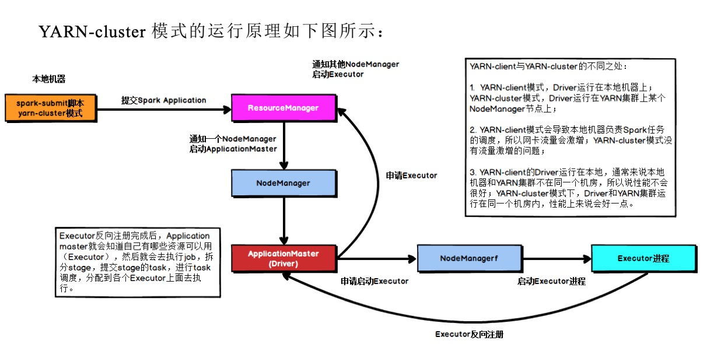
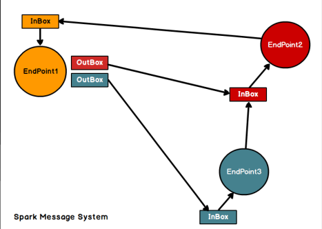
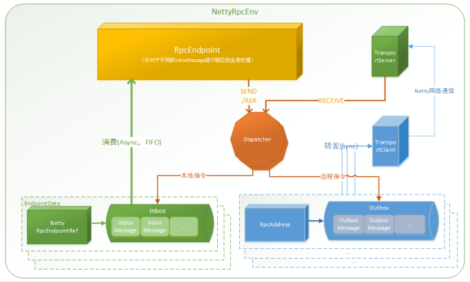
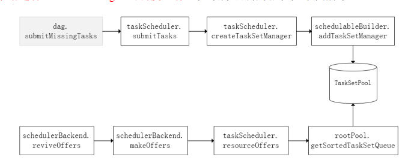
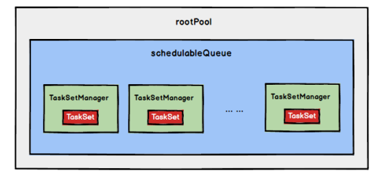
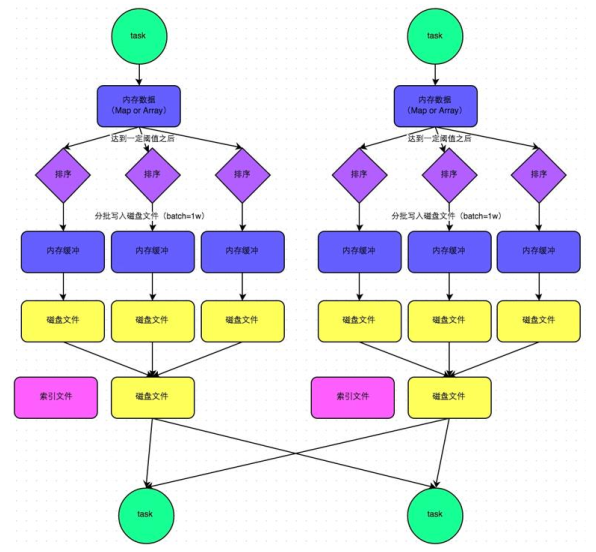
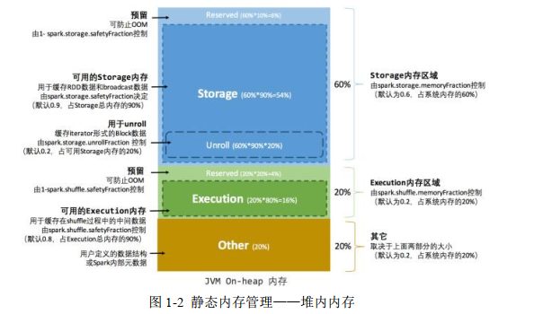
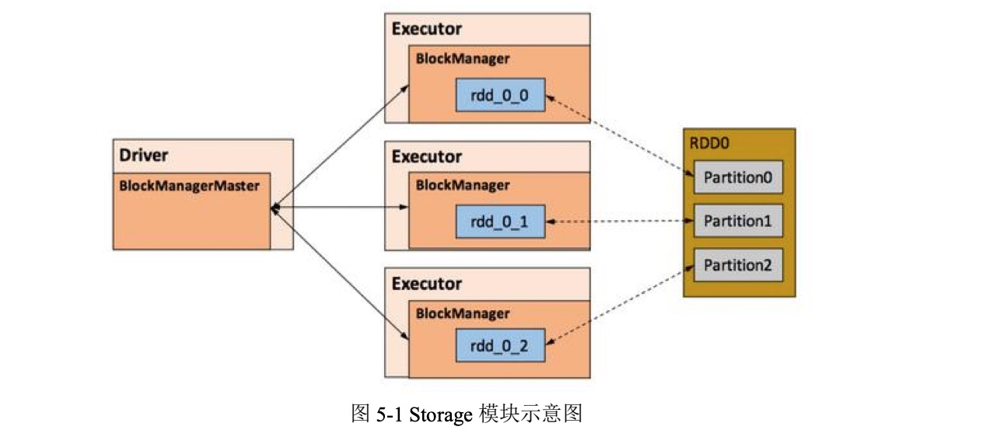
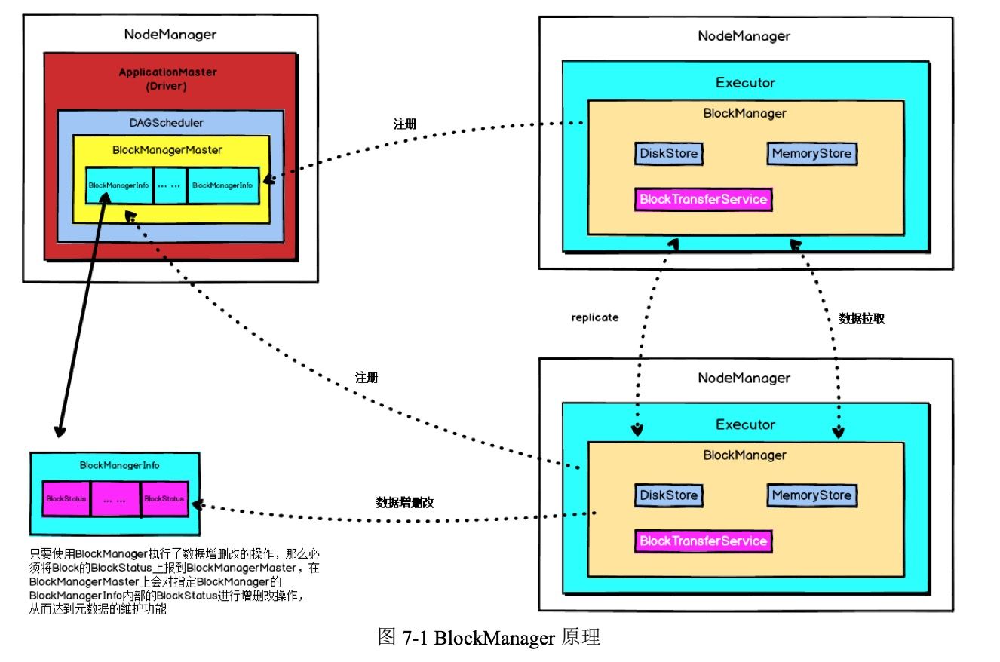
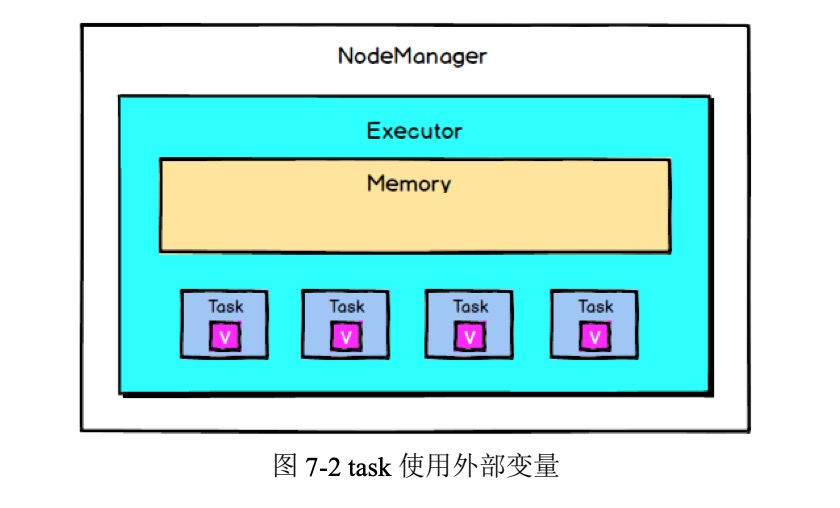

# Spark 内核解析


## 1.	Spark	内核概述

Spark 内核泛指 Spark 的核心运行机制，包括 Spark 核心组件的运行机制、Spark 任务调度机制、Spark 内存管理机制、Spark 核心功能的运行原理等，熟练掌握 Spark 内核原理，能够帮助我们更好地完成 Spark 代码设计，并能够帮助我们准确锁定项目运行过程中出现的问题的症结所在。

### 1.1	Spark 核心组件回顾

#### 1.1.1	Driver

Spark 驱动器节点，用于执行 Spark 任务中的 main 方法，负责实际代码的执行工作。Driver 在 Spark 作业执行时主要负责：
1.	将用户程序转化为任务（job）；
2.	在 Executor 之间调度任务（task）；
3.	跟踪 Executor 的执行情况；
4.	通过 UI 展示查询运行情况；

#### 1.1.2	Executor

Spark Executor 节点是一个 JVM 进程，负责在 Spark 作业中运行具体任务，任务彼此之间相互独立。Spark 应用启动时， Executor  节点被同时启动， 并且始终伴随着整个 Spark  应用的生命周期而存在。如果有 Executor 节点发生了故障或崩溃，
Spark 应用也可以继续执行， 会将出错节点上的任务调度到其他 Executor 节点上继续运行。
Executor 有两个核心功能：
1.	负责运行组成 Spark 应用的任务，并将结果返回给驱动器进程； 
2.	它们通过自身的块管理器（ Block Manager）为用户程序中要求缓存的 RDD
提供内存式存储。RDD  是直接缓存在 Executor  进程内的，因此任务可以在运行时
充分利用缓存数据加速运算。

### 1.2 Spark 通用运行流程概述
图 1-1 Spark 核心运行流程:   


不论 Spark 以何种模式进行部署， 任务提交后， 都会先启动 Driver 进程，随后 Driver 进程向集群管理器注册应用程序，之后集群管理器根据此任务的配置文件分配 Executor 并启动，当 Driver 所需的资源全部满足后， 
Driver 开始执行 main 函数， Spark 查询为懒执行， 当执行到 action 算子时开始反向推算，根据宽依赖进行 stage 的划分，随后每一个 stage 对应一个 taskset，taskset 中有多个 task，根据本地化原则， task 会被分发到指定的 Executor 去执行，在任务执行的过程中， Executor 也会不断与 Driver 进行通信，报告任务运行情况。

## 2.	Spark  部署模式

Spark 支持 3 种集群管理器（ Cluster Manager） ，分别为： 
1.	Standalone： 独立模式， Spark 原生的简单集群管理器， 自带完整的服务， 可单独部署到一个集群中，无需依赖任何其他资源管理系统， 使用 Standalone 可以很方便地搭建一个集群；
2.	Apache  Mesos：一个强大的分布式资源管理框架，它允许多种不同的框架部
署在其上，包括 yarn；
3.	Hadoop YARN： 统一的资源管理机制， 在上面可以运行多套计算框架， 如map  reduce、storm 等， 根据 driver 在集群中的位置不同，分为 yarn  client 和 yarn
cluster。
实际上，除了上述这些通用的集群管理器外，Spark 内部也提供了一些方便用户测试和学习的简单集群部署模式。由于在实际工厂环境下使用的绝大多数的集群管理器是 Hadoop YARN，因此我们关注的重点是 Hadoop YARN 模式下的 Spark 集群部署。
Spark 的运行模式取决于传递给 SparkContext 的 MASTER 环境变量的值， 个别模式还需要辅助的程序接口来配合使用，目前支持的 Master 字符串及 URL 包括： 
表 2-1 Spark运行模式配置

|  Master URL | Meaning |
| :--: | :---|
| local | 在本地运行，只有一个工作进程，无并行计算能力。|
| local[K] | 在本地运行，有 K 个工作进程，通常设置 K 为机器的CPU 核心数量。|
|local[*] | 在本地运行，工作进程数量等于机器的 CPU 核心数量。|
| spark://HOST:PORT | 以 Standalone 模式运行，这是 Spark 自身提供的集群运行模式，默认端口号: 7077。详细文档见:Spark standalone cluster。| 
| mesos://HOST:PORT | 在 Mesos 集群上运行，Driver 进程和 Worker 进程运行在 Mesos 集群上，部署模式必须使用固定值:--deploy-mode cluster。详细文档见:MesosClusterDispatcher. | 
| yarn-client |在 Yarn 集群上运行，Driver 进程在本地， Work 进程在 Yarn 集群上， 部署模式必须使用固定值:--deploy-mode client。Yarn  集群地址必须在 HADOOP_CONF_DIRorYARN_CONF_DIR  变量里定义。|
| yarn-cluster | 在 Yarn 集群上运行，Driver 进程在 Yarn 集群上，Work 进程也在 Yarn 集群上，部署模式必须使用固定值:--deploy-mode cluster。Yarn 集群地址必须在 HADOOP_CONF_DIRorYARN_CONF_DIR  变量里定义。|

用户在提交任务给 Spark 处理时，以下两个参数共同决定了 Spark 的运行方式。
·	– master MASTER_URL  ：决定了 Spark 任务提交给哪种集群处理。
·	– deploy-mode DEPLOY_MODE：决定了 Driver 的运行方式，可选值为 Client
或者 Cluster。

### 2.1	Standalone 模式运行机制

Standalone 集群有四个重要组成部分， 分别是：
 1.	Driver： 是一个进程，我们编写的 Spark  应用程序就运行在 Driver  上， 由
Driver 进程执行； 
 2.	Master：是一个进程，主要负责资源的调度和分配，并进行集群的监控等职责； 
 3.	Worker：是一个进程，一个 Worker 运行在集群中的一台服务器上，主要负责两个职责，一个是用自己的内存存储 RDD 的某个或某些 partition；另一个是启动其他进程和线程（Executor） ，对 RDD 上的 partition 进行并行的处理和计算。
 4.	Executor：是一个进程， 一个 Worker 上可以运行多个 Executor， Executor 通过启动多个线程（ task）来执行对 RDD 的 partition 进行并行计算，也就是执行我们对 RDD 定义的例如 map、flatMap、reduce 等算子操作。

#### 2.1.1	Standalone Client 模式
图 2-1 Standalone Client 模式:    


在 Standalone Client 模式下，Driver 在任务提交的本地机器上运行，Driver 启动后向 Master 注册应用程序，Master 根据 submit 脚本的资源需求找到内部资源至少可以启动一个 Executor 的所有 Worker，然后在这些 Worker 之间分配 Executor，Worker 上的 Executor 启动后会向 Driver 反向注册，所有的 Executor 注册完成后，Driver 开始执行 main 函数，之后执行到 Action 算子时，开始划分 stage，每个 stage 生成对
应的 taskSet，之后将 task 分发到各个 Executor 上执行。

#### 2.1.2	Standalone Cluster 模式
图 2-2 Standalone Cluster 模式:    


在 Standalone Cluster 模式下，任务提交后，Master 会找到一个 Worker 启动 Driver进程， Driver 启动后向 Master 注册应用程序， Master 根据 submit 脚本的资源需求找到内部资源至少可以启动一个 Executor 的所有 Worker，然后在这些 Worker 之间分配 Executor，Worker 上的 Executor 启动后会向 Driver 反向注册，所有的 Executor 注册完成后，Driver 开始执行 main 函数，之后执行到 Action 算子时，开始划分 stage，每个 stage 生成对应的 taskSet，之后将 task 分发到各个 Executor 上执行。
注意， Standalone  的两种模式下（ client/Cluster） ， Master  在接到 Driver  注册
Spark 应用程序的请求后，会获取其所管理的剩余资源能够启动一个 Executor 的所有 Worker， 然后在这些 Worker 之间分发 Executor， 此时的分发只考虑 Worker 上的资源是否足够使用，直到当前应用程序所需的所有 Executor 都分配完毕， Executor 反向注册完毕后，Driver 开始执行 main 程序。

### 2.2	YARN 模式运行机制

#### 2.2.1	YARN Client 模式
图 2-3 YARN Client 模式:    


在 YARN Client 模式下，Driver 在任务提交的本地机器上运行，Driver 启动后会和 ResourceManager 通讯申请启动 ApplicationMaster， 随后 ResourceManager 分配 container ， 在 合 适 的 NodeManager   上启动 ApplicationMaster ，此时的 
ApplicationMaster  的功能相当于一个 ExecutorLaucher， 只负责向 ResourceManager
申请 Executor 内存。
ResourceManager  接到 ApplicationMaster  的资源申请后会分配 container，然后
ApplicationMaster 在资源分配指定的 NodeManager 上启动 Executor 进程， Executor 进程启动后会向 Driver 反向注册， Executor 全部注册完成后 Driver 开始执行 main 函数，之后执行到 Action 算子时，触发一个 job，并根据宽依赖开始划分 stage，每个 stage 生成对应的 taskSet，之后将 task 分发到各个 Executor 上执行。

#### 2.2.2	YARN Cluster 模式
图 2-4 YARN Cluster 模式:   

 

在 YARN  Cluster  模式下， 任务提交后会和 ResourceManager  通讯申请启动
ApplicationMaster， 随后 ResourceManager  分配 container，在合适的 NodeManager
上启动 ApplicationMaster，此时的 ApplicationMaster 就是 Driver。
Driver 启动后向 ResourceManager 申请 Executor 内存， ResourceManager 接到
ApplicationMaster 的资源申请后会分配 container，然后在合适的 NodeManager 上启动 Executor 进程，Executor 进程启动后会向 Driver 反向注册， Executor 全部注册完成后 Driver 开始执行 main 函数，之后执行到 Action 算子时，触发一个 job，并根据宽依赖开始划分 stage，每个 stage  生成对应的 taskSet，之后将 task  分发到各个
Executor 上执行。

## 3.	Spark  通讯架构

### 3.1	Spark 通信架构概述

Spark2.x 版本使用 Netty 通讯框架作为内部通讯组件。spark  基于 netty 新的 rpc

框架借鉴了 Akka 的中的设计， 它是基于 Actor 模型， 如下图所示： 
图 4-1 Actor 模型:   

  

Spark 通讯框架中各个组件（ Client/Master/Worker）可以认为是一个个独立的实体，各个实体之间通过消息来进行通信。具体各个组件之间的关系图如下： 
图 4-2 Spark 通讯架构:   



Endpoint（ Client/Master/Worker）有 1 个 InBox 和 N 个 OutBox（ N>=1，N 取决于当前 Endpoint 与多少其他的 Endpoint 进行通信， 一个与其通讯的其他 Endpoint 对应一个 OutBox）， Endpoint  接收到的消息被写入 InBox， 发送出去的消息写入
OutBox 并被发送到其他 Endpoint 的 InBox 中。

### 3.2	Spark 通讯架构解析

Spark 通信架构如下图所示： 
图 4-3 Spark 通讯架构:   

   

1. RpcEndpoint：RPC 端点，Spark 针对每个节点（ Client/Master/Worker）都称之为一个 Rpc 端点，且都实现 RpcEndpoint 接口，内部根据不同端点的需求，设计不同的消息和不同的业务处理，如果需要发送（询问）则调用 Dispatcher；
2.	RpcEnv： RPC  上下文环境， 每个 RPC  端点运行时依赖的上下文环境称为
RpcEnv；
3. Dispatcher：消息分发器，针对于 RPC 端点需要发送消息或者从远程 RPC 接收到的消息，分发至对应的指令收件箱/发件箱。如果指令接收方是自己则存入收件箱，如果指令接收方不是自己，则放入发件箱； 
4.	Inbox：指令消息收件箱，一个本地 RpcEndpoint 对应一个收件箱，Dispatcher 在每次向 Inbox 存入消息时， 都将对应 EndpointData 加入内部 ReceiverQueue 中， 另外 Dispatcher 创建时会启动一个单独线程进行轮询 ReceiverQueue，进行收件箱消息消费； 
5.	RpcEndpointRef：RpcEndpointRef 是对远程 RpcEndpoint 的一个引用。当我们需要向一个具体的 RpcEndpoint 发送消息时，一般我们需要获取到该 RpcEndpoint 的引用，然后通过该应用发送消息。
6.	OutBox ： 指 令 消 息 发 件 箱 ， 对 于 当 前 RpcEndpoint  来 说 ， 一 个 目 标
RpcEndpoint  对应一个发件箱， 如果向多个目标 RpcEndpoint  发送信息， 则有多个
OutBox。当消息放入 Outbox 后，紧接着通过 TransportClient 将消息发送出去。消息放入发件箱以及发送过程是在同一个线程中进行； 
7.	RpcAddress： 表示远程的 RpcEndpointRef 的地址， Host + Port。
8.	TransportClient：Netty 通信客户端，一个 OutBox 对应一个 TransportClient，
TransportClient 不断轮询 OutBox，根据 OutBox 消息的 receiver 信息，请求对应的远程 TransportServer；
9.	TransportServer ： Netty   通 信 服 务 端 ， 一 个 RpcEndpoint   对 应 一 个
TransportServer，接受远程消息后调用 Dispatcher 分发消息至对应收发件箱； 
根据上面的分析， Spark 通信架构的高层视图如下图所示： 
图 4-4 Spark 通信框架高层视图    


## 4.	Spark	任务调度机制

在工厂环境下， Spark 集群的部署方式一般为 YARN-Cluster 模式， 之后的内核分析内容中我们默认集群的部署方式为 YARN-Cluster 模式。
### 4.1	Spark 任务提交流程

在上一章中我们讲解了 Spark YARN-Cluster 模式下的任务提交流程， 如下图所示： 
图 4-1 YARN-Cluster 任务提交流程:  

 


下面的时序图清晰地说明了一个 Spark 应用程序从提交到运行的完整流程：
图 4-2 Spark 任务提交时序图:  


提交一个 Spark 应用程序， 首先通过 Client 向 ResourceManager 请求启动一个Application，同时检查是否有足够的资源满足 Application 的需求，如果资源条件满足，则准备 ApplicationMaster  的启动上下文，交给 ResourceManager，并循环监控Application 状态。

当提交的资源队列中有资源时， ResourceManager 会在某个 NodeManager 上启动 ApplicationMaster 进程，ApplicationMaster 会单独启动 Driver 后台线程，当 Driver启动后，ApplicationMaster 会通过本地的 RPC 连接 Driver，并开始向 ResourceManager申请 Container 资源运行 Executor 进程（一个 Executor 对应与一个 Container），当ResourceManager 返回 Container 资源，ApplicationMaster 则在对应的 Container 上启动 Executor 。  

Driver 线程主要是初始化 SparkContext 对象，准备运行所需的上下文， 然后一方面保持与 ApplicationMaster 的 RPC 连接，通过 ApplicationMaster 申请资源，另一方面根据用户业务逻辑开始调度任务，将任务下发到已有的空闲 Executor 上。  

当	ResourceManager	向	ApplicationMaster	返 回	Container	资 源 时 ，ApplicationMaster 就尝试在对应的 Container 上启动 Executor 进程，Executor 进程起来后，会向 Driver 反向注册，注册成功后保持与 Driver 的心跳，同时等待 Driver 分发任务，当分发的任务执行完毕后，将任务状态上报给 Driver。  

从上述时序图可知，Client 只负责提交 Application 并监控 Application 的状态。对于 Spark  的任务调度主要是集中在两个方面:   资源申请和任务分发，其主要是通过 ApplicationMaster、Driver 以及 Executor 之间来完成。

### 4.2	Spark 任务调度概述

当 Driver 起来后，Driver 则会根据用户程序逻辑准备任务，并根据 Executor 资源情况逐步分发任务。在详细阐述任务调度前，首先说明下 Spark 里的几个概念。

一个 Spark 应用程序包括 Job、Stage 以及 Task 三个概念：   
1.	Job 是以 Action 方法为界， 遇到一个 Action 方法则触发一个 Job；
2.	Stage 是 Job 的子集，以 RDD 宽依赖(即 Shuffle)为界，遇到 Shuffle 做一次划分； 
3.	Task 是 Stage 的子集，以并行度(分区数)来衡量，分区数是多少，则有多少个 task。 一个task  对应一个RDD的分区   

宽窄依赖的界限: 当存在shuffle过程即为宽依赖, 没有shuffle过程为窄依赖  
1. 宽依赖: 父RDD中的一个分区的数据分别分发到了子RDD的多个分区中, 这就表明有shuffle过程，父分区数据经过shuffle过程的hash分区器（也可自定义分区器）划分到子RDD。例如GroupByKey，reduceByKey，join，sortByKey等操作。
2. 窄依赖: 父RDD的每个分区的数据直接到子RDD的对应一个分区（一分区对一分区），例如1号到5号分区的数据都只进入到子RDD的一个分区，这个过程没有shuffle。Spark中Stage的划分就是通过shuffle来划分。（shuffle可理解为数据的从原分区打乱重组到新的分区）如：map，filter
总结：如果父RDD的一个Partition被一个子RDD的Partition所使用就是窄依赖，否则的话就是宽依赖。


Spark  的任务调度总体来说分界两部分进行， 一路是 Stage  级的调度 一路是 Task级的调度，总体调度流程如下图所示： 
图 4-3 Spark 任务调度概览:  


Spark RDD 通过其 Transactions 操作，形成了 RDD 血缘关系图，即 DAG，最后通过 Action 的调用， 触发 Job 并调度执行。DAGScheduler 负责 Stage 级的调度，主要是将 DAG 切分成若干 Stages，并将每个 Stage 打包成 TaskSet 交给 TaskScheduler调度。TaskScheduler 负责 Task 级的调度，将 DAGScheduler 给过来的 TaskSet 按照指定的调度策略分发到 Executor 上执行，调度过程中 SchedulerBackend 负责提供可用资源，其中 SchedulerBackend 有多种实现，分别对接不同的资源管理系统。有了上述感性的认识后，下面这张图描述了 Spark-On-Yarn   模式下在任务调度期间，ApplicationMaster、Driver 以及 Executor 内部模块的交互过程：
图 4-4 YARN-Cluster 任务调度:   


Driver   初始化 SparkContext   过 程 中 ， 会 分 别 初 始 化 DAGScheduler 、TaskScheduler、SchedulerBackend 以及 HeartbeatReceiver，并启动 SchedulerBackend 以及 HeartbeatReceiver。SchedulerBackend 通过 ApplicationMaster 申请资源，并不断从 TaskScheduler 中拿到合适的 Task 分发到 Executor 执行。HeartbeatReceiver 负责接收 Executor 的心跳信息， 监控 Executor 的存活状况， 并通知到 TaskScheduler。

### 4.3	Spark Stage 级调度

Spark 的任务调度是从 DAG 切割开始， 主要是由 DAGScheduler 来完成。当遇到一个 Action 操作后就会触发一个 Job 的计算， 并交给 DAGScheduler 来提交，下图是涉及到 Job 提交的相关方法调用流程图。
图 4-5 Job 提交调用栈:  


Job  由 最 终 的 RDD  和 Action  方 法 封 装 而 成 ， SparkContext  将 Job  交给DAGScheduler 提交，它会根据 RDD 的血缘关系构成的 DAG 进行切分，将一个 Job 划分为若干 Stages，具体划分策略是，由最终的 RDD 不断通过依赖回溯判断父依赖是否是宽依赖，即以 Shuffle 为界，划分 Stage，窄依赖的 RDD 之间被划分到同一个Stage 中，可以进行 pipeline 式的计算，如上图紫色流程部分。划分的 Stages 分两类， 一类叫做 ResultStage，为 DAG 最下游的 Stage，由 Action 方法决定，另一类叫做 ShuffleMapStage，为下游 Stage 准备数据， 下面看一个简单的例子 WordCount。
图 4-6 WordCount 实例:  


Job 由 saveAsTextFile 触发，该 Job 由 RDD-3 和 saveAsTextFile 方法组成，根据RDD 之间的依赖关系从 RDD-3 开始回溯搜索， 直到没有依赖的 RDD-0，在回溯搜索过程中，RDD-3 依赖 RDD-2， 并且是宽依赖， 所以在 RDD-2 和 RDD-3 之间划分Stage，RDD-3 被划到最后一个 Stage，即 ResultStage 中，RDD-2 依赖 RDD-1，RDD-1 依赖 RDD-0， 这些依赖都是窄依赖， 所以将 RDD-0、RDD-1 和 RDD-2 划分到同一个 Stage，即 ShuffleMapStage 中， 实际执行的时候， 数据记录会一气呵成地执行RDD-0 到 RDD-2 的转化。不难看出， 其本质上是一个深度优先搜索算法。一个 Stage 是否被提交，需要判断它的父 Stage 是否执行，只有在父 Stage 执行完毕才能提交当前 Stage，如果一个 Stage 没有父 Stage，那么从该 Stage 开始提交。Stage 提交时会将 Task 信息（ 分区信息以及方法等）序列化并被打包成 TaskSet 交给TaskScheduler，一个 Partition 对应一个 Task， 另一方面 TaskScheduler 会监控 Stage 的运行状态，只有 Executor 丢失或者 Task  由于 Fetch 失败才需要重新提交失败的Stage 以调度运行失败的任务，其他类型的 Task 失败会在 TaskScheduler 的调度过程中重试。相对来说 DAGScheduler 做的事情较为简单，仅仅是在 Stage 层面上划分 DAG， 提交 Stage 并监控相关状态信息。TaskScheduler 则相对较为复杂，下面详细阐述其细节。


### 4.4	Spark Task 级调度

Spark  Task 的调度是由 TaskScheduler 来完成，由前文可知，DAGScheduler 将Stage  打 包到 TaskSet  交给 TaskScheduler ， TaskScheduler  会将 TaskSet  封装为TaskSetManager 加入到调度队列中， TaskSetManager 结构如下图所示。
图 4-7 TaskManager 结构:  


TaskSetManager  负责监控管理同一个 Stage  中的 Tasks， TaskScheduler  就是以TaskSetManager 为单元来调度任务。
前面也提到， TaskScheduler 初始化后会启动 SchedulerBackend， 它负责跟外界打交道，接收 Executor 的注册信息，并维护 Executor 的状态，所以说 SchedulerBackend 是管“粮食”的，同时它在启动后会定期地去“询问”TaskScheduler 有没有任务要运行， 也就是说， 它会定期地 “ 问 ”TaskScheduler“ 我有这么余量，你 要不要啊 ” ，TaskScheduler 在 SchedulerBackend“问”它的时候， 会从调度队列中按照指定的调度策略选择 TaskSetManager 去调度运行， 大致方法调用流程如下图所示：  
图 4-8 task 调度流程  

  

图 3-7 中，将 TaskSetManager 加入 rootPool 调度池中之后，调用 SchedulerBackend的 riviveOffers  方法给 driverEndpoint  发送 ReviveOffer  消息； driverEndpoint  收到ReviveOffer 消息后调用 makeOffers 方法，过滤出活跃状态的 Executor（这些 Executor都是任务启动时反向注册到 Driver 的 Executor），然后将 Executor 封装成 WorkerOffer对象 ； 准 备 好 计 算 资 源（ WorkerOffer ）后，taskScheduler 基于这些资源调用resourceOffer 在 Executor 上分配 task。


#### 4.4.1	调度策略

前 面讲 到， TaskScheduler  会 先把 DAGScheduler  给过来的 TaskSet  封装成 TaskSetManager 扔到任务队列里， 然后再从任务队列里按照一定的规则把它们取出来在 SchedulerBackend 给过来的 Executor 上运行。这个调度过程实际上还是比较粗粒度的，是面向 TaskSetManager 的。TaskScheduler 是以树的方式来管理任务队列，树中的节点类型为 Schdulable， 叶子节点为 TaskSetManager，非叶子节点为 Pool，下图是它们之间的继承关系。
图 4-9  任务队列继承关系:  


TaskScheduler 支持两种调度策略，一种是 FIFO，也是默认的调度策略，另一种是 FAIR。在 TaskScheduler 初始化过程中会实例化 rootPool， 表示树的根节点， 是Pool 类型。


##### 1.	FIFO 调度策略

如果是采用 FIFO 调度策略， 则直接简单地将 TaskSetManager 按照先来先到的方式入队，出队时直接拿出最先进队的 TaskSetManager ，其树结构如下图所示， 
TaskSetManager 保存在一个 FIFO 队列中。


##### 2.	FAIR 调度策略
图 4-10 FIFO 调度策略内存结构:   



FAIR  调度策略的树结构如下图所示： 图 4-11  


FAIR 模式中有一个 rootPool 和多个子 Pool， 各个子 Pool 中存储着所有待分配的 TaskSetMagager 。
在 FAIR 模式中 ， 需要先对子    Pool  进 行 排 序，再对子 Pool  里面的
TaskSetMagager 进行排序，因为 Pool 和 TaskSetMagager 都继承了 Schedulable 特质， 因此使用相同的排序算法。
排序过程的比较是基于 Fair-share 来比较的，每个要排序的对象包含三个属性:
runningTasks 值（ 正在运行的 Task 数）、minShare 值、weight 值，比较时会综合考量 runningTasks 值， minShare 值以及 weight 值。
注意，minShare、weight 的值均在公平调度配置文件 fairscheduler.xml 中被指定，调度池在构建阶段会读取此文件的相关配置。
1)	如果 A 对象的 runningTasks 大于它的 minShare， B 对象的 runningTasks 小于它的 minShare，那么 B 排在 A 前面； （ runningTasks 比 minShare 小的先执行）
2)	如果 A 、B  对象的 runningTasks  都小于它们的 minShare ，那么就比较
runningTasks 与 minShare 的比值（ minShare 使用率），谁小谁排前面；（ minShare
使用率低的先执行）
3)	如果 A 、B  对象的 runningTasks  都大于它们的 minShare ，那么就比较
runningTasks 与 weight 的比值（ 权重使用率），谁小谁排前面。（权重使用率低的先执行）
4)	如果上述比较均相等，则比较名字。
整体上来说就是通过 minShare 和 weight 这两个参数控制比较过程， 可以做到让 minShare 使用率和权重使用率少（ 实际运行 task 比例较少） 的先运行。
FAIR 模式排序完成后，所有的 TaskSetManager 被放入一个 ArrayBuffer 里，之
后依次被取出并发送给 Executor 执行。
从调度队列中拿到 TaskSetManager 后， 由于 TaskSetManager 封装了一个 Stage 的所有 Task， 并负责管理调度这些 Task， 那么接下来的工作就是 TaskSetManager 按照一定的规则一个 个取出 Task   给 TaskScheduler ， TaskScheduler   再交给 
SchedulerBackend 去发到 Executor 上执行。

#### 4.4.2	本地化调度

DAGScheduler 切割 Job，划分 Stage, 通过调用 submitStage 来提交一个 Stage 对应的 tasks， submitStage 会调用 submitMissingTasks， submitMissingTasks 确定每个需要计算的 task  的 preferredLocations ， 通过调用 getPreferrdeLocations() 得到
partition 的优先位置， 由于一个 partition 对应一个 task，此 partition 的优先位置就是 task 的优先位置，对于要提交到 TaskScheduler 的 TaskSet 中的每一个 task，该 task优先位置与其对应的 partition 对应的优先位置一致。
从调度队列中拿到 TaskSetManager 后，那么接下来的工作就是 TaskSetManager 按照一定的规则一个个取出 task 给 TaskScheduler，TaskScheduler 再交给 SchedulerBackend 去发到
Executor 上执行。前面也提到，TaskSetManager 封装了一个 Stage 的所有 task，并负责管理调度这些 task。
根据每个 task 的优先位置，确定 task 的 Locality 级别，Locality 一共有五种，优先级由高到低顺序：

表 4-1 Spark本地化等级

| 名称  | 解析 |
| :--: | :--- |
| PROCESS_LOCAL |  进程本地化， task   和 数 据 在 同 一 个 Executor 中， 性能最好。 |
| NODE_LOCAL  | 节点本地化， task 和数据在同一个节点中，但是 task 和数据不在同一个 Executor 中，数据需要在进程间进行传输。|
| RACK_LOCAL | 机架本地化，task 和数据在同一个机架的两个节点上，数据需要通过网络在节点之间进行传输。|
| NO_PREF | 对于 task 来说，从哪里获取都一样，没有好坏之分。|
| ANY | task 和数据可以在集群的任何地方，而且不在一个机架中，性能最差。|

在调度执行时，Spark 调度总是会尽量让每个 task 以最高的本地性级别来启动， 当一个 task 以 X 本地性级别启动，但是该本地性级别对应的所有节点都没有空闲资源而启动失败，此时并不会马上降低本地性级别启动而是在某个时间长度内再次以 X 本地性级别来启动该 task，若超过限时时间则降级启动， 去尝试下一个本地性级别，依次类推。可以通过调大每个类别的最大容忍延迟时间，在等待阶段对应的 Executor 可能就会有相应的资源去执行此 task， 这就在在一定程度上提到了运行性能。

#### 4.4.3	失败重试与黑名单机制

除了选择合适的 Task 调度运行外，还需要监控 Task 的执行状态，前面也提到， 与外部打交道的是 SchedulerBackend，Task 被提交到 Executor 启动执行后，Executor 会将执行状态上报给 SchedulerBackend， SchedulerBackend  则告诉 TaskScheduler，
TaskScheduler 找到该 Task 对应的 TaskSetManager，并通知到该 TaskSetManager，这样 TaskSetManager 就知道 Task 的失败与成功状态， 对于失败的 Task，会记录它失败的次数，如果失败次数还没有超过最大重试次数，那么就把它放回待调度的 Task 池子中，否则整个 Application 失败。
在记录 Task 失败次数过程中，会记录它上一次失败所在的 Executor Id 和 Host， 这样下次再调度这个 Task 时，会使用黑名单机制，避免它被调度到上一次失败的节点上，起到一定的容错作用。黑名单记录 Task 上一次失败所在的 Executor Id 和 Host， 以及其对应的“拉黑” 时间， “ 拉黑” 时间是指这段时间内不要再往这个节点上调度这个 Task 了。


## 5.	Spark Shuffle 解析
### 5.1	Shuffle 的核心要点

#### 5.1.1	ShuffleMapStage 与 FinalStage（resultstage）


在划分 stage 时，最后一个 stage 称为 FinalStage，它本质上是一个 ResultStage对象，前面的所有 stage 被称为 ShuffleMapStage。ShuffleMapStage 的结束伴随着 shuffle 文件的写磁盘。ResultStage 基本上对应代码中的 action 算子，即将一个函数应用在 RDD 的各个 partition 的数据集上，意味着一个 job 的运行结束。

#### 5.1.2	Shuffle 中的任务个数

我们知道， Spark Shuffle 分为 map 阶段和 reduce 阶段，或者称之为 ShuffleRed 阶段和 ShuffleWrite 阶段， 那么对于一次 Shuffle， map 过程和 reduce 过程都会由若干个 task 来执行， 那么 map task 和 reduce task 的数量是如何确定的呢？
假设 Spark 任务从 HDFS 中读取数据，那么初始 RDD 分区个数由该文件的 split 个数决定，也就是一个 split 对应生成的 RDD 的一个 partition，我们假设初始 partition个数为 N。
初始 RDD 经过一系列算子计算后（ 假设没有执行 repartition 和 coalesce 算子进行重分区，则分区个数不变，仍为 N，如果经过重分区算子，那么分区个数变为 M）， 我们假设分区个数不变， 当执行到 Shuffle 操作时， map 端的 task 个数和 partition 个数一致，即 map task 为 N 个。
reduce 端的 stage 默认取 spark.default.parallelism 这个配置项的值作为分区数， 如果没有配置，则以 map 端的最后一个 RDD 的分区数作为其分区数（也就是 N）， 那么分区数就决定了 reduce 端的 task 的个数。

#### 5.1.3	reduce 端数据的读取

根据 stage 的划分我们知道， map 端 task 和 reduce 端 task 不在相同的 stage 中， map task 位于 ShuffleMapStage， reduce task 位于 ResultStage， map task 会先执行， 那么后执行的 reduce task 如何知道从哪里去拉取 map task 落盘后的数据呢？ 
reduce 端的数据拉取过程如下：  
1.	map  task  执行完毕后 会将计算状态以 及磁 盘小文件位置等 信息封装到mapStatue 对象中，然后由本进程中的 MapOutPutTrackerWorker 对象将 mapStatus 对象发送给 Driver 进程的 MapOutPutTrackerMaster 对象；   
2.	在 reduce  task 开始执行之前会先让本进程中的 MapOutputTrackerWorker 向Driver 进程中的 MapoutPutTrakcerMaster 发动请求，请求获取磁盘小文件位置信息；
3.	当所有的 Map  task 执行完毕后， Driver 进程中的 MapOutPutTrackerMaster就掌握了所有的磁盘小文件的位置信息 。此时 MapOutPutTrackerMaster   会告诉MapOutPutTrackerWorker  磁盘小文件的位置信息；   
4.	完成之前的操作之后，由 BlockTransforService 去 Executor0 所在的节点拉数据，默认会启动五个子线程。每次拉取的数据量不能超过 48M（ reduce task 每次最多拉取 48M 数据，将拉来的数据存储到 Executor 内存的 20%内存中） 。   


### 5.2	HashShuffle 解析

以下的讨论都假设每个 Executor 有 1 个 CPU core。
##### 1.	未经优化的 HashShuffleManager
shuffle write 阶段，主要就是在一个 stage 结束计算之后， 为了下一个 stage 可以执行 shuffle 类的算子（ 比如 reduceByKey），而将每个 task 处理的数据按 key 进行“ 划分”。所谓“ 划分”，就是对相同的 key 执行 hash 算法，从而将相同 key 都写入同一个磁盘文件中，而每一个磁盘文件都只属于下游 stage 的一个 task。在将数据写入磁盘之前，会先将数据写入内存缓冲中，当内存缓冲填满之后，才会溢写到磁盘文件中去。
下一个 stage 的 task 有多少个，当前 stage 的每个 task 就要创建多少份磁盘文件。比如下一个 stage 总共有 100 个 task，那么当前 stage 的每个 task 都要创建 100 份磁盘文件。如果当前 stage 有 50 个 task，总共有 10 个 Executor，每个 Executor 执行 5 个 task，那么每个 Executor 上总共就要创建 500 个磁盘文件，所有 Executor 上会创建 5000 个磁盘文件。由此可见，未经优化的 shuffle write 操作所产生的磁盘文件的数量是极其惊人的。
shuffle read 阶段，通常就是一个 stage 刚开始时要做的事情。此时该 stage 的每一个 task 就需要将上一个 stage 的计算结果中的所有相同 key，从各个节点上通过网络都拉取到自己所在的节点上，然后进行 key 的聚合或连接等操作。由于 shuffle write 的过程中， map task 给下游 stage 的每个 reduce task 都创建了一个磁盘文件，因此shuffle read 的过程中，每个 reduce task 只要从上游 stage 的所有 map task 所在节点上，拉取属于自己的那一个磁盘文件即可。
shuffle read 的拉取过程是一边拉取一边进行聚合的。每个 shuffle read task 都会有一个自己的 buffer 缓冲，每次都只能拉取与 buffer 缓冲相同大小的数据，然后通过内存中的一个 Map 进行聚合等操作。聚合完一批数据后，再拉取下一批数据，并放到 buffer 缓冲中进行聚合操作。以此类推，直到最后将所有数据到拉取完， 并得到最终的结果。

未优化的 HashShuffleManager 工作原理如图 1-7 所示： 


##### 2.	优化后的 HashShuffleManager
为了优化 HashShuffleManager   我 们 可 以 设 置 一 个 参 数 ， spark.shuffle.
consolidateFiles， 该参数默认值为 false，将其设置为 true 即可开启优化机制，通常来说，如果我们使用 HashShuffleManager， 那么都建议开启这个选项。
开启 consolidate 机制之后，在 shuffle write 过程中，task 就不是为下游 stage 的每个 task 创建一个磁盘文件了 ， 此时会出现 shuffleFileGroup  的 概 念 ， 每个 shuffleFileGroup 会对应一批磁盘文件，磁盘文件的数量与下游 stage 的 task 数量是相同的。一个 Executor 上有多少个 CPU core，就可以并行执行多少个 task。而第一批并行执行的每个 task 都会创建一个 shuffleFileGroup，并将数据写入对应的磁盘文件内。  
当 Executor 的 CPU core 执行完一批 task，接着执行下一批 task 时，下一批 task 就会复用之前已有的 shuffleFileGroup，包括其中的磁盘文件， 也就是说， 此时 task 会将数据写入已有的磁盘文件中， 而不会写入新的磁盘文件中。因此， consolidate 机制允许不同的 task 复用同一批磁盘文件，这样就可以有效将多个 task 的磁盘文件进行一定程度上的合并， 从而大幅度减少磁盘文件的数量， 进而提升 shuffle write 的性能。  
假设第二个 stage 有 100 个 task，第一个 stage 有 50 个 task，总共还是有 10 个Executor（ Executor CPU 个数为 1），每个 Executor 执行 5 个 task。那么原本使用未经优化的 HashShuffleManager  时， 每个 Executor  会产生 500  个磁盘文件， 所有Executor 会产生 5000 个磁盘文件的。但是此时经过优化之后，每个 Executor 创建的磁盘文件的数量的计算公式为：CPU core 的数量 * 下一个 stage 的 task 数量，也就是说，每个 Executor 此时只会创建 100 个磁盘文件， 所有 Executor 只会创建 1000 个磁盘文件。

优化后的 HashShuffleManager 工作原理如图 1-8 所示： 优化后的 HashShuffleManager 工作原理    


### 5.3	SortShuffle 解析

SortShuffleManager  的运行机制主要分成两种，一种是普通运行机制，另一种是bypass  运行机制 。 当shuffle read task 的数量小于等于 spark.shuffle.sort.bypassMergeThreshold 参数的值时（ 默认为 200），就会启用 bypass 机制。

##### 1.	普通运行机制
在该模式下，数据会先写入一个内存数据结构中，此时根据不同的 shuffle 算子， 可能选用不同的数据结构。如果是 reduceByKey 这种聚合类的 shuffle 算子，那么会选用 Map 数据结构， 一边通过 Map 进行聚合，一边写入内存； 如果是 join 这种普通的 shuffle 算子，那么会选用 Array 数据结构，直接写入内存。接着， 每写一条数据进入内存数据结构之后，就会判断一下， 是否达到了某个临界阈值。如果达到临界阈值的话，那么就会尝试将内存数据结构中的数据溢写到磁盘， 然后清空内存数据结构。   
在溢写到磁盘文件之前，会先根据 key 对内存数据结构中已有的数据进行排序。排序过后，会分批将数据写入磁盘文件。默认的 batch 数量是 10000 条，也就是说， 排序好的数据，会以每批 1 万条数据的形式分批写入磁盘文件。写入磁盘文件是通过 Java 的 BufferedOutputStream 实现的。BufferedOutputStream 是 Java 的缓冲输出流，首先会将数据缓冲在内存中，当内存缓冲满溢之后再一次写入磁盘文件中，这 样可以减少磁盘 IO 次数， 提升性能。   
一个 task 将所有数据写入内存数据结构的过程中， 会发生多次磁盘溢写操作， 也就会产生多个临时文件。最后会将之前所有的临时磁盘文件都进行合并， 这就是
merge 过程， 此时会将之前所有临时磁盘文件中的数据读取出来， 然后依次写入最终的磁盘文件之中。此外，由于一个 task 就只对应一个磁盘文件，也就意味着该 task为下游 stage 的 task 准备的数据都在这一个文件中，因此还会单独写一份索引文件，其中标识了下游各个 task 的数据在文件中的 start offset 与 end offset。SortShuffleManager 由于有一个磁盘文件 merge 的过程，因此大大减少了文件数量。比如第一个 stage 有 50 个 task，总共有 10 个 Executor，每个 Executor 执行 5 个 task，而第二个 stage 有 100 个 task。由于每个 task 最终只有一个磁盘文件，因此此时每个 Executor 上只有 5 个磁盘文件， 所有 Executor 只有 50 个磁盘文件。  
普通运行机制的 SortShuffleManager 工作原理如图 1-9 所示： 普通运行机制的 SortShuffleManager 工作原理   




##### 2.	bypass 运行机制
bypass 运行机制的触发条件如下： 
λ	shuffle map task 数量小于 spark.shuffle.sort.bypassMergeThreshold 参数的值。
λ	不是聚合类的 shuffle 算子。
此时， 每个 task 会为每个下游 task 都创建一个临时磁盘文件，并将数据按 key 进行 hash 然后根据 key 的 hash 值，将 key 写入对应的磁盘文件之中。当然，写入磁盘文件时也是先写入内存缓冲，缓冲写满之后再溢写到磁盘文件的。最后，同样会将所有临时磁盘文件都合并成一个磁盘文件，并创建一个单独的索引文件。
该过程的磁盘写机制其实跟未经优化的 HashShuffleManager 是一模一样的， 因为都要创建数量惊人的磁盘文件，只是在最后会做一个磁盘文件的合并而已。因此少量的最终磁盘文件，也让该机制相对未经优化的 HashShuffleManager 来说，shuffle
read 的性能会更好。
而该机制与普通 SortShuffleManager 运行机制的不同在于： 第一， 磁盘写机制不同；第二，不会进行排序。也就是说，启用该机制的最大好处在于， shuffle write 过程中，不需要进行数据的排序操作，也就节省掉了这部分的性能开销。
普通运行机制的 SortShuffleManager 工作原理如图 1-10 所示： bypass 运行机制的 SortShuffleManager 工作原理   


## 6.	Spark	内存管理

在执行 Spark  的应用程序时， Spark  集群会启动 Driver  和 Executor  两种
JVM 进程，前者为主控进程，负责创建 Spark 上下文，提交 Spark 作业（ Job）， 并将作业转化为计算任务（ Task） ， 在各个 Executor  进程间协调任务的调度， 后者负责在工作节点上执行具体的计算任务，并将结果返回给 Driver，同时为需要持久化的 RDD 提供存储功能。由于 Driver  的内存管理相对来说较为简单， 本节主要对 Executor 的内存管理进行分析， 下文中的 Spark  内存均特指 Executor  的内存。

### 6.1 堆内和堆外内存规划

作为一个 JVM  进程，Executor  的内存管理建立在 JVM  的内存管理之上，Spark  对JVM  的堆内（On-heap）空间进行了更为详细的分配，以充分利用内存。同时，Spark  引入了堆外（Off-heap）内存，使之可以直接在工作节点的系统内存中开辟空间，进一步优化了内存的使用。堆内内存受到 JVM 统一管理，堆外内存是直接向操作系统进行内存的申请和释放。


##### 1.	堆内内存
图 1-1 Executor 堆内与堆外内存  


堆内内存的大小，由	Spark   应用程序启动时的	– executor-memory  或 spark.executor.memory 参数配置。Executor 内运行的并发任务共享 JVM 堆内内存，这些任务在缓存 RDD 数据和广播（ Broadcast）数据时占用的内存被规划为存储（ Storage ）内存 ，而 这些任务在执行 Shuffle   时 占 用 的 内 存 被 规 划 为 执 行（ Execution）内存，剩余的部分不做特殊规划，那些 Spark 内部的对象实例，或者用户定义的 Spark 应用程序中的对象实例，均占用剩余的空间。不同的管理模式下， 这三部分占用的空间大小各不相同。
Spark 对堆内内存的管理是一种逻辑上的” 规划式”（不能准确的管理） 的管理， 因为对象实例占用内存的申请和释放都由 JVM  完成，Spark   只能在申请后和释放前记录这些内存，

我们来看其具体流程： 申请内存流程如下：     
1.	Spark  在代码中 new  一个对象实例；   
2.	JVM   从堆内内存分配空间， 创建对象并返回对象引用；  
3.	Spark 保存该对象的引用， 记录该对象占用的内存。释放内存流程如下：   
 3.1.	Spark  记录该对象释放的内存，删除该对象的引用；  
 3.2.	等待 JVM 的垃圾回收机制释放该对象占用的堆内内存。  

我们知道，JVM 的对象可以以序列化的方式存储，序列化的过程是将对象转换为二进制字节流，本质上可以理解为将非连续空间的链式存储转化为连续空间或块存储，在访问时则需要进行序列化的逆过程— — 反序列化， 将字节流转化为对象， 序列化的方式可以节省存储空间，但增加了存储和读取时候的计算开销。
对于 Spark  中序列化的对象，由于是字节流的形式，其占用的内存大小可直接
计算， 而对于非序列化的对象， 其占用的内存是通过周期性地采样近似估算而得， 即并不是每次新增的数据项都会计算一次占用的内存大小，这种方法降低了时间开销但是有可能误差较大，导致某一时刻的实际内存有可能远远超出预期。此外，在被 Spark 标记为释放的对象实例，很有可能在实际上并没有被 JVM 回收，导致实际可用的内存小于 Spark 记录的可用内存。所以 Spark 并不能准确记录实际可用的堆内内存，从而也就无法完全避免内存溢出（ OOM, Out of Memory）的异常。
虽然不能精准控制堆内内存的申请和释放，但 Spark 通过对存储内存和执行内存各自独立的规划管理，可以决定是否要在存储内存里缓存新的 RDD，以及是否为新的任务分配执行内存，在一定程度上可以提升内存的利用率，减少异常的出现。
##### 2.  堆外内存
为了进一步优化内存的使用以及提高 Shuffle 时排序的效率， Spark 引入了堆外（ Off-heap） 内存， 使之可以直接在工作节点的系统内存中开辟空间， 存储经过序列化的二进制数据。
堆外内存意味着把内存对象分配在 Java 虚拟机的堆以外的内存，这些内存直接受操作系统管理（而不是虚拟机） 。这样做的结果就是能保持一个较小的堆， 以减少垃圾收集对应用的影响。
利用 JDK Unsafe API（从 Spark 2.0  开始，在管理堆外的存储内存时不再基于
Tachyon，而是与堆外的执行内存一样，基于 JDK Unsafe API 实现）， Spark  可以直接操作系统堆外内存，减少了不必要的内存开销，以及频繁的 GC 扫描和回收， 提升了处理性能。堆外内存可以被精确地申请和释放（ 堆外内存之所以能够被精确的申请和释放，是由于内存的申请和释放不再通过 JVM 机制，而是直接向操作系统申请，JVM 对于内存的清理是无法准确指定时间点的，因此无法实现精确的释放）， 而且序列化的数据占用的空间可以被精确计算，所以相比堆内内存来说降低了管理的难度，也降低了误差。  
在默认情况下堆外内存并不启用，可通过配置 spark.memory.offHeap.enabled 参数启用，并由 spark.memory.offHeap.size 参数设定堆外空间的大小。除了没有 other 空间，堆外内存与堆内内存的划分方式相同， 所有运行中的并发任务共享存储内存和执行内存。
（ *该部分内存主要用于程序的共享库、Perm  Space、线程 Stack 和一些 Memory
mapping 等,  或者类 C 方式 allocate object）


### 6.2	内存空间分配

##### 1.	静态内存管理
在 Spark 最初采用的静态内存管理机制下，存储内存、执行内存和其他内存的大小在 Spark 应用程序运行期间均为固定的， 但用户可以应用程序启动前进行配置，堆内内存的分配如图 2  所示： 
图 1-2  静态内存管理——堆内内存  



可以看到，可用的堆内内存的大小需要按照代码清单 1-1 的方式计算： 
代码清单 1-1 堆内内存计算公式

```
可用的存储内存 = systemMaxMemory * spark.storage.memoryFraction * spark.storage.safety
Fraction
可用的执行内存 = systemMaxMemory * spark.shuffle.memoryFraction * spark.shuffle.safety
Fraction
```

其中 systemMaxMemory 取决于当前 JVM 堆内内存的大小，最后可用的执行内存或者存储内存要在此基础上与各自的 memoryFraction 参数和 safetyFraction 参数相乘得出。上述计算公式中的两个 safetyFraction 参数， 其意义在于在逻辑上预留出 1-safetyFraction 这么一块保险区域，降低因实际内存超出当前预设范围而导致 OOM 的风险（ 上文提到， 对于非序列化对象的内存采样估算会产生误差） 。值得注意的是，这个预留的保险区域仅仅是一种逻辑上的规划，在具体使用时 Spark 并没有区别对待，和”其它内存”一样交给了 JVM  去管理。  
Storage 内存和 Execution 内存都有预留空间，目的是防止 OOM，因为 Spark 堆内内存大小的记录是不准确的，需要留出保险区域。
堆外的空间分配较为简单，只有存储内存和执行内存，如图 1-3 所示。可用的执行内存和存储内存占用的空间大小直接由参数 spark.memory.storageFraction 决定， 由于堆外内存占用的空间可以被精确计算， 所以无需再设定保险区域。  
图 1-3  静态内存管理  


静态内存管理机制实现起来较为简单，但如果用户不熟悉 Spark 的存储机制， 或没有根据具体的数据规模和计算任务或做相应的配置，很容易造成”一半海水，一半火焰”的局面，即存储内存和执行内存中的一方剩余大量的空间，而另一方却早早被占满，不得不淘汰或移出旧的内容以存储新的内容。由于新的内存管理机制的出现，这种方式目前已经很少有开发者使用，出于兼容旧版本的应用程序的目的，Spark 仍然保留了它的实现。  

##### 2.  统一内存管理

Spark 1.6 之后引入的统一内存管理机制，与静态内存管理的区别在于存储内存和执行内存共享同一块空间，可以动态占用对方的空闲区域， 统一内存管理的堆内内存结构如图 1-4 所示：  统一内存管理——堆内内存   
  


统一内存管理的堆外内存结构如图 1-5 所示： 


其中最重要的优化在于动态占用机制，其规则如下：  
1.	设定基本的存储内存和执行内存区域（ spark.storage.storageFraction 参数）， 该设定确定了双方各自拥有的空间的范围；   
2.	双方的空间都不足时， 则存储到硬盘； 若己方空间不足而对方空余时， 可借用对方的空间;（ 存储空间不足是指不足以放下一个完整的 Block）  
3.	执行内存的空间被对方占用后，可让对方将占用的部分转存到硬盘，然后”归还”借用的空间；   
4.	存储内存的空间被对方占用后，无法让对方”归还”，因为需要考虑  Shuffle过程中的很多因素，实现起来较为复杂。   

统一内存管理的动态占用机制如图 1-6 所示： 


凭借统一内存管理机制， Spark  在一定程度上提高了堆内和堆外内存资源的利用率，降低了开发者维护 Spark 内存的难度，但并不意味着开发者可以高枕无忧。如果存储内存的空间太大或者说缓存的数据过多，反而会导致频繁的全量垃圾回收， 降低任务执行时的性能，因为缓存的 RDD  数据通常都是长期驻留内存的。所以要想充分发挥 Spark  的性能，需要开发者进一步了解存储内存和执行内存各自的管理方式和实现原理。

### 6.3	存储内存管理

##### 1.	RDD 的持久化机制
弹性分布式数据集（ RDD）作为 Spark  最根本的数据抽象，是只读的分区记录
（ Partition）的集合，只能基于在稳定物理存储中的数据集上创建，或者在其他已有的 RDD  上执行转换（ Transformation）操作产生一个新的 RDD。转换后的 RDD 与原始的 RDD  之间产生的依赖关系，构成了血统（ Lineage）。凭借血统，Spark 保证了每一个   RDD  都可以被重新恢复。但 RDD  的所有转换都是惰性的，即只有当一个返回结果给 Driver 的行动（Action）发生时，Spark 才会创建任务读取 RDD， 然后真正触发转换的执行。  
Task 在启动之初读取一个分区时，会先判断这个分区是否已经被持久化，如果没有则需要检查 Checkpoint 或按照血统重新计算。所以如果一个 RDD 上要执行多次行动，可以在第一次行动中使用 persist 或 cache 方法，在内存或磁盘中持久化或缓存这个 RDD， 从而在后面的行动时提升计算速度。  
事实上，cache 方法是使用默认的 MEMORY_ONLY 的存储级别将 RDD  持久化到内存，故缓存是一种特殊的持久化。 堆内和堆外存储内存的设计，便可以对缓存   RDD  时使用的内存做统一的规划和管理。  
RDD  的持久化由 Spark  的 Storage  模块负责，实现了 RDD  与物理存储的解耦合。Storage 模块负责管理 Spark 在计算过程中产生的数据， 将那些在内存或磁盘、在本地或远程存取数据的功能封装了起来。在具体实现时 Driver 端和 Executor 端的  Storage  模 块 构 成 了 主 从 式 的 架 构 ， 即  Driver  端的  BlockManager 为Master， Executor  端 的 BlockManager  为 Slave 。  
Storage 模块在逻辑上以 Block  为基本存储单位， RDD  的每个  Partition  经过处理后唯一对应一个   Block（ BlockId  的格式为 rdd_RDD-ID_PARTITION-ID  ）。  
Driver 端的 Master 负责整个 Spark 应用程序的 Block  的元数据信息的管理和维护，而 Executor 端的 Slave  需要将 Block  的更新等状态上报到 Master，同时接收 Master  的命令，例如新增或删除一个 RDD。   
图 5-1 Storage 模块示意图  



在对 RDD  持久化时，Spark   规定了 MEMORY_ONLY、MEMORY_AND_DISK 等 7  种不同的存储级别 ，而存储级别是以下 5  个变量的组合：
代码清单 5-1 resourceOffer代码
```
class StorageLevel private(
  private var _useDisk: Boolean, //磁盘
  private var _useMemory: Boolean, //这里其实是指堆内内存
  private var _useOffHeap: Boolean, //堆外内存
  private var _deserialized: Boolean, //是否为非序列化
  private var _replication: Int = 1 //副本个数
)
```

Spark 中 7 种存储级别如下：
表 5-1 Spark持久化级别

| 持久化级别 | 含义 |
| :--:     | :--- |
| MEMORY_ONLY | 以非序列化的 Java 对象的方式持久化在 JVM 内存中。如果内存无法完全存储 RDD 所有的partition，那么那些没有持久化的 partition 就会在下一次需要使用它们的时候，重新被计算持久化级别 | 
| MEMORY_AND_DISK | 同上，但是当某些 partition 无法存储在内存中时，会持久化到磁盘中。下次需要使用这些 partition 时，需要从磁盘上读取 |
| MEMORY_ONLY_SER | 同 MEMORY_ONLY，但是会使用 Java 序列化方式，将 Java 对象序列化后进行持久化。可以减少内存开销，但是需要进行反序列化，因此会加大CPU 开销 | 
| MEMORY_AND_DISK_SER | 同 MEMORY_AND_DISK，但是使用序列化方式持久化 Java 对象 |
| DISK_ONLY | 使用非序列化 Java 对象的方式持久化，完全存储到磁盘上 |
| MEMORY_ONLY_2, MEMORY_AND_DISK_2, 等等 | 如果是尾部加了 2 的持久化级别，表示将持久化数据复用一份，保存到其他节点，从而在数据丢失时，不需要再次计算，只需要使用备份数据即可 | 


通 过 对 数 据 结 构 的 分 析 ， 可 以 看 出 存 储 级 别 从 三 个 维 度 定 义 了 RDD 的Partition（同时也就是 Block）的存储方式： 
1)	存储位置：磁盘／ 堆内内存／ 堆外内存。如 MEMORY_AND_DISK 是同时在磁盘和堆内内存上存储，实现了冗余备份。OFF_HEAP   则是只在堆外内存存储，
目前选择堆外内存时不能同时存储到其他位置。
2)	存储形式 ： Block  缓 存 到 存 储 内 存 后 ， 是 否 为 非 序 列 化 的 形 式 。 如
MEMORY_ONLY  是非序列化方式存储， OFF_HEAP  是序列化方式存储。
3)	副本数量：大于 1 时需要远程冗余备份到其他节点。如 DISK_ONLY_2 需要远程备份 1  个副本。

##### 2.	RDD 的缓存过程
RDD 在缓存到存储内存之前， Partition 中的数据一般以迭代器（ Iterator）的数据结构来访问，这是 Scala 语言中一种遍历数据集合的方法。通过 Iterator 可以获取分区中每一条序列化或者非序列化的数据项(Record)，这些 Record   的对象实例
在逻辑上占用了 JVM  堆内内存的 other  部分的空间， 同一   Partition  的不同
Record  的存储空间并不连续。

RDD 在缓存到存储内存之后， Partition 被转换成 Block， Record 在堆内或堆外存储内存中占用一块连续的空间。将 Partition 由不连续的存储空间转换为连续存储空间的过程， Spark 称之为"展开"（ Unroll） 。
Block 有序列化和非序列化两种存储格式，具体以哪种方式取决于该 RDD 的存储级别。非序列化的 Block 以一种 DeserializedMemoryEntry 的数据结构定义， 用一个数组存储所有的对象实例，序列化的 Block 则以 SerializedMemoryEntry 的数据结构定义，用字节缓冲区（ ByteBuffer）来存储二进制数据。每个 Executor   的
Storage 模块用一个链式 Map 结构（ LinkedHashMap）来管理堆内和堆外存储内存中所有的 Block 对象的实例，对这个 LinkedHashMap 新增和删除间接记录了内存的申请和释放。

因为不能保证存储空间可以一次容纳   Iterator  中的所有数据， 当前的计算任
务在   Unroll  时要向   MemoryManager  申请足够的   Unroll  空间来临时占位，空间
不足则   Unroll  失败， 空间足够时可以继续进行。
对于序列化的 Partition，其所需的 Unroll 空间可以直接累加计算，一次申请。对于非序列化的 Partition  则要在遍历 Record  的过程中依次申请，即每读取一条 Record，采样估算其所需的 Unroll 空间并进行申请，空间不足时可以中断，释放已占用的 Unroll  空间。
如果最终 Unroll 成功，当前 Partition 所占用的 Unroll 空间被转换为正常的缓存 RDD  的存储空间， 如下图所示。  

图 5-2 Spark Unroll  


在静态内存管理时， Spark 在存储内存中专门划分了一块 Unroll 空间， 其大小是固定的， 统一内存管理时则没有对 Unroll 空间进行特别区分，当存储空间不足时会根据动态占用机制进行处理。


##### 3.	淘汰与落盘
由于同一个   Executor  的所有的计算任务共享有限的存储内存空间， 当有新的
Block 需要缓存但是剩余空间不足且无法动态占用时，就要对 LinkedHashMap  中的旧 Block  进行淘汰（ Eviction） ， 而被淘汰的  Block  如果其存储级别中同时包含存储到磁盘的要求， 则要对其进行落盘（ Drop） ， 否则直接删除该   Block。
存储内存的淘汰规则为 ：  

1.	被淘汰的旧 Block 要与新 Block 的 MemoryMode 相同，即同属于堆外或堆内内存；
2.	新旧 Block  不能属于同一个 RDD， 避免循环淘汰；
3.	旧 Block  所属 RDD  不能处于被读状态， 避免引发一致性问题；
4.	遍历 LinkedHashMap 中 Block，按照最近最少使用（ LRU） 的顺序淘汰， 直到满足新 Block  所需的空间。其中 LRU  是 LinkedHashMap  的特性。  

落盘的流程则比较简单，如果其存储级别符合_useDisk 为 true 的条件，再根据其_deserialized 判断是否是非序列化的形式，若是则对其进行序列化,最后将数据存储到磁盘，在 Storage 模块中更新其信息。

### 6.4	执行内存管理

执行内存主要用来存储任务在执行 Shuffle   时占用的内存，Shuffle   是按照一定规则对 RDD 数据重新分区的过程， 我们来看 Shuffle 的 Write 和 Read  两阶段对执行内存的使用： 
1.	Shuffle Write  
 *	若在 map 端选择普通的排序方式，会采用 ExternalSorter 进行外排，在内存中存储数据时主要占用堆内执行空间。  
 *	若在 map 端选择 Tungsten 的排序方式，则采用 ShuffleExternalSorter 直接对以序列化形式存储的数据排序，在内存中存储数据时可以占用堆外或堆内执行空间，取决于用户是否开启了堆外内存以及堆外执行内存是否足够。  
2.	Shuffle Read  
 *	在对 reduce 端的数据进行聚合时， 要将数据交给 Aggregator 处理，在内存中存储数据时占用堆内执行空间。  
 *	如果需要进行最终结果排序，则要将再次将数据交给 ExternalSorter 处理， 占用堆内执行空间。    

在 ExternalSorter 和 Aggregator 中， Spark 会使用一种叫 AppendOnlyMap 的哈希表在堆内执行内存中存储数据，但在 Shuffle 过程中所有数据并不能都保存到该哈希表中， 当这个哈希表占用的内存会进行周期性地采样估算， 当其大到一定程度， 无法再从 MemoryManager 申请到新的执行内存时， Spark 就会将其全部内容存储到磁盘文件中， 这个过程被称为溢存(Spill)， 溢存到磁盘的文件最后会被归并(Merge)。
Shuffle Write 阶段中用到的 Tungsten 是 Databricks  公司提出的对 Spark  优化内存和 CPU 使用的计划（钨丝计划） ， 解决了一些 JVM 在性能上的限制和弊端。Spark  会根据 Shuffle  的情况来自动选择是否采用 Tungsten  排序。
Tungsten 采用的页式内存管理机制建立在 MemoryManager 之上，即 Tungsten 对执行内存的使用进行了一步的抽象，这样在 Shuffle 过程中无需关心数据具体存储在堆内还是堆外。  
每个内存页用一个 MemoryBlock 来定义，并用 Object obj 和 long  offset  这两个变量统一标识一个内存页在系统内存中的地址。
堆内的 MemoryBlock 是以 long  型数组的形式分配的内存，其 obj  的值为是这个数组的对象引用， offset  是 long  型数组的在 JVM  中的初始偏移地址， 两者配合使用可以定位这个数组在堆内的绝对地址； 堆外的 MemoryBlock 是直接申请到的内存块，其 obj   为 null，offset   是这个内存块在系统内存中的 64   位绝对地址。  
Spark  用   MemoryBlock  巧妙地将堆内和堆外内存页统一抽象封装， 并用页表(pageTable)管理每个Task申请到的内存页。
Tungsten  页式管理下的所有内存用 64  位的逻辑地址表示，由页号和页内偏移量组成：   
1.	页号： 占 13 位， 唯一标识一个内存页， Spark 在申请内存页之前要先申请空闲页号。   
2.	页内偏移量：占 51 位，是在使用内存页存储数据时，数据在页内的偏移地址。   
有了统一的寻址方式， Spark  可以用 64  位逻辑地址的指针定位到堆内或堆外的内存，整个 Shuffle Write 排序的过程只需要对指针进行排序，并且无需反序列化， 整个过程非常高效，对于内存访问效率和 CPU  使用效率带来了明显的提升。
Spark   的存储内存和执行内存有着截然不同的管理方式： 对于存储内存来说，
Spark  用一个 LinkedHashMap  来集中管理所有的 Block ， Block  由需要缓存的
RDD  的 Partition  转化而成；而对于执行内存，Spark  用 AppendOnlyMap  来存储
Shuffle 过程中的数据，在 Tungsten 排序中甚至抽象成为页式内存管理，开辟了全新的 JVM  内存管理机制。

## 7.	Spark	核心组件解析
### 7.1	BlockManager 数据存储与管理机制

BlockManager  是整个 Spark  底层负责数据存储与管理的一个组件， Driver  和
Executor 的所有数据都由对应的 BlockManager 进行管理。
Driver 上有 BlockManagerMaster，负责对各个节点上的 BlockManager 内部管理的数据的元数据进行维护， 比如 block 的增删改等操作， 都会在这里维护好元数据的变更。
每个节点都有一个 BlockManager，每个 BlockManager 创建之后， 第一件事即使去向 BlockManagerMaster 进行注册，此时 BlockManagerMaster 会为其长难句对应的 BlockManagerInfo 。
BlockManager 运行原理如下图所示：  

图 7-1 BlockManager 原理  



BlockManagerMaster 与 BlockManager 的关系非常像 NameNode 与 DataNode 的关系，BlockManagerMaster 中保存中 BlockManager 内部管理数据的元数据，进行维护，当 BlockManager 进行 Block 增删改等操作时，都会在 BlockManagerMaster 中进行元数据的变更， 这与 NameNode 维护 DataNode 的元数据信息，DataNode 中数据发生变化时 NameNode 中的元数据信息也会相应变化是一致的。
每个节点上都有一个 BlockManager， BlockManager 中有 3 个非常重要的组件：  
1. DiskStore：负责对磁盘数据进行读写； 
2. MemoryStore： 负责对内存数据进行读写；
3. BlockTransferService ： 负 责 建 立 BlockManager   到远程其他节点的 BlockManager 的连接，负责对远程其他节点的 BlockManager 的数据进行读写；  
每个 BlockManager 创建之后，做的第一件事就是想 BlockManagerMaster 进行注册，此时 BlockManagerMaster 会为其创建对应的 BlockManagerInfo。
使用 BlockManager 进行写操作时，比如说，RDD 运行过程中的一些中间数据， 或者我们手动指定了 persist()， 会优先将数据写入内存中， 如果内存大小不够， 会使用自己的算法， 将内存中的部分数据写入磁盘； 此外， 如果 persist() 指定了要replica ，那么会使用 BlockTransferService  将数据 replicate  一 份 到 其 他 节 点 的BlockManager 上去。    
使用 BlockManager 进行读操作时，比如说，shuffleRead 操作，如果能从本地读取，就利用 DiskStore 或者 MemoryStore 从本地读取数据， 但是本地没有数据的话， 那么会用 BlockTransferService  与 有 数 据 的 BlockManager 建立连接，然后用BlockTransferService 从远程 BlockManager 读取数据； 例如， shuffle Read 操作中， 很有可能要拉取的数据在本地没有，那么此时就会到远程有数据的节点上，找那个节点的 BlockManager 来拉取需要的数据。只要使用 BlockManager  执行了数 据增删改的操作， 那么必须 将 Block  的BlockStatus 上报到 BlockManagerMaster ，在 BlockManagerMaster   上会对指定 BlockManager 的 BlockManagerInfo 内部的 BlockStatus 进行增删改操作，从而达到元数据的维护功能。  

### 7.2	Spark 共享变量底层实现

Spark 一个非常重要的特性就是共享变量。
默认情况下，如果在一个算子的函数中使用到了某个外部的变量，那么这个变量的值会被拷贝到每个 task 中，此时每个 task 只能操作自己的那份变量副本。如果多个 task 想要共享某个变量， 那么这种方式是做不到的。
Spark 为此提供了两种共享变量，一种是 Broadcast Variable（ 广播变量），另一种是 Accumulator（ 累加变量）。Broadcast Variable 会将用到的变量，仅仅为每个节点拷贝一份，即每个 Executor 拷贝一份，更大的用途是优化性能，减少网络传输以及内存损耗。Accumulator 则可以让多个 task 共同操作一份变量，主要可以进行累加操作。Broadcast Variable 是共享读变量，task 不能去修改它，而 Accumulator 可以让多个 task 操作一个变量。

#### 7.2.1	广播变量

广播变量允许编程者在每个 Executor 上保留外部数据的只读变量，而不是给每个任务发送一个副本。
每个 task 都会保存一份它所使用的外部变量的副本，当一个 Executor 上的多个
task 都使用一个大型外部变量时， 对于 Executor 内存的消耗是非常大的，因此， 我们可以将大型外部变量封装为广播变量， 此时一个 Executor 保存一个变量副本，此


Executor 上的所有 task 共用此变量，不再是一个 task 单独保存一个副本，这在一定程度上降低了 Spark 任务的内存占用。
图 7-2 task 使用外部变量



图 7-3  使用广播变量


Spark  还尝试使用高效的广播算法分发广播变量， 以降低通信成本。
Spark 提供的 Broadcast Variable 是只读的，并且在每个 Executor 上只会有一个副本，而不会为每个 task 都拷贝一份副本，因此，它的最大作用，就是减少变量到各个节点的网络传输消耗，以及在各个节点上的内存消耗。此外，Spark 内部也使用了高效的广播算法来减少网络消耗。
可以通过调用 SparkContext 的 broadcast()方法来针对每个变量创建广播变量。然后在算子的函数内，使用到广播变量时，每个 Executor 只会拷贝一份副本了，每个 task 可以使用广播变量的 value()方法获取值。
在任务运行时，Executor 并不获取广播变量，当 task 执行到 使用广播变量的代码时，会向 Executor 的内存中请求广播变量，如下图所示：  
图 7-4 task 向 Executor 请求广播变量  


之后 Executor 会通过 BlockManager 向 Driver 拉取广播变量，然后提供给 task
进行使用，如下图所示：
图 7-5 Executor 从 Driver 拉取广播变量  


广播大变量是 Spark 中常用的基础优化方法， 通过减少内存占用实现任务执行性能的提升。

#### 7.2.2	累加器

累加器（ accumulator）：Accumulator 是仅仅被相关操作累加的变量，因此可以在并行中被有效地支持。它们可用于实现计数器（如 MapReduce）或总和计数。
Accumulator 是存在于 Driver 端的，集群上运行的 task 进行 Accumulator 的累加， 随后把值发到 Driver 端，在 Driver 端汇总（ Spark UI 在 SparkContext 创建时被创建， 即在 Driver 端被创建，因此它可以读取 Accumulator 的数值）， 由于 Accumulator 存在于 Driver 端，从节点读取不到 Accumulator 的数值。
Spark  提供的 Accumulator  主要用于多个节点对一个变量进行共享性的操作。
Accumulator 只提供了累加的功能，但是却给我们提供了多个 task 对于同一个变量并行操作的功能，但是 task 只能对 Accumulator 进行累加操作，不能读取它的值， 只有 Driver 程序可以读取 Accumulator 的值。
Accumulator 的底层原理如下图所示： 
图 7-6  累加器原理


## 8.总结

Spark 的内核原理对于更好的使用 Spark 完成开发任务有着非常重要的作用， 我们对 Spark 的部署模式、通信架构、任务调度机制、Shuffle 过程、内存管理机制以及 Spark 核心组件进行了详细分析， 这些内容都是 Spark 最为重要的架构原理，不断深化对于 Spark 内核架构的理解， 在更高的层次上去使用 Spark 技术框架。
